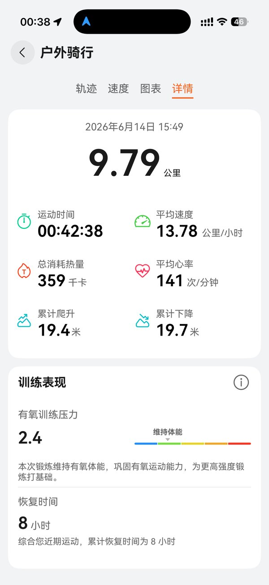
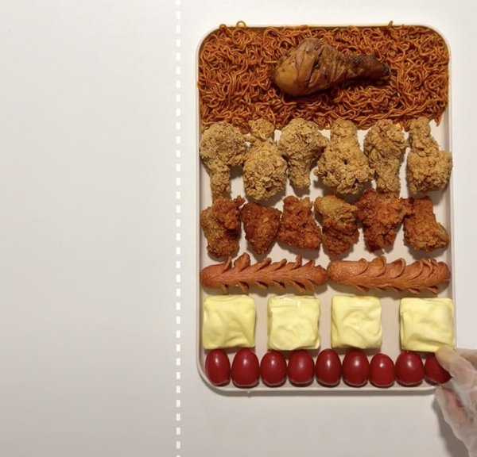
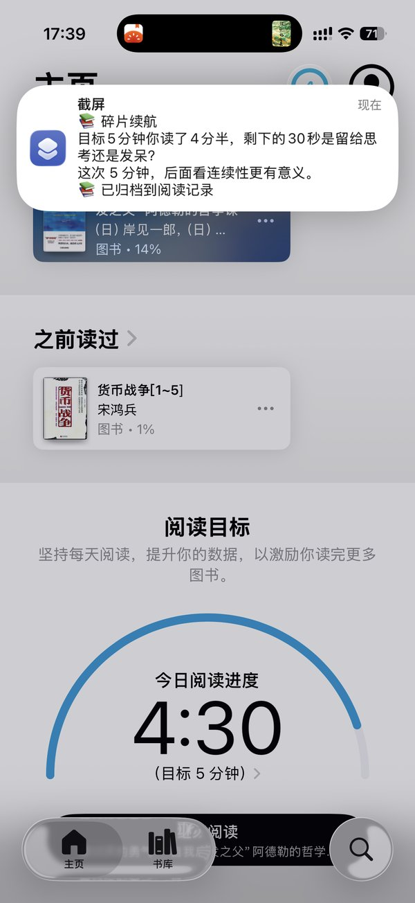
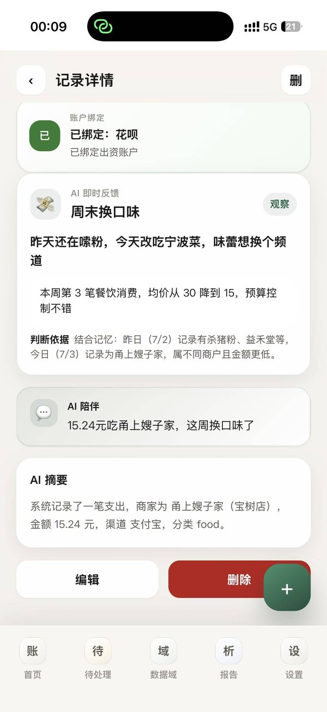

# 芥子 · Personal AI Memory

> **芥子纳须弥——AI 不应该只记住一次聊天，它应该记住你的人生。**

从截图记账出发，把散落的个人数据重新连接。消费、运动、睡眠、饮食、阅读——所有生活数据在同一套架构里联动，从聊天 AI 走向人生 AI。

[](https://www.gnu.org/licenses/agpl-3.0)
[](#-技术架构)
[](#-部署指南)
[](https://www.trae.cn/ai-creativity)

**[🌐 在线体验](https://snapflow.me)** · **[📱 iOS 快捷指令](https://www.icloud.com/shortcuts/60be42007bee43ff850d53106813b351)**

---

## ✨ 核心特性

- **📸 截图即数据**：iOS 快捷指令一键上传截图 → AI 视觉识别 → 自动结构化入库
- **🧠 AI 记忆与陪伴**：基于长期积累的个人数据，AI 提供跨记录的记忆关联与陪伴文案
- **🔀 多数据域联动**：消费、运动、睡眠、饮食、阅读、钱包——同一套 `data_records` 架构持续扩展
- **🔒 多用户 + RLS**：每个用户的数据完全隔离，`auth.uid() = user_id` 行级安全策略
- **🔁 去重 & 幂等**：pHash + dHash + 文本哈希三重去重，重传同一张截图不会重复入账
- **⚡ PWA 体验**：下拉刷新、离线友好、支持添加到主屏

---

## 🎯 真实识别案例

以下均为真实用户截图识别结果：

### 运动域 · 骑行记录



AI 识别出户外骑行 9.79km、42 分钟、消耗 359kcal、平均心率 141，生成伴随文案："平均心率141的有氧骑行，巩固体能的基础课。"

### 饮食域 · 食物拍照识别



AI 逐道识别出火鸡面配鸡腿、炸鸡块、花刀香肠、奶酪块、小番茄，估算总热量约 2770kcal，生成营养分析反馈。

### 阅读域 · 阅读进度



AI 识别出《被讨厌的勇气》阅读 4 分 30 秒，达成 5 分钟目标的 90%，生成"碎片续航"反馈文案。

### 消费域 · 支付记录（含 AI 记忆关联）



AI 识别出甬上嫂子家 ¥15.24，并**关联昨日记忆**："昨天还在嗦粉，今天改吃宁波菜，味蕾想换个频道"——从"甬上"推断宁波菜，关联 7/2 的杀猪粉和益禾堂记录。

---

## 🏗️ 技术架构

```
 ┌─────────────────┐        ┌──────────────────────────────┐
 │  iOS Shortcuts  │ ──📸──▶│  Supabase Edge Function      │
 │  / PWA 上传     │        │  ingest-receipt              │
 └─────────────────┘        │                              │
                            │  1. JWT 鉴权 / upload_token  │
 ┌─────────────────┐        │  2. pHash/文本去重           │
 │  PWA (Vue 3)    │◀──🔄──▶│  3. 域路由分发               │
 │  Cloudflare     │        │  4. AI 视觉识别              │
 │  Pages          │        │  5. 记忆关联 + 伴随文案      │
 └────────┬────────┘        │  6. 结构化入库               │
          │                 └──────────────┬───────────────┘
          │                                │
          ▼                                ▼
 ┌─────────────────────────────────────────────────┐
 │  Cloudflare Worker (supabase-proxy)             │
 │  反向代理 api.snapflow.me → *.supabase.co       │
 └────────────────────┬────────────────────────────┘
                      ▼
           ┌─────────────────────┐
           │  Supabase           │
           │  Postgres + Storage │
           │  Auth + RLS         │
           └─────────────────────┘
```

**前端**：Vue 3 + Vite · Composition API · PWA
**后端**：Supabase（Postgres + Edge Functions + Storage + Auth + RLS）
**AI**：Qwen / Moonshot / 自建 OpenAI 兼容 Vision 中转站（可替换为其他 Vision 模型）
**托管**：Cloudflare Pages（静态）+ Cloudflare Worker（反向代理）

---

## 🚀 部署指南

### 前置要求

- Node.js 18+ 和 npm
- 一个 Supabase 项目（[免费注册](https://supabase.com)）
- 一个 Cloudflare 账号（可选，用于反代和 Pages 托管）
- 一个 Vision 模型 API Key（Qwen / Moonshot 等）

### 1. 克隆与依赖

```bash
git clone https://github.com/shenfn/SnapCount.git
cd SnapCount
npm install
```

### 2. 配置环境变量

```bash
cp .env.example .env.local
# 编辑 .env.local，填入 VITE_SUPABASE_URL 和 VITE_SUPABASE_ANON_KEY
```

### 3. 初始化 Supabase 数据库

```bash
supabase link --project-ref <your-project-ref>
supabase db push   # 推送 supabase/migrations/ 下的所有迁移文件
```

### 4. 部署 Edge Function

```bash
# 设置 secrets（一次性）
supabase secrets set SUPABASE_URL="https://<your-project-ref>.supabase.co"
supabase secrets set SUPABASE_SERVICE_ROLE_KEY="<service-role-key>"
supabase secrets set QWEN_API_KEY="<your-qwen-key>"
supabase secrets set QWEN_MODEL="qwen3.6-flash"
supabase secrets set QWEN_PHOTO_MODEL="qwen3.7-plus"

# 部署
supabase functions deploy ingest-receipt --no-verify-jwt
supabase functions deploy generate-insights --no-verify-jwt
```

### 5. 本地开发 / 构建

```bash
npm run dev      # 本地开发
npm run build    # 构建 dist/
```

---

## 📱 iOS 快捷指令

1. [点击导入芥子快捷指令](https://www.icloud.com/shortcuts/60be42007bee43ff850d53106813b351)
2. 在 App 设置页复制你的 `upload_token`
3. 打开快捷指令 App → 找到 `upload_token` 字段 → 粘贴 Token
4. 绑定触发方式（辅助触控 / 操作按钮）

配置完成后，在任意页面触发快捷指令即可自动上传截图识别。

---

## 🗂️ 项目结构

```
SnapCount/
├── src/                      Vue 3 前端
│   ├── components/
│   │   ├── pages/            各页面（Home / Pending / Report / Settings ...）
│   │   └── Modal*.vue        各操作弹窗
│   ├── composables/          Vue 组合式逻辑
│   ├── lib/supabase.js       Supabase 客户端
│   └── styles/               样式
├── supabase/
│   ├── migrations/           数据库迁移
│   └── functions/
│       └── ingest-receipt/   截图识别 Edge Function
├── docs/cases/               案例截图（README 引用）
├── cloudflare-worker/        Cloudflare Worker 反向代理
├── public/                   静态资源
├── landing.html              芥子落地页（初赛体验入口）
└── .env.example              环境变量示例
```

---

## 🗺️ Roadmap

**已上线**
- [x] 截图识别支出 / 收入
- [x] 多数据域架构（运动 / 睡眠 / 饮食 / 阅读 / 钱包）
- [x] AI 记忆关联与陪伴文案
- [x] iOS 快捷指令集成
- [x] 多用户 + RLS 行级安全
- [x] PWA + 下拉刷新
- [x] 数据导出（CSV / JSON）

**开发中**
- [ ] 篇章域：长文本记录与阅读笔记联动
- [ ] 信息捕获归档：截图 → AI 自动分类归档（类似 Cubox 但零摩擦）
- [ ] 多截图上下文关联：连续截图让 AI 分析关联关系

**规划中**
- [ ] iOS 原生 App（AppStore 上架，免 token 配置）
- [ ] 数据域模板市场：用户自定义数据域 + AI 辅助建库 + 社区发布
- [ ] 跨域数据分析与个人画像生成
- [ ] 主动式异步补全：AI 主动提醒缺失数据

---

## 📜 License

**AGPL-3.0-or-later** — 详见 [LICENSE](./LICENSE)。

---

## 🙏 致谢

- [Supabase](https://supabase.com) — 全栈 BaaS
- [Qwen](https://help.aliyun.com/zh/model-studio/) — 通义千问视觉模型
- [Cloudflare](https://cloudflare.com) — Pages + Workers
- [Vue](https://vuejs.org) — 前端框架
- [TRAE](https://www.trae.cn) — AI 创造力大赛
