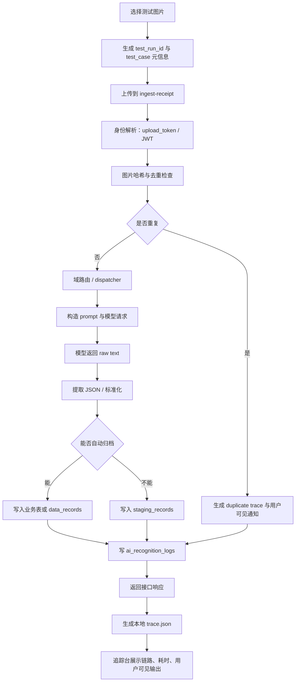
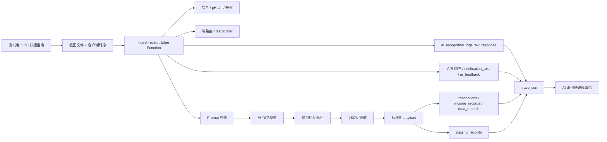
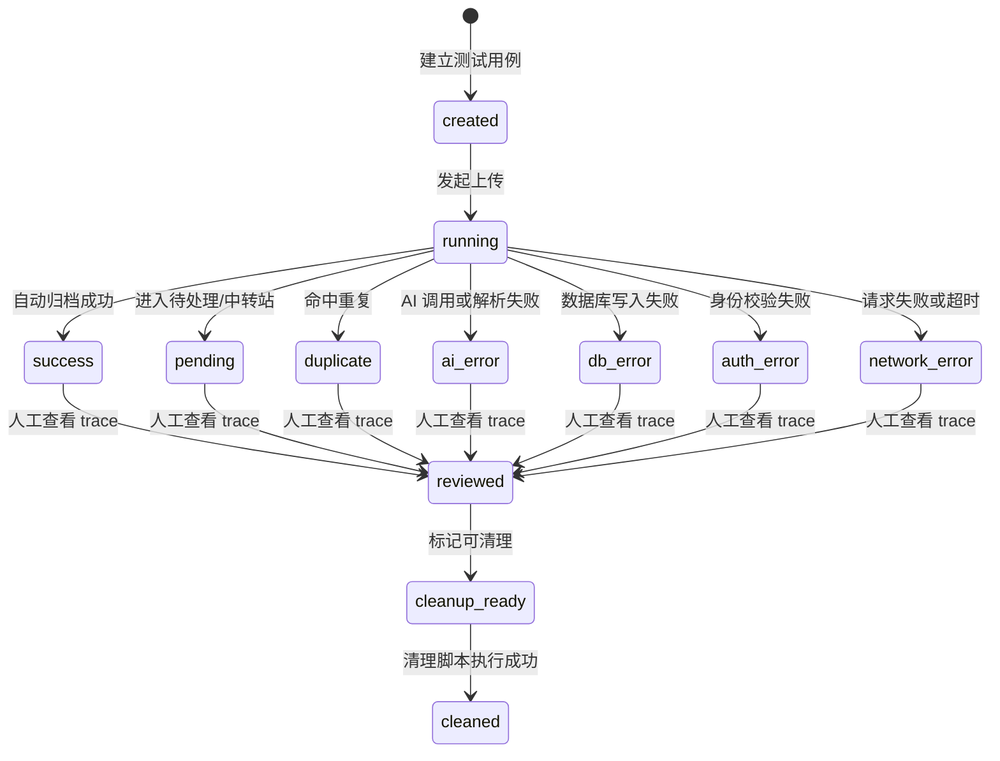
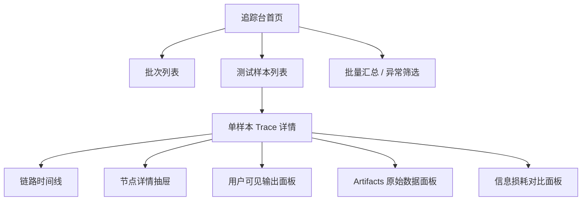

# AI 识别链路追踪台产品需求文档（PRD）

版本号：V0.1.0

| 版本 | 时间 | 修订人 | 备注 |
|---|---|---|---|
| V0.1.0 | 2026-06-27 | Codex | 创建 PRD 初稿，用于评审 AI 截图识别白盒追踪能力 |

## 一、概述

### 1.1 产品概述及目标

#### 1.1.1 背景介绍

当前项目已经具备一套本地 AI 截图验证工具：测试图片按域分类放入 `test-cases/`，脚本调用线上 `ingest-receipt` Edge Function，结果写入 `test-results/`，并通过 `test_run_id` 和 `test_meta` 标识测试批次。

这套能力已经能回答“这张图最终识别成什么”，但还不能很好回答以下问题：

- 这张截图从上传到落库，中间经过了哪些节点？
- 哪些数据是用户能看到的，哪些只是内部调试数据？
- iOS 快捷指令最终弹出的通知文案是什么，来源于哪一步？
- 原始模型返回、提取后的 JSON、标准化后的 payload、最终入库数据之间有没有信息损耗？
- 哪一步耗时最高，是图片上传、路由、模型调用、解析、归档，还是通知展示？
- 某个 AI 弹窗体验不好时，应该改 prompt、后处理、弹窗映射，还是快捷指令文案？

因此需要建设一个“AI 识别链路追踪台”，把黑盒识别过程变成可查看、可对比、可定位问题的白盒链路。

#### 1.1.2 产品概述

AI 识别链路追踪台是面向项目开发者、产品设计者和测试者的本地/内部调试工具。它以单张截图或批量测试结果为入口，展示截图从上传、身份解析、去重、域路由、prompt 构造、模型返回、JSON 提取、标准化、落库、用户可见输出的完整链路。

第一阶段不做大型后台系统，不进入正式用户 App 主流程；优先基于现有 `test-results/`、`ai_recognition_logs` 和 Edge Function 调试数据，建立稳定的 trace 数据契约和轻量可视化页面。

#### 1.1.3 产品目标

**业务目标**

| 目标 | 指标 | 目标值 | 达成时间 |
|---|---|---|---|
| 降低 AI 弹窗调试成本 | 单张截图定位问题所需时间 | 从人工翻日志降低到 3 分钟内定位主要节点 | V0.2 |
| 提升测试覆盖可见性 | 每轮批量测试的可查看链路比例 | 主要成功、待补全、重复、AI 错误分支均可生成 trace | V0.3 |
| 支撑后续后台系统孵化 | Trace 数据契约稳定性 | 核心字段连续 2 个版本不大改 | V0.4 |
| 减少误推线上风险 | 测试数据隔离能力 | 所有线上测试请求默认携带 `test_run_id` 和测试账号身份 | V0.2 |

**用户目标**

| 目标用户 | 用户目标 | 衡量指标 |
|---|---|---|
| 产品/项目负责人 | 看清楚用户最终能感知到哪些内容，并判断体验问题在哪里 | 每张图能列出 iOS 通知、App 弹窗、App 记录页字段 |
| AI prompt 调试者 | 对比 prompt、模型原文、提取 JSON 和标准化结果 | 能点击节点查看输入/输出/耗时/错误 |
| 前端开发者 | 验证 App 弹窗和设置页展示是否拿到了正确字段 | 能区分接口返回字段和最终 UI 显示字段 |
| 后端/Edge Function 开发者 | 快速定位路由、去重、归档、日志写入问题 | trace 中包含目标表、目标 ID、日志 ID、错误信息 |
| 测试者 | 批量跑图后筛选异常样本 | 能按域、状态、是否有用户可见输出筛选 |

### 1.2 名词说明

| 名词 | 说明 |
|---|---|
| Trace | 一次截图识别请求的完整链路记录。 |
| Trace Step | Trace 中的一个处理节点，例如“身份解析”“模型调用”“标准化”“落库”。 |
| Run | 一轮测试批次，对应 `test_run_id`。 |
| Test Case | 单张测试图片及其预期域、日期、文件名等元信息。 |
| User-visible Output | 用户能直接看到的输出，例如 iOS 快捷指令通知、App AI 弹窗、账单/记录详情字段。 |
| Internal Debug Data | 用户看不到、仅供调试的数据，例如 prompt、模型原始返回、路由候选、耗时、数据库 ID。 |
| Artifact | Trace 附件数据，例如原始响应 JSON、模型原文、提取 JSON、标准化 payload、截图缩略图。 |
| `test_meta` | 写入测试数据中的元信息，用于标识测试批次、域、日期、文件名和清理范围。 |
| `ai_recognition_logs` | Supabase 中记录 AI 识别日志的表，当前已有部分调试信息。 |
| iOS 快捷指令通知 | iPhone 快捷指令上传截图后，用户看到的系统通知文案。 |

### 1.3 角色及权限

| 角色 | 权限范围 | 数据范围 |
|---|---|---|
| 项目负责人 | 查看全部本地测试结果、触发测试、评审体验问题 | 专用测试账号与本地结果 |
| 开发者 | 查看 trace、调试脚本、调整埋点、运行本地工具 | 专用测试账号与开发环境 |
| 测试者 | 上传/选择测试图、查看结果、标记异常 | 专用测试账号与测试图片 |
| 未来管理员 | 查看历史批次、执行受控清理、管理测试配置 | 仅测试数据，不能默认管理真实用户数据 |

权限原则：

- V0.1/V0.2 默认只面向本地开发环境，不暴露给正式用户。
- 如果后续接入线上后台，必须区分测试账号数据和真实用户数据。
- Service Role Key 只能存在于本地服务端或后端，不允许暴露给浏览器页面。

### 1.4 文档阅读对象

| 对象 | 关注内容 |
|---|---|
| 产品/项目负责人 | 功能范围、用户可见数据、阶段路线、风险边界 |
| 前端开发 | 追踪台页面结构、交互、可视化要求 |
| 后端/Edge Function 开发 | Trace 数据契约、埋点缺口、日志关联 |
| 测试 | 验收标准、异常分支、批量测试流程 |
| 后续 Agent | 当前已有能力、不要误碰的边界、下一步实施顺序 |

## 二、产品描述

### 2.1 产品需求描述

本功能要做的是一个 AI 截图识别链路的白盒追踪工具，而不是一个模拟页面。它必须基于真实请求、真实响应、真实日志和真实测试批次生成追踪数据。

V0.1 的重点是完成产品和数据契约设计。后续实现时优先选择性价比最高的方式：

- 工具代码放在 `tools/ai-validation/` 或现有脚本体系中。
- 测试图片和测试结果继续放在本地忽略目录，不提交 GitHub。
- 可视化页面优先读取本地 `test-results/` 和 trace JSON。
- 线上测试可以支持，但必须默认使用测试账号、`upload_token`、`test_run_id`、`test_meta` 和清理边界。

本阶段不做：

- 不把追踪台入口放进正式用户 App 底部导航。
- 不默认做 Java 后台系统。
- 不允许在页面里直接暴露数据库高危密钥。
- 不允许在没有 dry-run 和确认的情况下执行线上批量清理。
- 不把测试图片、真实截图、响应 JSON 提交到 GitHub。

### 2.2 当前技术基础与缺口

#### 2.2.1 已具备能力

| 能力 | 当前位置 | 可用于追踪台的价值 |
|---|---|---|
| 分段耗时 | `ingest-receipt/index.ts` 的 `makeTimings()` | 能展示 Edge Function 内部主要耗时 |
| 原始调试 JSON | `buildAiRawDebug()` 写入 `ai_recognition_logs.raw_response` | 已包含 prompt 版本/哈希、模型原文、提取 JSON、伴随文案、通知、视觉尝试等 |
| AI 识别日志表 | `ai_recognition_logs` | 能关联状态、目标表、目标 ID、耗时、错误、模型信息 |
| 测试批次标识 | `test_run_id`、`test_case_domain`、`test_case_file` | 能把本地测试结果和线上测试数据对应起来 |
| 本地测试脚本 | `scripts/test-ingest-receipt.mjs` | 能批量上传图片并保存响应 |
| 清理脚本 | `scripts/cleanup-test-receipts.mjs` | 能按测试标签清理部分测试数据 |
| 客户端时序字段 | `client_*` / `shortcut_*` 表单字段 | 可用于展示 iOS 快捷指令侧耗时 |

#### 2.2.2 主要缺口

| 缺口 | 影响 | 建议优先级 |
|---|---|---|
| 没有稳定 `trace_id` | 本地响应、线上日志、结果文件之间不能精确一跳关联 | P0 |
| 没有统一 `steps[]` 结构 | 目前是零散字段，页面难以画完整流程图 | P0 |
| API 响应未返回 `ai_log_id` 或 trace 引用 | 测试脚本不能自动拉取对应日志 | P0 |
| prompt 只有版本和 hash，缺少可审查的 prompt 快照 | 难以判断 prompt 本身是否造成体验问题 | P1 |
| 早返回分支 trace 不完整 | 重复截图、鉴权失败、AI 错误等分支不容易对比 | P1 |
| 没有用户可见/不可见字段分层 | 产品评审时不知道用户真正看到了什么 | P0 |
| 没有信息损耗 diff | 无法判断哪一步丢字段或改字段 | P1 |
| 没有可视化页面 | 仍需人工翻 JSON 和日志 | P1 |

### 2.3 产品整体流程

#### 2.3.1 主流程



#### 2.3.2 数据流图



#### 2.3.3 Trace 状态转换



### 2.4 数据可见性分层

| 层级 | 名称 | 用户是否可见 | 示例 | 处理规则 |
|---|---|---|---|---|
| L0 | 真实用户可见 | 是 | iOS 通知、AI 弹窗、账单金额、分类、时间、伴随文案 | 追踪台必须重点展示 |
| L1 | 测试者可见 | 仅内部测试可见 | trace 页面、summary、测试批次结果 | 可展示完整但默认脱敏 |
| L2 | 内部调试数据 | 正式用户不可见 | prompt 版本、模型原文、路由候选、耗时、DB ID | 需要折叠展示，避免误以为用户可见 |
| L3 | 受限敏感数据 | 不应在前端明文暴露 | Service Role Key、完整密钥、非测试账号隐私数据 | 禁止进入浏览器或 Git |

### 2.5 用户可见输出清单

| 输出位置 | 当前可能字段 | 用户是否直接感知 | 说明 |
|---|---|---|---|
| iOS 快捷指令通知 | `notification_text` / `notification.final` | 是 | 上传完成后系统通知，是用户第一感知点 |
| App AI 弹窗 | `ai_feedback`、`companion_message` | 是 | 当前 AI 弹窗体验优化的核心 |
| App 记录列表 | 金额、商家/来源、分类、日期、域 | 是 | 识别结果是否“看起来对”主要看这里 |
| App 详情页 | 标准化后的 payload 字段 | 是 | 用于确认字段完整性 |
| 待处理页 | 缺失字段、待补全原因 | 是 | 失败/不确定样本的用户体验 |
| 追踪台 | prompt、raw response、timings、DB ID | 否，内部可见 | 用于调试，不代表真实用户体验 |

### 2.6 产品版本规划

| 版本 | 范围 | 状态 |
|---|---|---|
| V0.1 | PRD 与技术边界设计 | 当前文档 |
| V0.2 | Trace 数据契约、脚本输出 trace JSON、API 返回 trace 引用 | 实施中 |
| V0.3 | 轻量本地追踪台页面，读取 `test-results/` 展示链路 | 待开发 |
| V0.4 | 在线测试执行、日志拉取、历史批次对比、异常筛选 | 规划中 |
| V1.0 | 独立内部测试平台 / 后台系统评估 | 远期 |

### 2.7 产品框架

推荐长期目录方向：

```text
tools/
  ai-validation/
    README.md
    server/
    ui/
    scripts/
    docs/

local-only/
  ai-validation/
    test-cases/
    test-results/
    references/
```

说明：

- 第一阶段可以继续复用现有 `scripts/`，但新增 Web 原型和本地服务优先放入 `tools/ai-validation/`。
- `local-only/`、`test-cases/`、`test-results/` 不提交 GitHub。
- 如果未来做 Java 后台，建议等 Trace 契约稳定后再迁移，不要现在为了后台形态提前引入复杂度。

### 2.8 功能清单

| 模块 | 功能 | 优先级 | 版本 | 说明 |
|---|---|---|---|---|
| Trace 数据契约 | 定义 `trace_id`、`steps[]`、artifacts、用户可见输出 | P0 | V0.2 | 后续页面和对比能力的基础 |
| Trace 生成 | 单图/批量测试生成 `.trace.json` | P0 | V0.2 | 基于现有测试脚本扩展 |
| 日志关联 | 响应返回 `trace_id` / `ai_log_id` | P0 | V0.2 | 解决本地结果与线上日志无法精确关联 |
| 链路可视化 | 时间线 / 节点图 / 状态流转展示 | P1 | V0.3 | 核心交互 |
| 节点详情 | 点击节点查看输入、输出、耗时、错误、prompt | P1 | V0.3 | 白盒调试核心 |
| 用户可见面板 | 汇总 iOS 通知、App 弹窗、列表/详情字段 | P0 | V0.3 | 聚焦体验优化 |
| 信息损耗对比 | raw → extracted → normalized → stored diff | P1 | V0.4 | 定位字段丢失或误变形 |
| 在线测试执行 | 页面触发单图/批量上传 | P2 | V0.4 | 有边界但不是高不可做 |
| 清理辅助 | 展示清理范围、调用 dry-run、生成清理命令 | P2 | V0.4 | 真实删除仍需二次确认 |
| 后台系统化 | 用户、权限、历史库、审计 | P3 | V1.0 | 等需求稳定后再做 |

## 三、功能需求

### 3.1 Trace 数据契约

#### 3.1.1 描述

定义一份稳定的 JSON 契约，用于描述单次截图识别的完整链路。追踪台页面只依赖这份契约，不直接理解 Edge Function 内部散乱字段。

#### 3.1.2 用户故事

作为开发者，我希望每张测试图都有一个稳定的 `trace_id`，以便从本地结果、线上日志和数据库记录之间精确跳转。

作为产品负责人，我希望看到每一步的输入输出和用户可见结果，以便判断体验问题发生在哪个节点。

#### 3.1.3 前置条件

| 类型 | 条件 |
|---|---|
| 数据依赖 | 测试脚本能拿到接口响应，Edge Function 能写入 AI 日志 |
| 身份依赖 | 默认使用专用测试账号或合法 `upload_token` |
| 文件依赖 | 测试结果目录被 `.gitignore` 忽略 |

#### 3.1.4 后置条件

- 每张图片生成一个 `*.trace.json`。
- 每个 trace 至少包含基础状态、用户可见输出、关键耗时、错误信息。
- 如果线上日志可拉取，则 trace 中包含 `ai_log_id` 和扩展 artifacts。

#### 3.1.5 数据字典

```json
{
  "trace_id": "trace_20260627_xxx",
  "run_id": "local-ai-popup-v1",
  "status": "success",
  "created_at": "2026-06-27T12:00:00.000Z",
  "case": {
    "domain": "expense",
    "date": "2026-06-27",
    "file": "001-wechat-coffee.jpg",
    "image_relative_path": "test-cases/expense/2026-06-27/001-wechat-coffee.jpg"
  },
  "user_context": {
    "user_id": "2eee906d-d3ad-493f-b54e-691d8e95b855",
    "identity_source": "upload_token",
    "is_test_account": true
  },
  "steps": [],
  "user_visible_outputs": [],
  "artifacts": {},
  "db_targets": [],
  "errors": []
}
```

| 字段名 | 类型 | 必填 | 说明 | 示例值 |
|---|---|---|---|---|
| `trace_id` | String | 是 | 单次识别链路 ID | `trace_20260627_abc` |
| `run_id` | String | 是 | 测试批次 ID | `local-ai-popup-v1` |
| `status` | Enum | 是 | 识别最终状态 | `success` / `pending` / `duplicate` |
| `case` | Object | 是 | 测试图片元信息 | 见示例 |
| `user_context` | Object | 是 | 身份来源和测试账号信息 | 见示例 |
| `steps` | Array | 是 | 链路节点列表 | 见 3.1.6 |
| `user_visible_outputs` | Array | 是 | 用户可见输出 | iOS 通知、App 弹窗 |
| `artifacts` | Object | 否 | 原始响应、prompt、模型原文等 | 见 3.1.7 |
| `db_targets` | Array | 否 | 写入的目标表和 ID | `data_records` |
| `errors` | Array | 否 | 错误列表 | `AI_PARSE_FAILED` |

#### 3.1.6 Step 数据字典

| 字段名 | 类型 | 必填 | 说明 | 示例值 |
|---|---|---|---|---|
| `step_id` | String | 是 | 节点 ID | `model_call` |
| `name` | String | 是 | 节点名称 | `模型调用` |
| `status` | Enum | 是 | 节点状态 | `success` / `skipped` / `error` |
| `started_at` | DateTime | 否 | 开始时间 | `2026-06-27T12:00:00Z` |
| `duration_ms` | Number | 否 | 节点耗时 | `1830` |
| `input_snapshot` | Object | 否 | 节点输入摘要 | `{ "prompt_version": "..." }` |
| `output_snapshot` | Object | 否 | 节点输出摘要 | `{ "record_type": "expense" }` |
| `user_visible` | Boolean | 是 | 该节点输出是否用户可见 | `false` |
| `visibility_level` | Enum | 是 | 可见性层级 | `L0` / `L1` / `L2` / `L3` |
| `artifact_refs` | Array | 否 | 关联附件 | `["model_raw.text"]` |
| `loss_or_transform_notes` | Array | 否 | 转换/损耗说明 | `["amount string -> number"]` |

#### 3.1.7 推荐 Step 列表

| Step ID | 名称 | 当前是否基本有数据 | 说明 |
|---|---|---|---|
| `client_prepare` | 客户端准备 | 部分有 | iOS 或本地脚本侧图片准备、压缩、发起时间 |
| `upload_request` | 上传请求 | 部分有 | endpoint、图片大小、mime、请求耗时 |
| `identity_resolve` | 身份解析 | 需要补强 | upload_token/JWT/user_id 解析结果 |
| `image_hash` | 图片哈希 | 已有 | `image_hash`、`perceptual_hash` |
| `duplicate_check` | 去重检查 | 已有 | duplicate kind/ref |
| `domain_dispatch` | 域路由 | 部分有 | dispatcher 结果和候选域 |
| `prompt_build` | Prompt 构造 | 需要补强 | 当前只有版本/hash，缺少快照策略 |
| `model_call` | 模型调用 | 部分有 | provider/model/attempts/raw text |
| `model_parse` | 模型解析 | 部分有 | extracted JSON |
| `normalize_validate` | 标准化校验 | 需要补强 | 字段类型转换、缺失字段 |
| `companion_feedback` | 伴随文案/AI 反馈 | 已有部分 | model/raw/guard/fallback/final |
| `archive_or_staging` | 归档或中转 | 已有部分 | target_table/target_id/staging_record_id |
| `write_ai_log` | 日志写入 | 已有 | `ai_recognition_logs` |
| `response_build` | 响应构造 | 部分有 | API 返回 JSON 或 text |
| `shortcut_notification` | 快捷指令通知 | 部分有 | `notification_text`、展示耗时 |
| `app_render` | App 展示映射 | 需要前端补充 | 弹窗/详情页最终展示字段 |

### 3.2 本地 Trace 生成

#### 3.2.1 描述

扩展本地测试脚本，使其除了保存 `.response.json` 和 `summary.md` 外，为每张图额外生成 `.trace.json`。

#### 3.2.2 用户故事

作为测试者，我希望跑完一轮图片后，不只看到成功/失败，还能打开每张图片的链路详情。

#### 3.2.3 界面及交互

本功能第一阶段仍通过 CLI 使用：

```powershell
npm run test:receipt -- --dir test-cases --run-id local-ai-popup-v1
```

输出示例：

```text
test-results/
  local-ai-popup-v1/
    summary.md
    summary.json
    expense/
      2026-06-27/
        001-wechat-coffee.response.json
        001-wechat-coffee.trace.json
```

#### 3.2.4 异常/分支流程

| 场景 | 触发条件 | 处理方式 | 提示文案 |
|---|---|---|---|
| API 请求失败 | 网络错误、CORS、TLS、超时 | 生成 `network_error` trace | `请求失败，未进入 Edge Function` |
| API 返回非 JSON | text 模式或异常响应 | 保存 raw，trace 标记 `response_parse_error` | `响应无法解析为 JSON` |
| 无法拉取线上日志 | 缺少权限或 `ai_log_id` | 生成 partial trace | `仅包含接口响应，缺少线上日志` |
| 图片文件不存在 | 路径错误 | CLI 直接失败，不生成 trace | `图片路径不是文件` |

### 3.3 追踪台页面

#### 3.3.1 描述

提供一个轻量 Web 页面，用于读取本地 trace 结果并可视化展示链路。页面优先作为开发工具存在，不进入正式 PWA 主界面。

#### 3.3.2 用户故事

作为产品负责人，我希望点开一张截图后，能像看流水线一样看到它经过了哪些处理节点，以便判断体验问题发生在哪。

作为开发者，我希望点击某个节点时能看到这个节点的输入、输出、耗时和错误，以便快速定位代码或 prompt 问题。

#### 3.3.3 页面信息架构



#### 3.3.4 页面布局建议

| 区域 | 内容 | 说明 |
|---|---|---|
| 顶部概览 | run_id、状态、总耗时、域、文件名、最终结果 | 让用户先判断这张图是否正常 |
| 左侧列表 | 批次、域、图片、状态筛选 | 支持快速切换样本 |
| 中间主区域 | 数据流转时间线 / 节点图 | 核心可视化区域 |
| 右侧详情 | 当前节点输入、输出、耗时、错误、artifact | 点击节点后展开 |
| 底部/侧栏 | 用户可见输出 | 单独突出 iOS 通知和 App 弹窗 |

#### 3.3.5 核心交互

| 交互 | 说明 |
|---|---|
| 点击节点 | 展示该节点输入、输出、耗时、错误、关联 artifact |
| 切换“用户视角” | 只高亮 L0 用户可见数据 |
| 切换“开发视角” | 展示 L1/L2 调试数据 |
| 查看 prompt | 默认折叠，展开后展示 prompt 版本、hash、可选快照 |
| 查看 raw response | 默认折叠，支持复制和格式化 |
| 查看 diff | 对比模型原文、提取 JSON、标准化 payload、入库数据 |
| 标记问题 | 本地标记该样本问题类型，例如“通知文案差”“路由错”“字段丢失” |

### 3.4 用户可见输出面板

#### 3.4.1 描述

这是追踪台最重要的产品视角模块。它不展示所有内部数据，而是回答“用户到底看到了什么”。

#### 3.4.2 输出项

| 输出项 | 来源 | 展示方式 | 优先级 |
|---|---|---|---|
| iOS 快捷指令通知 | `notification_text` / `notification.final` | 原样展示，多行保留 | P0 |
| 通知展示耗时 | `client_notification_delay_ms` 或推导值 | 毫秒 + 相对阶段 | P1 |
| App AI 弹窗主文案 | `ai_feedback` / `companion_message` | 模拟弹窗卡片 | P0 |
| App 记录摘要 | API response / normalized payload | 字段卡片 | P0 |
| 待处理提示 | `pending` / missing fields | 警示卡片 | P1 |
| 用户看不到的数据提示 | prompt/raw/db id 等 | 灰色折叠说明 | P1 |

#### 3.4.3 验收标准

- 每张成功或待处理样本都能列出至少一个用户可见输出。
- 如果用户可见输出缺失，页面必须明确显示“缺失”，不能空白。
- iOS 通知和 App 弹窗必须分开展示，不能混在一个字段里。

### 3.5 信息损耗与转换对比

#### 3.5.1 描述

展示一条数据在不同阶段的变化，帮助判断“问题是 AI 没识别出来，还是后处理弄丢了”。

#### 3.5.2 对比链路

```text
图片可见信息
  -> 模型原始文本
  -> extracted_json
  -> normalized_payload
  -> db row / API response
  -> user_visible_output
```

#### 3.5.3 对比字段

| 字段 | 例子 | 检查点 |
|---|---|---|
| 金额 | `amount` | 是否从字符串正确转为数字 |
| 时间 | `occurred_at` / `income_date` | 是否时区正确，是否被推断 |
| 商家/来源 | `merchant` / `source_name` | 是否被截断或误归类 |
| 域 | `record_type` / `domain_key` | 是否路由到正确域 |
| 分类 | `category` | 是否从 prompt 到入库保持一致 |
| AI 文案 | `companion_message` / `ai_feedback` | 是否经过 guard 后变得生硬或丢失 |
| 通知文案 | `notification_text` | 是否和 App 弹窗表达一致 |

### 3.6 在线测试执行

#### 3.6.1 描述

线上测试执行不是禁止项。当前本地验证体系已经通过测试账号、`upload_token`、`test_run_id`、`test_meta` 和清理脚本降低风险。因此追踪台后续可以支持从页面触发真实线上测试，但必须有明确边界。

#### 3.6.2 安全边界

| 规则 | 说明 |
|---|---|
| 默认测试账号 | 不混用日常账号 |
| 默认 upload_token | 不让测试者手填 user_id |
| 必须带 `test_run_id` | 方便查询和清理 |
| 必须带 `test_meta` | 标识测试来源、域、日期、文件 |
| 批量执行前确认 | 展示将上传的图片数、域、目标账号 |
| 清理先 dry-run | 删除前显示影响范围 |
| 不在浏览器保存高危密钥 | Service Role 只能在本地 server 或后端 |

#### 3.6.3 异常/分支流程

| 场景 | 处理方式 |
|---|---|
| upload_token 无效 | 请求失败，trace 标记 `auth_error` |
| 域不存在或域隔离异常 | trace 标记 `domain_error`，提示检查系统域配置 |
| 触发重复检测 | trace 标记 `duplicate`，展示重复来源 |
| 进入正式业务表但无 test_meta | 高亮清理风险，要求人工确认 |

### 3.7 历史批次与回归对比

#### 3.7.1 描述

用于比较同一批测试图片在不同 prompt、不同 Edge Function 版本、不同前端弹窗映射下的结果差异。

#### 3.7.2 对比维度

| 维度 | 说明 |
|---|---|
| 状态变化 | success → pending、success → ai_error |
| 域变化 | expense → wallet、sport → other |
| 字段变化 | 金额、时间、商家、分类变化 |
| 用户可见文案变化 | 通知、AI 弹窗、伴随文案变化 |
| 耗时变化 | 总耗时、模型耗时、归档耗时变化 |
| 成本变化 | token usage、cost estimate 变化 |

### 3.8 后续后台系统演进

#### 3.8.1 描述

本功能未来可以孵化为更大的后台系统，但不建议第一步直接上 Java 后台和独立数据库。更稳的路径是先把 trace 契约、样本体系、页面交互和清理规则打磨稳定。

#### 3.8.2 技术路线建议

| 阶段 | 推荐技术 | 原因 |
|---|---|---|
| V0.2 | Node 脚本 + trace JSON | 复用现有脚本，成本最低 |
| V0.3 | Vite/轻量 Web UI + 本地文件读取服务 | 能快速做可视化，不影响正式 App |
| V0.4 | 本地 server 调 Supabase 日志 | 支持在线日志关联，但仍不暴露密钥 |
| V1.0 | 再评估 Java/Spring Boot + PostgreSQL/MySQL | 当出现多人协作、权限、审计、长期历史库需求时再做 |

独立数据库的定位：

- 可以存测试批次、trace 索引、人工标注、回归对比结果。
- 不应该替代 Supabase 正式业务库。
- 不应该复制真实用户隐私数据，除非有明确脱敏和保留周期。

## 四、非功能需求

### 4.1 安全与合规需求

| 需求 | 说明 |
|---|---|
| 测试素材隔离 | `test-cases/`、`test-results/`、截图缩略图默认不提交 Git |
| 敏感字段脱敏 | user_id、token、图片 URL、模型原文中的隐私内容支持折叠/脱敏 |
| 密钥隔离 | Service Role Key 不能进入浏览器端代码 |
| 测试账号隔离 | 默认只使用专用测试账号执行批量测试 |
| 清理保护 | 真实删除必须先 dry-run，并包含测试账号和 `test_run_id` 条件 |
| Prompt 保护 | 完整 prompt 是否落盘需要单独开关，默认只存版本/hash |

### 4.2 统计与埋点需求

追踪台本身可先不接正式埋点系统，但 trace 数据中需要具备以下事件能力：

| 事件名 | 触发时机 | 属性 | 说明 |
|---|---|---|---|
| `trace_created` | 单张测试开始 | `trace_id`, `run_id`, `domain` | 建立 trace |
| `trace_step_completed` | 节点完成 | `step_id`, `duration_ms`, `status` | 计算耗时和失败率 |
| `trace_completed` | 单张测试结束 | `status`, `total_ms`, `target_table` | 汇总成功率 |
| `user_visible_output_generated` | 生成用户可见输出 | `output_type`, `source_step` | 分析弹窗/通知覆盖率 |
| `trace_view_opened` | 打开详情页 | `trace_id`, `run_id` | 后续分析工具使用情况 |
| `cleanup_dry_run` | 清理预检查 | `run_id`, `affected_count` | 审计清理范围 |

### 4.3 性能需求

| 指标 | 要求 |
|---|---|
| 单个 trace JSON 大小 | 默认建议小于 1MB，超长 raw 文本截断并放 artifact |
| 详情页加载时间 | 本地读取单个 trace 小于 1 秒 |
| 批次列表规模 | V0.3 支持至少 200 张图片的批次浏览 |
| 节点切换 | 点击节点后 200ms 内展示详情 |
| 批量执行 | 支持串行或小并发，默认避免打爆线上函数 |

### 4.4 数据存储需求

| 数据 | 存储位置 | 保留策略 |
|---|---|---|
| 测试图片 | `local-only/ai-validation/test-cases/` 或 `test-cases/` | 本地保留，不提交 |
| 响应 JSON | `test-results/<run_id>/` | 本地保留，可手动清理 |
| Trace JSON | `test-results/<run_id>/` | 本地保留，可用于回归 |
| 线上 AI 日志 | Supabase `ai_recognition_logs` | 由线上策略决定 |
| 测试业务数据 | Supabase 业务表，带 `test_meta` | 可按 run_id 清理 |
| 人工标注 | 初期本地 JSON，后期可入独立测试库 | 后续评估 |

### 4.5 系统集成

| 对接系统 | 接口方向 | 协议 | 说明 |
|---|---|---|---|
| Supabase Edge Function | 调用 | HTTP multipart | 上传测试图片 |
| Supabase Database | 读取/清理 | Supabase JS / SQL | 拉取 AI 日志和清理测试数据 |
| 本地文件系统 | 读取/写入 | Node fs | 保存 test-results 和 trace |
| Vite 本地页面 | 展示 | HTTP localhost | 可视化 trace |
| iOS 快捷指令 | 间接接入 | 表单字段 | 提供客户端时序和通知展示信息 |

## 五、验收标准与测试要点

### 5.1 V0.2 Trace 契约验收

| 功能 | 验收条件 | 优先级 |
|---|---|---|
| Trace ID | 每张真实上传图片都生成唯一 `trace_id` | P0 |
| 日志关联 | API 响应或本地结果能关联到 `ai_recognition_logs` | P0 |
| Step 列表 | 成功样本至少包含身份、去重、路由、模型、解析、归档、响应节点 | P0 |
| 用户可见输出 | trace 中明确列出 iOS 通知和 App 弹窗相关字段 | P0 |
| 错误样本 | AI 错误、鉴权错误、网络错误能生成 partial trace | P1 |
| 测试隔离 | 真实测试请求默认携带 `test_run_id` 和 `test_meta` | P0 |

### 5.2 V0.3 页面验收

| 功能 | 验收条件 | 优先级 |
|---|---|---|
| 批次列表 | 能读取一个 `test-results/<run_id>` 并列出样本 | P0 |
| 链路图 | 能展示单样本的节点顺序、状态和耗时 | P0 |
| 节点详情 | 点击节点能看到输入、输出、错误和 artifact 引用 | P0 |
| 用户视角 | 能一键只看用户可见输出 | P0 |
| 原始数据 | 能展开 raw response / extracted JSON / normalized payload | P1 |
| 隐私保护 | token、密钥不会显示在页面中 | P0 |

### 5.3 V0.4 回归对比验收

| 功能 | 验收条件 | 优先级 |
|---|---|---|
| 批次对比 | 选择两个 run_id 后能显示状态变化 | P1 |
| 字段 diff | 能看到核心字段变化 | P1 |
| 文案 diff | 能对比通知和 AI 弹窗文案 | P1 |
| 异常筛选 | 能筛选失败、待处理、缺少用户可见输出的样本 | P1 |

## 六、待确认项

### 已确认决策

1. [已确认] 完整 prompt 默认只存版本/hash；如需保存完整 prompt，应通过本地调试开关启用，避免默认把敏感 prompt 和上下文写入结果文件。
2. [已确认] V0.2 应让 Edge Function 响应返回 `ai_log_id` 或等价 trace 引用，这是本地结果和线上日志精确关联的关键。
3. [已确认] 追踪台第一版优先只读本地 `test-results/` / trace JSON；页面发起真实线上上传可以后续支持，但需要保留测试账号、`upload_token`、`test_run_id`、`test_meta` 和清理边界。

### 建议确认

4. [待确认] 截图缩略图是否在 trace 页面展示？建议支持，但默认只引用本地路径，不复制图片。
5. [待确认] 用户可见输出是否需要模拟真实 iOS 通知样式？建议先文本原样展示，后续再做样式模拟。
6. [待确认] 是否要加入人工标注能力，例如“这张图路由错/文案差/字段丢失”？建议 V0.4 加。
7. [非阻塞] 本地测试上传食物等真实照片时，是否必须显式传 `capture_kind=photo` 或新增 `--capture-kind photo` 参数？当前脚本默认传 `capture_kind=test-batch`，Edge Function 会根据路由、OCR 文本、source_app 和图片特征判断是否使用拍照质量模型。该逻辑可用，但后续需要验证它是否足够贴近真实 iOS 拍照链路。
8. [非阻塞] 是否需要在 trace 中明确记录“本次实际使用的是截图模型还是拍照模型”？建议记录，因为用户可配置截图/拍照两套模型，本地验证必须能看出具体走了哪套。

### 可后续补充

9. [待确认] 是否上独立 Java 后台？建议等 trace 契约和轻量页面稳定后再决策。
10. [待确认] 是否需要长期保存历史 trace 到独立数据库？建议等测试批次明显增多后再做。

## 七、实施建议

推荐实施顺序：

1. 先补 Trace 契约，不做页面。
2. 再让测试脚本生成 `.trace.json`。
3. 再补 Edge Function 响应里的 `trace_id` / `ai_log_id`。
4. 再做只读追踪台页面，读取本地结果。
5. 再做在线上传、日志拉取、历史对比。
6. 最后评估是否需要 Java 后台和独立测试数据库。

这样做的好处是每一步都有可验证产物，不会一开始就把工作复杂度拉到后台系统级别。

## 八、代码核查依据

本 PRD 对“当前已有能力”和“需要补强能力”的判断基于以下代码位置：

| 结论 | 依据 |
|---|---|
| Edge Function 已有分段耗时能力 | `supabase/functions/ingest-receipt/index.ts` 中 `makeTimings()` |
| Edge Function 已能收集 iOS/客户端侧时序 | `collectClientTiming()` 读取 `client_*` / `shortcut_*` 字段 |
| AI 日志已经有统一写入入口 | `writeAiLog()` 写入 `ai_recognition_logs` |
| `raw_response` 已包含部分白盒调试数据 | `buildAiRawDebug()` 输出 prompt 版本/hash、dispatcher、model raw、companion、notification、vision attempts、timings |
| AI 日志表已支持核心识别结果 | `005_ai_recognition_logs.sql` 包含 `duration_ms`、`ai_response`、`raw_response`、`target_table`、`target_id`、`status` |
| AI 日志表已支持模型和成本字段 | `006_staging_mvp.sql` 增加 `model_provider`、`model_name`、`prompt_version`、`token_usage`、`cost_estimate` |
| 本地脚本已支持测试批次元信息 | `scripts/test-ingest-receipt.mjs` 中 `buildCaseMeta()` 生成 `test_run_id`、`test_case_domain`、`test_case_date`、`test_case_file` |
| 本地脚本默认用 `upload_token` 进行测试身份识别 | `executeCase()` 默认 append `upload_token`，仅显式 `--user-id` 时传 user_id |
| 本地脚本已保存 response artifact | `writeCaseArtifacts()` 写入每张图的 `.response.json` |
| 本地脚本已保存批次 summary | `writeBatchSummary()` 写入 `summary.json` / `summary.md` |
| 消费直接成功会进入 AI 日志 | 支出成功分支写入 `ai_recognition_logs`，包含 `target_table: "transactions"`、`target_id`、`status`、`ai_response`、`raw_response`、`model_provider`、`model_name`、`prompt_version` |
| 收入直接成功会进入 AI 日志 | 收入成功分支写入 `ai_recognition_logs`，包含 `target_table: "income_records"`、`target_id`、`status: "success"`、`ai_response`、`raw_response`、`model_provider`、`model_name`、`prompt_version` |
| 通用域成功归档会进入 AI 日志 | data_records 成功分支写入 `ai_recognition_logs`，包含 `target_table: "data_records"`、`data_record_id`、`domain_id`、`status: "success"` |
| 截图/拍照模型选择不是单纯按域固定 | `selectVisionProvidersForImage()` 会先看 `capture_kind`，再看 dispatcher 是否选中 `food`，再看 OCR/source_app/图片特征；本地脚本当前传 `capture_kind: "test-batch"` |
| V0.2 已开始落地 trace 响应字段 | Edge Function 响应增加 `trace_id`、`ai_log_id`、`vision_mode`、`photo_quality_mode`、`model_provider`、`model_name` |
| V0.2 已开始落地本地 trace 文件 | `scripts/test-ingest-receipt.mjs` 生成每张图片对应的 `.trace.json`，并在 `summary.md` / `summary.json` 中引用 |

因此，追踪台不是从零开始；真正缺的是一层稳定的 trace 聚合协议，以及把现有零散日志转成页面能消费的 `steps[]`、`user_visible_outputs[]` 和 artifacts。

### 8.1 关于截图识别与拍照识别路径的补充结论

当前 Edge Function 不是简单地“所有上传都走截图模型”，也不是完全“按最终识别域再决定模型”。实际逻辑更接近：

1. 如果 `capture_kind` 明确像截图，例如包含 `screenshot`、`screen`、`截图`、`截屏`，则不启用拍照质量模型。
2. 如果 `capture_kind` 明确像拍照，例如包含 `photo`、`camera`、`拍照`、`相机`、`food`，则启用拍照质量模型。
3. 如果低成本 dispatcher 已选中 `food`，则启用拍照质量模型。
4. 如果 dispatcher 已选中非 food 域，则不启用拍照质量模型。
5. 如果没有 OCR 文本、没有 source_app，且图片尺寸特征像真实照片，则可能启用拍照质量模型。

本地测试脚本当前固定传：

```text
capture_kind = test-batch
source_app = codex-local-validation
```

这意味着：

- 对食物照片，如果 dispatcher 能提前判断为 `food`，大概率会走拍照质量模型。
- 如果 dispatcher 没提前选中 `food`，由于本地脚本传了 `source_app`，后续兜底条件会更偏向不启用拍照质量模型。
- 因此，本地食物照片测试“能验证食物域最终识别结果”，但未必总能完全模拟真实 iOS 拍照链路。

V0.2 已给测试脚本增加 `--capture-kind` 参数，并在 trace 中记录实际使用的 `model_name`、`model_provider`、`capture_kind`、`photo_quality_mode`。后续仍需通过真实样本验证食物照片默认 `test-batch` 与显式 `photo` 的差异。

### 8.2 V0.2 当前实施边界

已实施：

- Edge Function 为主要成功、待处理、重复分支返回 `trace_id`。
- Edge Function 在成功写入 `ai_recognition_logs` 后返回 `ai_log_id`。
- Edge Function 在模型调用后返回 `vision_mode`、`photo_quality_mode`、`model_provider`、`model_name`。
- `ai_recognition_logs.raw_response` 中补充 `trace_id` 和请求上下文。
- 本地测试脚本支持 `--capture-kind` 和 `--source-app`。
- 本地测试脚本为每张图生成 `.response.json` 和 `.trace.json`。
- 本地测试脚本在配置日志读取 key 且响应包含 `ai_log_id` 时，可读取 `ai_recognition_logs.raw_response` 并展开更多后端节点。

暂未实施：

- 追踪台 Web 页面。
- 将 `ai_recognition_logs.raw_response` 展开为最终稳定的完整 15 节点契约，目前已能展开主要后端节点，但仍需真实样本验证字段完整度。
- 前端 App 渲染层的最终字段采集。
- 完整 prompt 快照开关。
