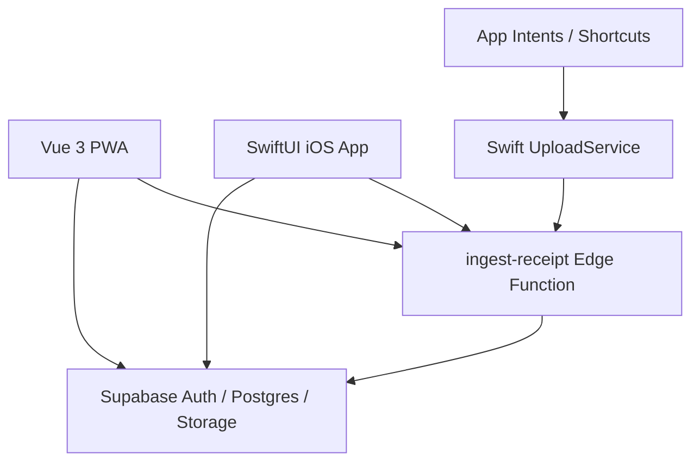
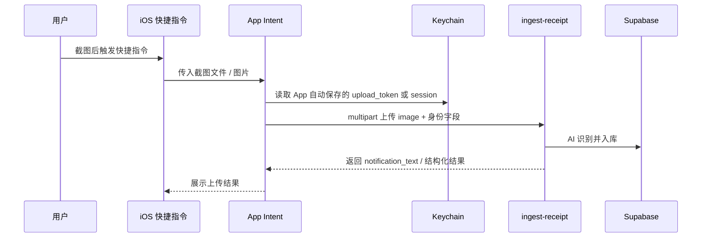
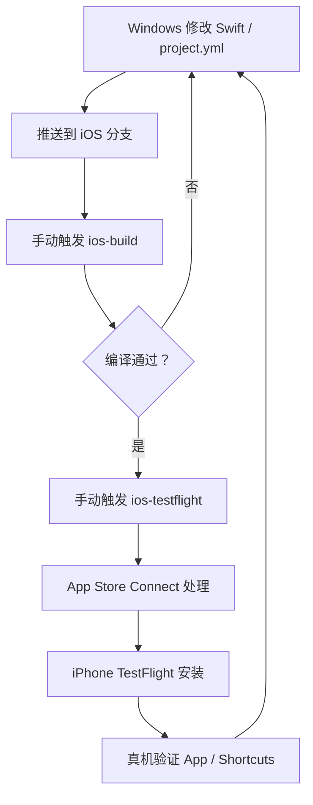

# 芥子 / SnapCount iOS SwiftUI 原生首版 PRD 与执行清单 V0.1

> 版本：V0.1  
> 日期：2026-07-09  
> 状态：方向确认后的执行草案  
> 适用范围：在保留现有 Vue 3 + Vite PWA 的同时，新建 SwiftUI 原生 iOS App，并通过 GitHub Actions + TestFlight 在真机验证与上架。

## 0. 结论摘要

首版目标调整为：**不做 Capacitor WebView 壳，改做 SwiftUI 原生 iOS App**。

这不是“Vue 改 React”。React 是 Web / React Native 路线；SwiftUI 原生 App 不需要 React，也不需要把现有 Vue 代码翻译成 React。正确拆法是：

- 现有 Vue PWA 继续保留，用于 Web 端、线上访问、已有用户与快速后台验证。
- 新增 `ios/` 原生客户端，用 SwiftUI 重做 App 端体验。
- 后端继续复用 Supabase、RLS、`ingest-receipt` Edge Function、Storage、AI 识别链路。
- App Intents / Shortcuts 作为首版高光能力，必须做。
- App 内也必须有完整上传、识别、查看、确认 / 归档闭环，不能只依赖 Shortcuts。

我对这个方向的判断：**更难，但更符合你想要的首版气质**。如果目标是 App Store 上架后让用户一打开就觉得“这是认真做的 iPhone App”，SwiftUI 是比 Capacitor 更适合的地基。

## 1. 当前项目真实状态

### 1.1 已有资产

当前项目已经具备一条非常有价值的后端链路：

- `README.md` 已定义核心路径：`iOS Shortcuts / PWA 上传 -> Supabase Edge Function ingest-receipt`。
- `supabase/functions/ingest-receipt/index.ts` 已支持 `multipart/form-data` 图片上传。
- 上传图片字段为 `image`。
- 身份识别已经支持：
  - 优先 `Authorization: Bearer <Supabase JWT>`。
  - 兜底 `upload_token` 表单字段反查 `user_configs.user_id`。
- `supabase/migrations/008_user_configs.sql` 已有 `user_configs.upload_token`。
- `src/App.vue` 已有“从后台回前台刷新数据”的逻辑，说明当前产品已经围绕快捷指令上传后的数据刷新做过设计。
- `src/components/ModalWelcome.vue` 和 `src/components/pages/PageSettings.vue` 仍保留“复制 token 到快捷指令”的旧体验，这是原生版需要移除的体验债。

### 1.2 当前缺口

- 没有 iOS 原生工程。
- 没有 SwiftUI 页面体系。
- 没有 iOS 原生登录态 / Keychain 凭据存储。
- 没有 App Intents Swift 实现。
- 没有 GitHub Actions 的 iOS 构建、签名、TestFlight 上传闭环。
- 没有 App Store 审核所需的账号删除、隐私政策、服务协议、审核说明完整闭环。
- 现有 Web UI 不能直接复用到 SwiftUI，需要按产品优先级重建。

## 2. 关键澄清

### 2.1 后端是否要大改？

不需要大改，但需要做少量“客户端化加固”。

首版可复用的后端能力：

| 能力 | 当前状态 | SwiftUI 复用方式 |
|---|---|---|
| 登录 / 用户体系 | Supabase Auth 已在 Web 使用 | iOS 使用 Supabase Swift SDK 或 Auth REST |
| 数据隔离 | RLS 基于 `auth.uid()` | iOS 请求携带 JWT 即可复用 |
| 图片识别 | `ingest-receipt` 已可用 | Swift `URLSession` multipart 上传 |
| 快捷指令身份 | `upload_token` 已可用 | App 登录后自动写入 Keychain，Intent 读取 |
| 数据列表 | Supabase 表结构已存在 | SwiftUI 读取 `transactions` / `income_records` / `data_records` |
| 图片存储 | Supabase Storage 已存在 | 继续用 signed URL 或后端返回图像地址 |

建议新增 / 补强的后端能力：

| 能力 | 是否首版必须 | 原因 |
|---|---:|---|
| `account deletion` RPC 或 Edge Function | 是 | App Store 账号型 App 高风险审核点 |
| `native_bootstrap` 数据接口或视图 | 建议 | SwiftUI 首页不应一次拼很多表逻辑 |
| `upload_token` 轮换 / 失效能力 | 建议 | 登出、设备丢失、凭据泄露时可控 |
| 上传接口返回更稳定的数据结构 | 建议 | SwiftUI 和 Intent 都需要稳定解析 |
| 审核 demo 账号数据种子 | 是 | 审核员要能快速看到效果 |

### 2.2 Vue 要不要改 React？

不需要。

三条路线的区别：

| 路线 | 是否需要 React | 体验 | 复用 Vue | 适合当前目标 |
|---|---:|---|---:|---:|
| Capacitor + Vue | 否 | WebView 体验，可加部分原生能力 | 高 | 中 |
| React Native | 是 | 接近原生，但不是 SwiftUI | 低 | 中 |
| SwiftUI 原生 | 否 | 最 iPhone、系统能力最好 | 低 | 高 |

如果你已经接受“前端大改”，那就没有必要从 Vue 改 React 再绕一层。直接 SwiftUI 更干净。

### 2.3 PWA 会不会废掉？

不会。新的结构应该是“双客户端共用后端”：



PWA 继续由当前 Cloudflare Pages / main 分支 CI 部署。iOS 开发在独立分支和独立 workflow 中推进，避免推送代码就影响线上 PWA。

## 3. 首版产品目标

### 3.1 首版必须达成

- 用户可以在 iPhone 安装 TestFlight / App Store 版“芥子”。
- 用户可以邮箱密码登录。
- 用户可以在 App 内拍照或选图上传截图 / 照片。
- AI 识别后，用户可以在 App 内看到结果。
- 不确定结果进入待处理 / 待确认。
- 用户可以确认、编辑或删除记录。
- 用户可以通过 Shortcuts / Action Button / Siri 调用 App Intent 上传截图。
- App Intent 接收快捷指令传入的图片，不读取“相册最新截图”作为核心路径。
- 用户不需要手动复制 `upload_token`。
- App 有隐私政策、服务协议、账号删除入口。
- GitHub Actions 可以从 Windows 提交代码后构建 iOS，并上传 TestFlight。

### 3.2 首版暂不做

- 不做完整 Web 端所有页面的 1:1 迁移。
- 不做 IAP / 订阅。
- 不做复杂推送通知。
- 不做数据域模板市场。
- 不做完整 AI 聊天或长期记忆可视化大系统。
- 不强行做 Apple 登录，除非后续加入其他第三方登录。
- 不在首版重构为异步识别队列；先沿用现有同步 `ingest-receipt` 链路，把 App 内上传、结果查看、待处理和 Shortcuts 配置体验补完整。

## 4. 首版功能范围

### 4.1 原生信息架构

建议 SwiftUI 首版做 5 个 Tab：

| Tab | 首版目标 | 对应现有能力 |
|---|---|---|
| 今日 | 今日记录、待处理提醒、快速上传 | `homeTimeline` / `todaySummary` 的原生简化版 |
| 收件箱 | AI 刚识别出的待确认记录 | `stagingRecords` / `pending` |
| 记录 | 消费、收入、运动、睡眠、饮食、阅读等时间线 | `transactions` / `income_records` / `data_records` |
| 分析 | 月度消费、收入、数据域摘要 | 先做轻量图表 |
| 设置 | 账号、隐私、上传凭据、删除账号 | `user_configs` |

不要首版追求“把 Web 所有页面搬完”。首版要让用户感到这个 App 是为 iPhone 重新设计过的。

### 4.2 iPhone 原生体验要求

| 体验 | SwiftUI 实现方向 |
|---|---|
| 侧滑返回 | `NavigationStack` + 系统返回手势 |
| 底部 Tab | `TabView` |
| 玻璃感组件 | SwiftUI `Material`、半透明 toolbar、sheet detents |
| 原生弹层 | `.sheet` / `.confirmationDialog` / `.alert` |
| 图片选择 | `PhotosPicker` |
| 拍照 | `UIImagePickerController` 包装或后续接更现代 Camera flow |
| 触感反馈 | `sensoryFeedback` / UIKit haptics |
| 空状态 | 原生插画 / SF Symbols + 简洁文案 |
| 加载态 | `ProgressView` + 骨架屏 |
| 错误态 | 可重试、可复制错误码、可打开设置 |

### 4.3 App Intents / Shortcuts 正确路径

首版核心路径：



明确不做：

- 不把“读取相册最新截图”作为首版核心路径。
- 不要求用户手动复制 token。
- 不依赖 SwiftUI App 正在前台运行。
- 不让 App Intent 调用 WebView JS。

## 5. 技术方案

### 5.1 仓库结构建议

```text
SnapCount/
├─ src/                         # 现有 Vue PWA，继续保留
├─ supabase/                    # 现有后端，继续保留
├─ ios/
│  ├─ project.yml               # XcodeGen 配置，Windows 可维护
│  ├─ SnapCount/
│  │  ├─ App/
│  │  ├─ Features/
│  │  ├─ Services/
│  │  ├─ Models/
│  │  ├─ DesignSystem/
│  │  └─ Intents/
│  └─ SnapCountTests/
├─ .github/workflows/
│  ├─ ios-build.yml             # 手动编译验证
│  └─ ios-testflight.yml        # 手动签名上传 TestFlight
└─ docs/
```

### 5.2 为什么建议 XcodeGen

你没有 Mac，所以不能依赖 Xcode 图形界面维护工程。`.xcodeproj/project.pbxproj` 可以手写，但非常容易坏。

建议用 `XcodeGen`：

- Windows 端编辑 Swift 文件和 `ios/project.yml`。
- GitHub Actions macOS runner 安装 XcodeGen。
- CI 生成 `.xcodeproj`。
- CI 执行 `xcodebuild`。
- CI 签名、导出 `.ipa`、上传 TestFlight。

这是“Windows 写代码 -> 手机验证”的关键地基。

### 5.3 iOS 依赖建议

| 依赖 | 用途 | 首版建议 |
|---|---|---|
| Supabase Swift SDK | Auth、数据库读取、RLS 请求 | 建议使用 |
| KeychainAccess 或原生 Keychain 封装 | 保存 `upload_token` / session 信息 | 建议使用轻量封装 |
| SwiftUI Charts | 分析页轻图表 | 可选 |
| AppIntents | Shortcuts / Siri | 必须 |
| PhotosUI | 相册选图 | 必须 |

### 5.4 鉴权方案

首版建议采用“双凭据”策略：

| 场景 | 凭据 | 原因 |
|---|---|---|
| App 内数据读取 / 写入 | Supabase access token | 复用 RLS，安全边界清楚 |
| App 内上传 | Supabase access token 优先 | `ingest-receipt` 已支持 JWT |
| App Intent 上传 | `upload_token` 优先 | Intent 脱离 App 生命周期，刷新 JWT 更复杂 |
| 登出 | 清理 Keychain 中 session 和 upload_token | 防止旧快捷指令继续上传 |

后续更强方案：

- 建一个后端 RPC 返回“设备级上传凭据”。
- 支持设备级撤销、轮换、过期。
- 替代直接使用长期 `upload_token`。

首版为了速度，可以先复用 `upload_token`，但必须做到 App 自动同步、登出清理、设置页可重置。

## 6. CI / TestFlight 验证流程

### 6.1 分支策略

- 当前 iOS 原生开发分支：`codex/ios-swiftui-native-app`。
- 不直接推 `main`。
- 现有 PWA 自动部署继续绑定 `main`。
- iOS workflow 初期只允许 `workflow_dispatch` 手动触发。
- 稳定后再考虑 tag 触发，例如 `ios-v0.1.0`。

### 6.2 两条 workflow

第一条：`ios-build.yml`

- 触发：手动。
- 作用：只验证 Swift 编译，不上传 TestFlight。
- 输出：build log、可选 `.xcarchive` artifact。
- 用途：快速发现语法、依赖、工程配置错误。

第二条：`ios-testflight.yml`

- 触发：手动。
- 作用：签名、Archive、Export IPA、上传 App Store Connect / TestFlight。
- 输出：TestFlight 构建。
- 用途：真机验证 App Intents、Keychain、相册、拍照、系统手势。

### 6.3 Windows 到 iPhone 的最短迭代链路



现实耗时预期：

| 环节 | 预估耗时 |
|---|---:|
| GitHub Actions 编译 | 5-15 分钟 |
| 签名导出上传 | 3-8 分钟 |
| TestFlight 处理 | 5-30+ 分钟 |
| 真机安装验证 | 2-5 分钟 |

结论：SwiftUI 真机迭代不可能像 Web 热更新一样快。要提速，必须把开发拆成两层：

- 编译层：频繁跑 `ios-build`，不每次上传 TestFlight。
- 真机层：只有手势、App Intents、Keychain、权限、相机相册、系统 UI 确认时才上传 TestFlight。

## 7. 执行清单

### Phase 0：方向冻结与风险隔离

目标：避免继续在 Capacitor / SwiftUI / React Native 之间摇摆。

| 序号 | 事项 | 负责人 | 前置条件 | 阻塞后续 |
|---:|---|---|---|---|
| 0.1 | 确认首版采用 SwiftUI 原生 | 用户 | 无 | 全部 iOS 工程 |
| 0.2 | 建立独立分支 | Codex | 无 | 防止影响 main 自动部署 |
| 0.3 | 保留 PWA，不迁移为 React | 用户 + Codex | 0.1 | 架构边界 |
| 0.4 | 冻结首版功能范围 | 用户 + Codex | 0.1 | 排期与审核 |
| 0.5 | 建立本 PRD | Codex | 0.1 | 后续执行标准 |

通过标准：

- `main` 不受影响。
- SwiftUI 首版范围写入文档。
- Capacitor 方案不再作为当前主线。

### Phase 1：iOS 工程与 CI 地基

目标：让 Windows 写 SwiftUI 代码后，GitHub Actions 能编译。

| 序号 | 事项 | 负责人 | 前置条件 | 阻塞后续 |
|---:|---|---|---|---|
| 1.1 | 新建 `ios/project.yml` | Codex | 0.1 | Xcode 工程生成 |
| 1.2 | 新建 SwiftUI App 骨架 | Codex | 1.1 | App 编译 |
| 1.3 | 配置 Bundle ID `com.jiezi.app` | Codex | Apple 后台已完成 | 签名 |
| 1.4 | 配置 Team ID `G6592SL596` | Codex | Apple 后台已完成 | 签名 |
| 1.5 | 新增 `ios-build.yml` | Codex | 1.1 | 编译验证 |
| 1.6 | 新增 `ios-testflight.yml` | Codex | 1.5 + Secrets | TestFlight |

通过标准：

- CI 可以生成 Xcode 工程。
- CI 可以完成一次 unsigned 或 development build。
- PWA 的 `npm run build` 不受影响。

### Phase 2：原生设计系统与导航

目标：先把“好看的地基”做出来，而不是先堆业务表单。

| 序号 | 事项 | 负责人 | 前置条件 | 阻塞后续 |
|---:|---|---|---|---|
| 2.1 | 建立 SwiftUI DesignSystem | Codex | 1.2 | 全局一致性 |
| 2.2 | 实现 TabView 五栏结构 | Codex | 2.1 | 页面入口 |
| 2.3 | 实现 NavigationStack 和侧滑返回 | Codex | 2.2 | 原生导航 |
| 2.4 | 实现玻璃工具栏 / Sheet 样式 | Codex | 2.1 | 视觉基调 |
| 2.5 | 实现空状态 / 加载态 / 错误态组件 | Codex | 2.1 | 审核体验 |

通过标准：

- TestFlight 打开后不像网页壳。
- 页面可导航、可返回、可显示基础状态。

### Phase 3：登录与 Keychain

目标：App 可以登录，并把 App Intent 所需凭据安全保存。

| 序号 | 事项 | 负责人 | 前置条件 | 阻塞后续 |
|---:|---|---|---|---|
| 3.1 | 接入 Supabase 配置 | Codex | 1.2 | Auth |
| 3.2 | 实现邮箱密码登录 | Codex | 3.1 | 主流程 |
| 3.3 | 实现 session 恢复 | Codex | 3.2 | 冷启动 |
| 3.4 | 登录后读取 `user_configs.upload_token` | Codex | 3.2 | App Intent |
| 3.5 | 写入 Keychain | Codex | 3.4 | App Intent |
| 3.6 | 登出清理 Keychain | Codex | 3.5 | 安全 |

通过标准：

- 真机首次登录成功。
- 关闭重开仍保持登录。
- 登出后 App Intent 不能继续用旧凭据上传。

### Phase 4：App 内上传主路径

目标：审核员不懂 Shortcuts，也能体验核心功能。

| 序号 | 事项 | 负责人 | 前置条件 | 阻塞后续 |
|---:|---|---|---|---|
| 4.1 | PhotosPicker 选图 | Codex | 3.2 | 上传 |
| 4.2 | 拍照入口 | Codex | 3.2 | 上传 |
| 4.3 | Swift multipart 上传到 `ingest-receipt` | Codex | 4.1 | AI 识别 |
| 4.4 | 携带 JWT / `source_app=ios_native` | Codex | 3.2 | 身份归属 |
| 4.5 | 解析 `notification_text` 和结构化响应 | Codex | 4.3 | 结果展示 |
| 4.6 | 上传成功后刷新收件箱 / 记录 | Codex | 4.5 | 闭环 |
| 4.7 | 上传失败重试与错误文案 | Codex | 4.3 | 审核体验 |

通过标准：

- App 内选图上传成功。
- App 内拍照上传成功。
- AI 结果能在 App 内看到。

### Phase 5：原生数据浏览与确认

目标：用户能处理 AI 识别出来的数据。

| 序号 | 事项 | 负责人 | 前置条件 | 阻塞后续 |
|---:|---|---|---|---|
| 5.1 | 首页今日摘要 | Codex | 3.2 | 体验完整性 |
| 5.2 | 收件箱待处理列表 | Codex | 4.6 | 审核主路径 |
| 5.3 | 记录详情页 | Codex | 5.2 | 查看结果 |
| 5.4 | 确认 / 归档操作 | Codex | 5.3 | 核心闭环 |
| 5.5 | 删除记录 | Codex | 5.3 | 数据控制 |
| 5.6 | 轻量分析页 | Codex | 5.1 | 产品完整感 |

通过标准：

- 上传后不是只弹一个成功提示，而是能进入 App 内处理。
- 待确认记录有明确出口，不形成数据死锁。

### Phase 6：App Intents / Shortcuts

目标：实现首版最亮的“截图即记忆 / 记录”体验。

| 序号 | 事项 | 负责人 | 前置条件 | 阻塞后续 |
|---:|---|---|---|---|
| 6.1 | 新建 `UploadScreenshotIntent` | Codex | 3.5 | Shortcuts |
| 6.2 | 定义图片输入参数 | Codex | 6.1 | 接收截图 |
| 6.3 | Intent 读取 Keychain `upload_token` | Codex | 3.5 | 身份 |
| 6.4 | Intent 使用 `URLSession` 上传 | Codex | 4.3 | 后端识别 |
| 6.5 | 返回 Shortcut 可读结果 | Codex | 6.4 | 用户反馈 |
| 6.6 | 注册 App Shortcuts 短语 | Codex | 6.1 | Siri / Shortcuts |
| 6.7 | 未登录 / 无图片 / 网络失败处理 | Codex | 6.3 | 稳定性 |

通过标准：

- Shortcuts App 能搜索到“上传到芥子”。
- 快捷指令传入截图后可上传。
- 上传结果归属当前登录用户。
- 用户不需要复制 token。

### Phase 7：合规与上架材料

目标：减少审核硬拒。

| 序号 | 事项 | 负责人 | 前置条件 | 阻塞后续 |
|---:|---|---|---|---|
| 7.1 | 隐私政策 URL | 用户 + Codex | 域名 / 部署 | 审核 |
| 7.2 | 服务协议 URL | 用户 + Codex | 域名 / 部署 | 审核 |
| 7.3 | App 内协议入口 | Codex | 7.1 / 7.2 | 审核 |
| 7.4 | 账号删除功能 | Codex | 删除范围确认 | 审核 |
| 7.5 | 首次上传 AI 处理说明 | Codex | 7.1 | 审核 |
| 7.6 | App Store 隐私问卷 | 用户，Codex 辅助 | 7.1 | 审核 |
| 7.7 | 审核备注与 demo 账号 | 用户 + Codex | 4 / 5 / 6 完成 | 审核 |

通过标准：

- 审核员可以登录、上传、看到结果、删除账号。
- 隐私披露与真实行为一致。

## 8. 最大风险

| 风险 | 等级 | 为什么危险 | 应对 |
|---|---|---|---|
| 没有 Mac 导致调试慢 | 高 | SwiftUI 和 App Intents 真机问题只能靠 CI/TestFlight | XcodeGen + 双 workflow；先编译、少量 TestFlight |
| SwiftUI 重写范围失控 | 高 | Web 功能太多，全部迁移会拖垮首版 | 只做上传、收件箱、记录、轻分析、设置 |
| App Intent 调试困难 | 高 | CI 过了不代表 Shortcuts 可用 | 尽早做最小 Intent，尽早 TestFlight |
| 审核认为功能不完整 | 高 | 只有 Shortcuts 会被认为主流程不完整 | App 内必须有上传和结果处理 |
| 账号删除缺失 | 高 | 账号型 App 常见审核卡点 | Phase 7 必做，不后置 |
| `upload_token` 长期有效 | 中 | 设备丢失或登出后风险 | 登出清理、设置页重置，后续设备级凭据 |
| 后端响应结构不稳定 | 中 | Swift 强类型解析容易碎 | 定义 Native DTO，后端返回兼容字段 |
| App 美观但数据流弱 | 中 | 首屏好看但不能闭环 | 先保证上传 -> 结果 -> 处理 |

## 9. 需要你手动操作的事项

已完成：

- Bundle ID：`com.jiezi.app`
- Team ID：`G6592SL596`
- App Store Connect App 已创建
- 证书、Provisioning Profile、API Key 已准备

仍需要你手动处理：

| 事项 | 时机 | 说明 |
|---|---|---|
| GitHub Secrets | Phase 1 / 6 | 用于 CI 签名与上传 TestFlight |
| TestFlight 内测授权 | Phase 6 | 把你的 Apple ID 加为测试者 |
| 隐私政策 / 服务协议最终确认 | Phase 7 | Codex 可写初稿，你确认口径 |
| App Store 隐私问卷 | Phase 7 | Codex 可给填写建议，你最终提交 |
| App Store 截图选择 | Phase 7 | 需要真机效果稳定后截 |
| 审核 demo 账号 | Phase 7 | 需要可登录、带示例数据 |

安全提醒：

- 不要在聊天或日志里打印 `.p8`、`.p12`、mobileprovision 的 Base64。
- 之前已经在对话里暴露过 p12 密码，正式提交前建议重新导出 p12 并换新密码。

## 10. 下一步建议

立即下一步不是写完整 App，而是做一个“原生地基 Spike”：

1. 新建 `ios/project.yml`。
2. 新建最小 SwiftUI App。
3. 做 5 Tab 空壳 + 一两个高质感原生页面。
4. 接 `ios-build.yml`，先让 CI 编译通过。
5. 接签名和 TestFlight，先让手机装上一个原生壳。
6. 再做登录、上传、App Intents。

这样你很快就能在 iPhone 上看到“原生 App 的感觉”，同时不会一上来就陷入几千行 SwiftUI 业务迁移。

## 11. 待确认项

必须确认：

1. [已确认] 首版方向改为 SwiftUI 原生 App。
2. [待确认] App 显示名最终使用 `芥子`、`SnapCount`，还是中文名 + 英文副标题。
3. [待确认] 首版是否接受“SwiftUI 功能少于 PWA，但质感更强”。
4. [待确认] `upload_token` 首版是否可以作为 App Intent 凭据，后续再升级为设备级 token。
5. [待确认] 账号删除采用硬删除、软删除，还是先停用再异步清理。

建议确认：

1. [待确认] App Store 分类：Finance / Productivity / Lifestyle / Utilities。
2. [待确认] 首版视觉关键词：极简、玻璃、数据记忆、生活日志、AI 陪伴中优先哪两个。
3. [待确认] 是否需要我把旧 Capacitor PRD 标记为“已废弃 / 备选方案”。
