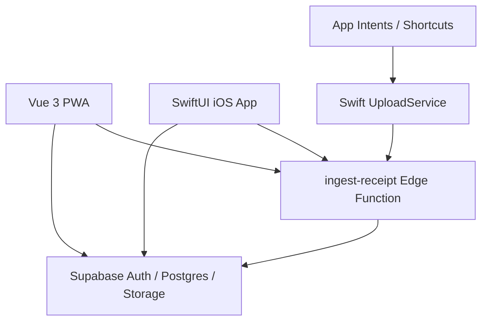
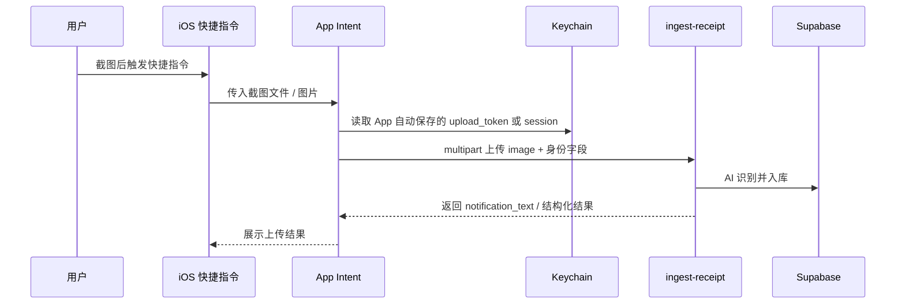
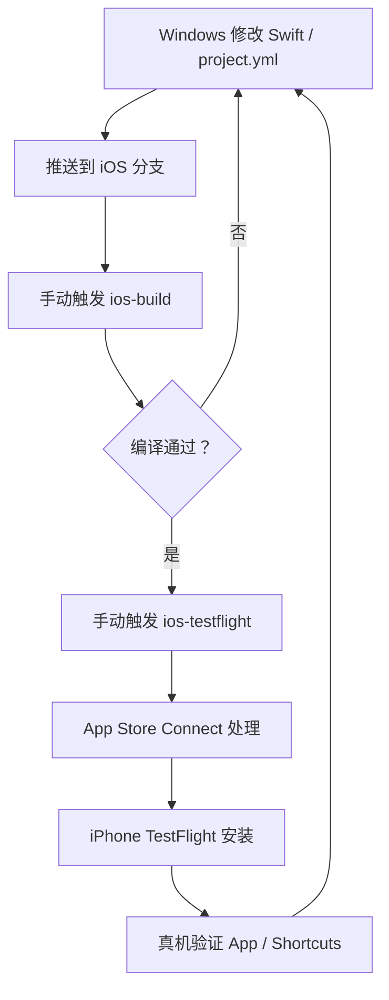

# 芥子 / SnapCount iOS SwiftUI 原生首版 PRD 与执行清单 V0.1

> 版本：V0.1  
> 日期：2026-07-09  
> 状态：方向确认后的执行草案  
> 适用范围：在保留现有 Vue 3 + Vite PWA 的同时，新建 SwiftUI 原生 iOS App，并通过 GitHub Actions + TestFlight 在真机验证与上架。

## 0. 结论摘要

首版目标调整为：**不做 Capacitor WebView 壳，改做 SwiftUI 原生 iOS App**。

这不是“Vue 改 React”。React 是 Web / React Native 路线；SwiftUI 原生 App 不需要 React，也不需要把现有 Vue 代码翻译成 React。正确拆法是：

- 现有 Vue PWA 继续保留，用于 Web 端、线上访问、已有用户与快速后台验证。
- 新增 `ios/` 原生客户端，用 SwiftUI 重做 App 端体验。
- 后端继续复用 Supabase、RLS、`ingest-receipt` Edge Function、Storage、AI 识别链路。
- App Intents / Shortcuts 作为首版高光能力，必须做。
- App 内也必须有完整上传、识别、查看、确认 / 归档闭环，不能只依赖 Shortcuts。

我对这个方向的判断：**更难，但更符合你想要的首版气质**。如果目标是 App Store 上架后让用户一打开就觉得“这是认真做的 iPhone App”，SwiftUI 是比 Capacitor 更适合的地基。

## 1. 当前项目真实状态

### 1.1 已有资产

当前项目已经具备一条非常有价值的后端链路：

- `README.md` 已定义核心路径：`iOS Shortcuts / PWA 上传 -> Supabase Edge Function ingest-receipt`。
- `supabase/functions/ingest-receipt/index.ts` 已支持 `multipart/form-data` 图片上传。
- 上传图片字段为 `image`。
- 身份识别已经支持：
  - 优先 `Authorization: Bearer <Supabase JWT>`。
  - 兜底 `upload_token` 表单字段反查 `user_configs.user_id`。
- `supabase/migrations/008_user_configs.sql` 已有 `user_configs.upload_token`。
- `src/App.vue` 已有“从后台回前台刷新数据”的逻辑，说明当前产品已经围绕快捷指令上传后的数据刷新做过设计。
- `src/components/ModalWelcome.vue` 和 `src/components/pages/PageSettings.vue` 仍保留“复制 token 到快捷指令”的旧体验，这是原生版需要移除的体验债。

### 1.2 当前缺口

- 没有 iOS 原生工程。
- 没有 SwiftUI 页面体系。
- 没有 iOS 原生登录态 / Keychain 凭据存储。
- 没有 App Intents Swift 实现。
- 没有 GitHub Actions 的 iOS 构建、签名、TestFlight 上传闭环。
- 没有 App Store 审核所需的账号删除、隐私政策、服务协议、审核说明完整闭环。
- 现有 Web UI 不能直接复用到 SwiftUI，需要按产品优先级重建。

## 2. 关键澄清

### 2.1 后端是否要大改？

不需要大改，但需要做少量“客户端化加固”。

首版可复用的后端能力：

| 能力 | 当前状态 | SwiftUI 复用方式 |
|---|---|---|
| 登录 / 用户体系 | Supabase Auth 已在 Web 使用 | iOS 使用 Supabase Swift SDK 或 Auth REST |
| 数据隔离 | RLS 基于 `auth.uid()` | iOS 请求携带 JWT 即可复用 |
| 图片识别 | `ingest-receipt` 已可用 | Swift `URLSession` multipart 上传 |
| 快捷指令身份 | `upload_token` 已可用 | App 登录后自动写入 Keychain，Intent 读取 |
| 数据列表 | Supabase 表结构已存在 | SwiftUI 读取 `transactions` / `income_records` / `data_records` |
| 图片存储 | Supabase Storage 已存在 | 继续用 signed URL 或后端返回图像地址 |

建议新增 / 补强的后端能力：

| 能力 | 是否首版必须 | 原因 |
|---|---:|---|
| `account deletion` RPC 或 Edge Function | 是 | App Store 账号型 App 高风险审核点 |
| `native_bootstrap` 数据接口或视图 | 建议 | SwiftUI 首页不应一次拼很多表逻辑 |
| `upload_token` 轮换 / 失效能力 | 建议 | 登出、设备丢失、凭据泄露时可控 |
| 上传接口返回更稳定的数据结构 | 建议 | SwiftUI 和 Intent 都需要稳定解析 |
| 审核 demo 账号数据种子 | 是 | 审核员要能快速看到效果 |

### 2.2 Vue 要不要改 React？

不需要。

三条路线的区别：

| 路线 | 是否需要 React | 体验 | 复用 Vue | 适合当前目标 |
|---|---:|---|---:|---:|
| Capacitor + Vue | 否 | WebView 体验，可加部分原生能力 | 高 | 中 |
| React Native | 是 | 接近原生，但不是 SwiftUI | 低 | 中 |
| SwiftUI 原生 | 否 | 最 iPhone、系统能力最好 | 低 | 高 |

如果你已经接受“前端大改”，那就没有必要从 Vue 改 React 再绕一层。直接 SwiftUI 更干净。

### 2.3 PWA 会不会废掉？

不会。新的结构应该是“双客户端共用后端”：



PWA 继续由当前 Cloudflare Pages / main 分支 CI 部署。iOS 开发在独立分支和独立 workflow 中推进，避免推送代码就影响线上 PWA。

## 3. 首版产品目标

### 3.1 首版必须达成

- 用户可以在 iPhone 安装 TestFlight / App Store 版“芥子”。
- 用户可以邮箱密码登录。
- 用户可以在 App 内拍照或选图上传截图 / 照片。
- AI 识别后，用户可以在 App 内看到结果。
- 不确定结果进入待处理 / 待确认。
- 用户可以确认、编辑或删除记录。
- 用户可以通过 Shortcuts / Action Button / Siri 调用 App Intent 上传截图。
- App Intent 接收快捷指令传入的图片，不读取“相册最新截图”作为核心路径。
- 用户不需要手动复制 `upload_token`。
- App 有隐私政策、服务协议、账号删除入口。
- GitHub Actions 可以从 Windows 提交代码后构建 iOS，并上传 TestFlight。

### 3.2 首版暂不做

- 不做完整 Web 端所有页面的 1:1 迁移。
- 不做 IAP / 订阅。
- 不做复杂推送通知。
- 不做数据域模板市场。
- 不做完整 AI 聊天或长期记忆可视化大系统。
- 不强行做 Apple 登录，除非后续加入其他第三方登录。
- 不在首版重构为异步识别队列；先沿用现有同步 `ingest-receipt` 链路，把 App 内上传、结果查看、待处理和 Shortcuts 配置体验补完整。

## 4. 首版功能范围

### 4.1 原生信息架构

建议 SwiftUI 首版做 5 个 Tab：

| Tab | 首版目标 | 对应现有能力 |
|---|---|---|
| 今日 | 今日记录、待处理提醒、快速上传 | `homeTimeline` / `todaySummary` 的原生简化版 |
| 收件箱 | AI 刚识别出的待确认记录 | `stagingRecords` / `pending` |
| 记录 | 消费、收入、运动、睡眠、饮食、阅读等时间线 | `transactions` / `income_records` / `data_records` |
| 分析 | 月度消费、收入、数据域摘要 | 先做轻量图表 |
| 设置 | 账号、隐私、上传凭据、删除账号 | `user_configs` |

不要首版追求“把 Web 所有页面搬完”。首版要让用户感到这个 App 是为 iPhone 重新设计过的。

### 4.2 iPhone 原生体验要求

| 体验 | SwiftUI 实现方向 |
|---|---|
| 侧滑返回 | `NavigationStack` + 系统返回手势 |
| 底部 Tab | `TabView` |
| 玻璃感组件 | SwiftUI `Material`、半透明 toolbar、sheet detents |
| 原生弹层 | `.sheet` / `.confirmationDialog` / `.alert` |
| 图片选择 | `PhotosPicker` |
| 拍照 | `UIImagePickerController` 包装或后续接更现代 Camera flow |
| 触感反馈 | `sensoryFeedback` / UIKit haptics |
| 空状态 | 原生插画 / SF Symbols + 简洁文案 |
| 加载态 | `ProgressView` + 骨架屏 |
| 错误态 | 可重试、可复制错误码、可打开设置 |

### 4.3 App Intents / Shortcuts 正确路径

首版核心路径：



明确不做：

- 不把“读取相册最新截图”作为首版核心路径。
- 不要求用户手动复制 token。
- 不依赖 SwiftUI App 正在前台运行。
- 不让 App Intent 调用 WebView JS。

## 5. 技术方案

### 5.1 仓库结构建议

```text
SnapCount/
├─ src/                         # 现有 Vue PWA，继续保留
├─ supabase/                    # 现有后端，继续保留
├─ ios/
│  ├─ project.yml               # XcodeGen 配置，Windows 可维护
│  ├─ SnapCount/
│  │  ├─ App/
│  │  ├─ Features/
│  │  ├─ Services/
│  │  ├─ Models/
│  │  ├─ DesignSystem/
│  │  └─ Intents/
│  └─ SnapCountTests/
├─ .github/workflows/
│  ├─ ios-build.yml             # 手动编译验证
│  └─ ios-testflight.yml        # 手动签名上传 TestFlight
└─ docs/
```

### 5.2 为什么建议 XcodeGen

你没有 Mac，所以不能依赖 Xcode 图形界面维护工程。`.xcodeproj/project.pbxproj` 可以手写，但非常容易坏。

建议用 `XcodeGen`：

- Windows 端编辑 Swift 文件和 `ios/project.yml`。
- GitHub Actions macOS runner 安装 XcodeGen。
- CI 生成 `.xcodeproj`。
- CI 执行 `xcodebuild`。
- CI 签名、导出 `.ipa`、上传 TestFlight。

这是“Windows 写代码 -> 手机验证”的关键地基。

### 5.3 iOS 依赖建议

| 依赖 | 用途 | 首版建议 |
|---|---|---|
| Supabase Swift SDK | Auth、数据库读取、RLS 请求 | 建议使用 |
| KeychainAccess 或原生 Keychain 封装 | 保存 `upload_token` / session 信息 | 建议使用轻量封装 |
| SwiftUI Charts | 分析页轻图表 | 可选 |
| AppIntents | Shortcuts / Siri | 必须 |
| PhotosUI | 相册选图 | 必须 |

### 5.4 鉴权方案

首版建议采用“双凭据”策略：

| 场景 | 凭据 | 原因 |
|---|---|---|
| App 内数据读取 / 写入 | Supabase access token | 复用 RLS，安全边界清楚 |
| App 内上传 | Supabase access token 优先 | `ingest-receipt` 已支持 JWT |
| App Intent 上传 | `upload_token` 优先 | Intent 脱离 App 生命周期，刷新 JWT 更复杂 |
| 登出 | 清理 Keychain 中 session 和 upload_token | 防止旧快捷指令继续上传 |

后续更强方案：

- 建一个后端 RPC 返回“设备级上传凭据”。
- 支持设备级撤销、轮换、过期。
- 替代直接使用长期 `upload_token`。

首版为了速度，可以先复用 `upload_token`，但必须做到 App 自动同步、登出清理、设置页可重置。

## 6. CI / TestFlight 验证流程

### 6.1 分支策略

- 当前 iOS 原生开发分支：`codex/ios-swiftui-native-app`。
- 不直接推 `main`。
- 现有 PWA 自动部署继续绑定 `main`。
- iOS workflow 初期只允许 `workflow_dispatch` 手动触发。
- 稳定后再考虑 tag 触发，例如 `ios-v0.1.0`。

### 6.2 两条 workflow

第一条：`ios-build.yml`

- 触发：手动。
- 作用：只验证 Swift 编译，不上传 TestFlight。
- 输出：build log、可选 `.xcarchive` artifact。
- 用途：快速发现语法、依赖、工程配置错误。

第二条：`ios-testflight.yml`

- 触发：手动。
- 作用：签名、Archive、Export IPA、上传 App Store Connect / TestFlight。
- 输出：TestFlight 构建。
- 用途：真机验证 App Intents、Keychain、相册、拍照、系统手势。

### 6.3 Windows 到 iPhone 的最短迭代链路



现实耗时预期：

| 环节 | 预估耗时 |
|---|---:|
| GitHub Actions 编译 | 5-15 分钟 |
| 签名导出上传 | 3-8 分钟 |
| TestFlight 处理 | 5-30+ 分钟 |
| 真机安装验证 | 2-5 分钟 |

结论：SwiftUI 真机迭代不可能像 Web 热更新一样快。要提速，必须把开发拆成两层：

- 编译层：频繁跑 `ios-build`，不每次上传 TestFlight。
- 真机层：只有手势、App Intents、Keychain、权限、相机相册、系统 UI 确认时才上传 TestFlight。

## 7. 执行清单

### Phase 0：方向冻结与风险隔离

目标：避免继续在 Capacitor / SwiftUI / React Native 之间摇摆。

| 序号 | 事项 | 负责人 | 前置条件 | 阻塞后续 |
|---:|---|---|---|---|
| 0.1 | 确认首版采用 SwiftUI 原生 | 用户 | 无 | 全部 iOS 工程 |
| 0.2 | 建立独立分支 | Codex | 无 | 防止影响 main 自动部署 |
| 0.3 | 保留 PWA，不迁移为 React | 用户 + Codex | 0.1 | 架构边界 |
| 0.4 | 冻结首版功能范围 | 用户 + Codex | 0.1 | 排期与审核 |
| 0.5 | 建立本 PRD | Codex | 0.1 | 后续执行标准 |

通过标准：

- `main` 不受影响。
- SwiftUI 首版范围写入文档。
- Capacitor 方案不再作为当前主线。

### Phase 1：iOS 工程与 CI 地基

目标：让 Windows 写 SwiftUI 代码后，GitHub Actions 能编译。

| 序号 | 事项 | 负责人 | 前置条件 | 阻塞后续 |
|---:|---|---|---|---|
| 1.1 | 新建 `ios/project.yml` | Codex | 0.1 | Xcode 工程生成 |
| 1.2 | 新建 SwiftUI App 骨架 | Codex | 1.1 | App 编译 |
| 1.3 | 配置 Bundle ID `com.jiezi.app` | Codex | Apple 后台已完成 | 签名 |
| 1.4 | 配置 Team ID `G6592SL596` | Codex | Apple 后台已完成 | 签名 |
| 1.5 | 新增 `ios-build.yml` | Codex | 1.1 | 编译验证 |
| 1.6 | 新增 `ios-testflight.yml` | Codex | 1.5 + Secrets | TestFlight |

通过标准：

- CI 可以生成 Xcode 工程。
- CI 可以完成一次 unsigned 或 development build。
- PWA 的 `npm run build` 不受影响。

### Phase 2：原生设计系统与导航

目标：先把“好看的地基”做出来，而不是先堆业务表单。

| 序号 | 事项 | 负责人 | 前置条件 | 阻塞后续 |
|---:|---|---|---|---|
| 2.1 | 建立 SwiftUI DesignSystem | Codex | 1.2 | 全局一致性 |
| 2.2 | 实现 TabView 五栏结构 | Codex | 2.1 | 页面入口 |
| 2.3 | 实现 NavigationStack 和侧滑返回 | Codex | 2.2 | 原生导航 |
| 2.4 | 实现玻璃工具栏 / Sheet 样式 | Codex | 2.1 | 视觉基调 |
| 2.5 | 实现空状态 / 加载态 / 错误态组件 | Codex | 2.1 | 审核体验 |

通过标准：

- TestFlight 打开后不像网页壳。
- 页面可导航、可返回、可显示基础状态。

### Phase 3：登录与 Keychain

目标：App 可以登录，并把 App Intent 所需凭据安全保存。

| 序号 | 事项 | 负责人 | 前置条件 | 阻塞后续 |
|---:|---|---|---|---|
| 3.1 | 接入 Supabase 配置 | Codex | 1.2 | Auth |
| 3.2 | 实现邮箱密码登录 | Codex | 3.1 | 主流程 |
| 3.3 | 实现 session 恢复 | Codex | 3.2 | 冷启动 |
| 3.4 | 登录后读取 `user_configs.upload_token` | Codex | 3.2 | App Intent |
| 3.5 | 写入 Keychain | Codex | 3.4 | App Intent |
| 3.6 | 登出清理 Keychain | Codex | 3.5 | 安全 |

通过标准：

- 真机首次登录成功。
- 关闭重开仍保持登录。
- 登出后 App Intent 不能继续用旧凭据上传。

### Phase 4：App 内上传主路径

目标：审核员不懂 Shortcuts，也能体验核心功能。

| 序号 | 事项 | 负责人 | 前置条件 | 阻塞后续 |
|---:|---|---|---|---|
| 4.1 | PhotosPicker 选图 | Codex | 3.2 | 上传 |
| 4.2 | 拍照入口 | Codex | 3.2 | 上传 |
| 4.3 | Swift multipart 上传到 `ingest-receipt` | Codex | 4.1 | AI 识别 |
| 4.4 | 携带 JWT / `source_app=ios_native` | Codex | 3.2 | 身份归属 |
| 4.5 | 解析 `notification_text` 和结构化响应 | Codex | 4.3 | 结果展示 |
| 4.6 | 上传成功后刷新收件箱 / 记录 | Codex | 4.5 | 闭环 |
| 4.7 | 上传失败重试与错误文案 | Codex | 4.3 | 审核体验 |

通过标准：

- App 内选图上传成功。
- App 内拍照上传成功。
- AI 结果能在 App 内看到。

### Phase 5：原生数据浏览与确认

目标：用户能处理 AI 识别出来的数据。

| 序号 | 事项 | 负责人 | 前置条件 | 阻塞后续 |
|---:|---|---|---|---|
| 5.1 | 首页今日摘要 | Codex | 3.2 | 体验完整性 |
| 5.2 | 收件箱待处理列表 | Codex | 4.6 | 审核主路径 |
| 5.3 | 记录详情页 | Codex | 5.2 | 查看结果 |
| 5.4 | 确认 / 归档操作 | Codex | 5.3 | 核心闭环 |
| 5.5 | 删除记录 | Codex | 5.3 | 数据控制 |
| 5.6 | 轻量分析页 | Codex | 5.1 | 产品完整感 |

通过标准：

- 上传后不是只弹一个成功提示，而是能进入 App 内处理。
- 待确认记录有明确出口，不形成数据死锁。

### Phase 6：App Intents / Shortcuts

目标：实现首版最亮的“截图即记忆 / 记录”体验。

| 序号 | 事项 | 负责人 | 前置条件 | 阻塞后续 |
|---:|---|---|---|---|
| 6.1 | 新建 `UploadScreenshotIntent` | Codex | 3.5 | Shortcuts |
| 6.2 | 定义图片输入参数 | Codex | 6.1 | 接收截图 |
| 6.3 | Intent 读取 Keychain `upload_token` | Codex | 3.5 | 身份 |
| 6.4 | Intent 使用 `URLSession` 上传 | Codex | 4.3 | 后端识别 |
| 6.5 | 返回 Shortcut 可读结果 | Codex | 6.4 | 用户反馈 |
| 6.6 | 注册 App Shortcuts 短语 | Codex | 6.1 | Siri / Shortcuts |
| 6.7 | 未登录 / 无图片 / 网络失败处理 | Codex | 6.3 | 稳定性 |

通过标准：

- Shortcuts App 能搜索到“上传到芥子”。
- 快捷指令传入截图后可上传。
- 上传结果归属当前登录用户。
- 用户不需要复制 token。

### Phase 7：合规与上架材料

目标：减少审核硬拒。

| 序号 | 事项 | 负责人 | 前置条件 | 阻塞后续 |
|---:|---|---|---|---|
| 7.1 | 隐私政策 URL | 用户 + Codex | 域名 / 部署 | 审核 |
| 7.2 | 服务协议 URL | 用户 + Codex | 域名 / 部署 | 审核 |
| 7.3 | App 内协议入口 | Codex | 7.1 / 7.2 | 审核 |
| 7.4 | 账号删除功能 | Codex | 删除范围确认 | 审核 |
| 7.5 | 首次上传 AI 处理说明 | Codex | 7.1 | 审核 |
| 7.6 | App Store 隐私问卷 | 用户，Codex 辅助 | 7.1 | 审核 |
| 7.7 | 审核备注与 demo 账号 | 用户 + Codex | 4 / 5 / 6 完成 | 审核 |

通过标准：

- 审核员可以登录、上传、看到结果、删除账号。
- 隐私披露与真实行为一致。

## 8. 最大风险

| 风险 | 等级 | 为什么危险 | 应对 |
|---|---|---|---|
| 没有 Mac 导致调试慢 | 高 | SwiftUI 和 App Intents 真机问题只能靠 CI/TestFlight | XcodeGen + 双 workflow；先编译、少量 TestFlight |
| SwiftUI 重写范围失控 | 高 | Web 功能太多，全部迁移会拖垮首版 | 只做上传、收件箱、记录、轻分析、设置 |
| App Intent 调试困难 | 高 | CI 过了不代表 Shortcuts 可用 | 尽早做最小 Intent，尽早 TestFlight |
| 审核认为功能不完整 | 高 | 只有 Shortcuts 会被认为主流程不完整 | App 内必须有上传和结果处理 |
| 账号删除缺失 | 高 | 账号型 App 常见审核卡点 | Phase 7 必做，不后置 |
| `upload_token` 长期有效 | 中 | 设备丢失或登出后风险 | 登出清理、设置页重置，后续设备级凭据 |
| 后端响应结构不稳定 | 中 | Swift 强类型解析容易碎 | 定义 Native DTO，后端返回兼容字段 |
| App 美观但数据流弱 | 中 | 首屏好看但不能闭环 | 先保证上传 -> 结果 -> 处理 |

## 9. 需要你手动操作的事项

已完成：

- Bundle ID：`com.jiezi.app`
- Team ID：`G6592SL596`
- App Store Connect App 已创建
- 证书、Provisioning Profile、API Key 已准备

仍需要你手动处理：

| 事项 | 时机 | 说明 |
|---|---|---|
| GitHub Secrets | Phase 1 / 6 | 用于 CI 签名与上传 TestFlight |
| TestFlight 内测授权 | Phase 6 | 把你的 Apple ID 加为测试者 |
| 隐私政策 / 服务协议最终确认 | Phase 7 | Codex 可写初稿，你确认口径 |
| App Store 隐私问卷 | Phase 7 | Codex 可给填写建议，你最终提交 |
| App Store 截图选择 | Phase 7 | 需要真机效果稳定后截 |
| 审核 demo 账号 | Phase 7 | 需要可登录、带示例数据 |

安全提醒：

- 不要在聊天或日志里打印 `.p8`、`.p12`、mobileprovision 的 Base64。
- 之前已经在对话里暴露过 p12 密码，正式提交前建议重新导出 p12 并换新密码。

## 10. 下一步建议

立即下一步不是写完整 App，而是做一个“原生地基 Spike”：

1. 新建 `ios/project.yml`。
2. 新建最小 SwiftUI App。
3. 做 5 Tab 空壳 + 一两个高质感原生页面。
4. 接 `ios-build.yml`，先让 CI 编译通过。
5. 接签名和 TestFlight，先让手机装上一个原生壳。
6. 再做登录、上传、App Intents。

这样你很快就能在 iPhone 上看到“原生 App 的感觉”，同时不会一上来就陷入几千行 SwiftUI 业务迁移。

## 11. 待确认项

必须确认：

1. [已确认] 首版方向改为 SwiftUI 原生 App。
2. [待确认] App 显示名最终使用 `芥子`、`SnapCount`，还是中文名 + 英文副标题。
3. [待确认] 首版是否接受“SwiftUI 功能少于 PWA，但质感更强”。
4. [待确认] `upload_token` 首版是否可以作为 App Intent 凭据，后续再升级为设备级 token。
5. [待确认] 账号删除采用硬删除、软删除，还是先停用再异步清理。

建议确认：

1. [待确认] App Store 分类：Finance / Productivity / Lifestyle / Utilities。
2. [待确认] 首版视觉关键词：极简、玻璃、数据记忆、生活日志、AI 陪伴中优先哪两个。
3. [待确认] 是否需要我把旧 Capacitor PRD 标记为“已废弃 / 备选方案”。


## 12. 2026-07-12 PWA 全量迁移计划复审结论

> 本节为最新强制执行基线。如与前文“首版功能少于 PWA”“质感优先”“先做页面壳”等描述冲突，以本节为准。

### 12.1 评审结论

用户提交的《PWA → iOS 功能迁移差距与执行清单》评审结论为：**有条件通过，按修订后的顺序执行，不得原样照抄。**

成立的部分：

- PWA 页面、组件、适配器、Supabase 表、RPC、Edge Function 和 Storage 调用清单可作为迁移范围基线。
- 月份选择、每日明细、日详情、数据域、账户、未绑定记录、报告、AI 洞察、设置和数据迁移均需进入原生迁移范围。
- 图片、详情缓存、数据服务拆分与 TestFlight 分批验收是必要工程任务。

必须修正的部分：

1. **PWA 是唯一业务真相。** iOS 不是重新设计产品；页面字段、状态流转、后端规则和导航关系均先对照 PWA 实现。
2. **主题保持“芥青微光”。** 不执行原计划中的“枯木逢春”主题替换，也不在功能迁移阶段增加深色主题工程。
3. **数据层前置。** 原计划 Phase 4 不得放在最后，必须先建立页面所需 DTO、服务和 AppState，再实现依赖页面。
4. **动态数据域不得硬编码。** iOS 必须读取 `data_domains` 及其协议配置；允许对已知域提供原生展示适配器，但未知域必须能用通用详情和通用表单兜底。
5. **禁止新增不符合既定产品规则的 AI 设置。** 不提供关闭 AI、全部确认、模型选择、提示词编辑、置信度阈值、逐数据域自动归档开关。
6. **AI 视觉设置不按原计划实现。** 普通用户设置只保留真实、必要、可解释的快捷指令引导、通知反馈、图片留存和服务端允许的偏好；模型策略由服务端管理。
7. **财务数据不得伪造。** 待还、余额、负债、账户汇总必须接入真实账户/流水/账期数据后展示，未接入前隐藏而不是显示固定值。
8. **账号删除不能直接假设调用 Supabase Auth delete user。** 必须采用后端受控删除流程，明确数据级联、图片清理、冷静期或立即删除策略后实施。
9. **每批必须真机验收。** 每个可交付批次都要经过 GitHub iOS Build、TestFlight 和用户截图复核后再进入下一批。

### 12.2 修订后的执行顺序

#### Batch A：迁移地基与数据契约

- 固化 PWA 功能矩阵、表/RPC/Edge Function 映射及字段口径。
- 拆分过大的 `NativeDataService`，至少形成 Dashboard、Record、Domain、Account、Insight、Settings/DataMigration 等职责边界。
- 补充月份参数、动态数据域协议、每日汇总、账户详情、未绑定记录、AI 洞察、导出所需 DTO 和 API。
- 建立统一加载态、空状态、部分失败、重试、缓存和签名图片 URL 策略。

#### Batch B：核心浏览与记录闭环

- 月份选择器。
- PWA 首页个人数据平台与每日明细。
- 日详情页面及按类型跳转。
- 记录详情：原图、基本信息、提取字段、账户绑定、AI 陪伴、AI 摘要、编辑/补充、删除。
- 图片全屏预览、缩放、失败重试和签名 URL 缓存。

#### Batch C：动态数据域

- 数据域总览。
- 数据域详情 Hero、指标、趋势、分布、最近记录。
- 动态协议读取与已知域原生适配器。
- 通用域详情和通用记录表单兜底。

#### Batch D：账户与财务闭环

- 真实账户列表、账户详情、账户流水。
- 账户新增、编辑、删除的 PWA 同规则实现。
- 未绑定记录查看、推荐绑定、手动绑定和批量绑定。
- 信用账期、还款、撤销还款、负债等状态流转按现有 PWA/RPC 实现。

#### Batch E：分析、洞察与设置

- PWA 报告页指标和 Swift Charts 原生表达。
- AI 洞察缓存、生成和自定义提问。
- 设置页：账户、快捷指令教程、通知反馈、图片留存、隐私/协议、数据迁移、退出登录。
- 导入与导出统一放在“数据迁移”入口。
- 账号删除在后端删除契约确认后实现。

### 12.3 状态机验收要求

以下实体必须在实现前列出完整状态、入口、出口和失败恢复：

- `staging_records`：待路由、识别失败、路由失败、已归档、已丢弃等状态均须有明确出口。
- 消费/收入记录：pending、已补充、已绑定账户、编辑、删除及关联流水同步。
- 账户账期与还款：未出账、已出账、待还、已还、撤销还款及级联影响。
- AI 洞察：缓存命中、生成中、生成成功、生成失败、强制刷新。
- 数据导入：待校验、校验失败、可导入、导入中、部分成功、完成、回滚/重试。
- 账号删除：申请、确认、执行中、完成、失败恢复及关联图片/业务数据清理。

### 12.4 交付完成定义

单个功能只有同时满足以下条件才算完成：

- 行为与 PWA 当前代码一致，或差异已经用户确认。
- 使用真实 Supabase 数据，不使用假数据或固定占位指标。
- 加载、空、失败、重试、权限不足和离线状态可解释。
- GitHub iOS Build 成功。
- TestFlight 上传成功。
- 用户完成真机截图或操作复核。


## 13. 2026-07-12 Supabase Swift SDK 渐进迁移决策

### 13.1 决策结论

iOS 长期数据访问地基采用官方 `supabase-swift`，不继续扩建自制 Supabase 客户端。当前已经完成的 JWT 自动续期、错误分类、完整记录缓存和手写 `URLSession` 服务作为过渡与回滚方案保留，不能一次性删除。

选择官方 SDK 的原因：

- PWA 已使用官方 `supabase-js`，原生端采用同一厂商维护的协议客户端更容易保持 Auth、PostgREST、Storage 和 Functions 行为一致。
- iOS 后续需要迁移账户、动态数据域、报告、AI 洞察、设置和数据迁移，继续手写会让 `NativeDataService` 演变成难以维护的自制 SDK。
- JWT 到期是正常安全机制；用户不应感知续期。会话刷新、Refresh Token 轮换、Auth 状态变化和并发控制应优先交由官方 Auth 客户端维护。
- 后续 Apple 登录、手机号 OTP 和账号身份绑定更适合建立在官方 Auth API 上。

### 13.2 渐进迁移顺序

1. **Auth**：引入 SDK，接管登录、会话恢复、自动刷新和 Auth 状态变化。
2. **Storage**：迁移私有图片签名 URL、下载和未来清理接口，保留内存 URL 缓存。
3. **PostgREST**：按 Dashboard、Records、Domains、Accounts、Insights、Settings/DataMigration 的顺序逐模块迁移。
4. **Functions**：优先迁移 JSON Edge Function；现有稳定的 multipart 图片上传识别链路暂不改动。

每个阶段只替换一个职责域，旧实现保留到新实现通过 Build、TestFlight 和真机验证后再删除。

### 13.3 必须保留的现有能力

- `upload_token` 继续写入现有 Keychain，供 App Intent 和快捷指令读取。
- `SnapCountUploadService` 的 multipart 图片识别上传暂时保留，避免影响已经在使用的快捷指令链路。
- 图片预处理、通知反馈、快捷指令 Intent 和现有深链接不因 SDK 迁移改变。
- “芥青微光”主题和 PWA 业务规则不属于 SDK 迁移范围。

### 13.4 会话迁移策略

- 首次启用 SDK 时尝试读取现有 Keychain 会话并建立兼容迁移。
- 如果官方 SDK 无法安全接管旧 Refresh Token，会明确要求用户重新登录一次，不伪造或静默丢失会话。
- SDK 会话存储必须评估 Keychain 适配，不把敏感 Refresh Token 降级为普通明文配置。
- SDK 登录成功后必须继续同步 `upload_token` 到 App Intent 使用的 Keychain Key。
- 用户退出登录时同时清理 SDK 会话、旧兼容会话和 Upload Token。

### 13.5 回滚和验收

每个 SDK 迁移批次必须满足：

- 旧 URLSession 服务仍可通过功能开关或小范围代码回退。
- 不允许 Auth 和数据请求在同一页面混用两个不同用户会话。
- JWT 自动续期、断网恢复、Refresh Token 失效、退出登录和重装恢复均需测试。
- GitHub iOS Build 与 TestFlight 成功。
- 真机验证登录、后台恢复、超过 Access Token 有效期后的继续使用、快捷指令上传和图片查看。

## 14. Batch B：原生本地优先、隐私存储与后台云端协作地基

> 本节记录 2026-07-12 对启动性能、本地数据快照、图片缓存、本地原图保存和云端 AI 协作的统一评审结论。该能力属于新增的原生基础设施，不是现有 PWA 页面迁移的自然附带项；必须按本节边界分批实施，不得为了“打开更快”直接扩张为未经设计的完整离线同步系统。

### 14.1 目标与基本判定

本批次解决的用户问题：

- App 冷启动应尽快显示上一次可用内容，不等待多个数据域和图片全部从 Supabase 返回。
- 重复打开记录和图片时优先使用本地已有内容，避免重复签名和下载。
- 用户可以选择原图是否在芥子云端长期保留，同时继续使用云端 AI 识别。
- 本地优先能力必须支持未来饮食、运动、睡眠、钱包、欠款及更多数据域扩展，而不是只为消费记录制作一次性缓存。
- PWA、iOS、快捷指令和后端必须继续共享同一套业务事实和状态机。

总体架构分为两条轨道：

1. **B-Data：结构化数据本地优先读取。** 用于首页快照、记录详情、收件箱和未来数据域的快速展示及后台校准。
2. **B-Media：图片与媒体本地存储。** 区分可丢弃图片缓存和用户唯一原图，承接本地回看、云端临时分析及可选云端长期留存。

两条轨道共享用户隔离、版本迁移、存储空间、导入导出、登出清理、错误恢复和多设备边界，但必须使用不同的数据模型与生命周期策略。

### 14.2 权威数据与分层边界

首版固定规则：

1. Supabase 仍是结构化业务数据的唯一权威源。
2. 本地数据首先是只读展示快照或远端数据副本，不独立决定消费、收入、余额、欠款、还款、账户流水和归档状态。
3. 所有新增、编辑、删除、归档操作仍先提交现有 Supabase 表、RPC 或 Edge Function；服务端成功后再更新或失效本地副本。
4. 首版不支持财务数据离线写入，不建立“本地先成功、以后再同步”的双向财务状态机。
5. SwiftUI 页面不得直接耦合具体本地存储技术，应通过 Repository / Store 层读取数据；未来从 JSON 快照升级到 SwiftData、增量同步或 Realtime 时，不重写页面业务。
6. 本地缓存不能形成第二套 PWA 业务规则。字段、状态、分类、数据域协议和账户联动继续以成熟 PWA 与后端实现为准。

推荐分层：

```text
SwiftUI View
  → Domain Repository
    → Local Read Store / Local Media Store
    → Supabase Swift / Existing Edge Functions
```

### 14.3 B0：已完成的非权威缓存优化

当前已经完成且允许保留：

- 登录会话恢复后不再等待完整 Dashboard 请求结束才进入 App。
- Storage signed URL 使用官方 Supabase Swift SDK，并进行短期内存缓存。
- 图片使用内存和磁盘缓存，重复打开时复用已下载内容。
- Dashboard 返回后后台预热当前可见记录和中转站图片。

这些内容属于可重新生成的性能缓存，不是本地原图保存，也不改变 Supabase 的权威地位。缓存丢失时可以重新从远端获取，不得向用户承诺其为唯一副本或长期备份。

### 14.4 B1：用户隔离的只读启动快照

B1 是下一阶段允许开发的最小范围。

本地保存：首页统计和每日明细、最近记录摘要、已加载的完整记录详情、当前中转站摘要、快照生成时间、最近成功同步时间，以及 `schemaVersion`、`userId` 和数据域版本信息。

启动流程：

1. Supabase SDK 恢复会话并确定当前 `user.id`。
2. 仅加载该用户对应的本地快照。
3. 立即展示上一次可用页面。
4. 后台向 Supabase 执行静默全量校准。
5. 成功后替换本地快照并安静刷新受影响组件。
6. 失败时继续展示本地快照，并使用轻量提示说明暂未同步。

B1 明确不做：离线新增、编辑、删除或归档；本地账户余额与负债独立计算；仅凭 `updated_at` 实现全域增量同步；把 Realtime 作为唯一一致性来源；将 Dashboard 展示模型永久当作所有数据域的业务数据库模型。

### 14.5 B2：Repository 与分数据域只读存储

在 B1 真机稳定后，按 PWA 数据域逐步建立本地只读副本，包括 `transactions`、`income_records`、`data_records` 与动态数据域、`staging_records`，以及后续账户、钱包、欠款、饮食、运动、睡眠等模块。

每个本地实体至少记录：远端 ID、用户 ID、数据域、远端更新时间、本地缓存时间、业务字段、图片引用和本地同步状态。未知动态数据域必须保留通用载荷，不能只支持当前硬编码类型。

### 14.6 B3：增量同步前置条件

增量同步必须独立评审。开始开发前必须确认所有参与表和 RPC 满足：

- 稳定且真实更新的 `updated_at`；
- 新增、编辑、归档及 RPC 修改都会推进更新时间；
- `(updated_at, id)` 可作为稳定游标，避免相同时间戳遗漏记录；
- 查询字段有必要索引；
- 服务端物理删除有可感知出口，例如 `deleted_at`、变更日志或周期性 ID 校准；
- 多设备同时修改时有明确的服务端裁决规则。

在删除语义未统一前，首版继续采用“不阻塞 UI 的后台全量校准”，不得上线可能保留已删除记录的伪增量同步。Realtime 只能作为“某数据域发生变化”的提示，收到事件后仍由 Repository 执行校准。

### 14.7 图片缓存与本地原图必须分离

图片分为两类：

1. **Remote Image Cache**：可丢弃缓存。用于 signed URL 下载结果、缩略图和快速预览，可以放在系统缓存目录，系统清理后重新下载。
2. **Local Original Media**：用户原图。可能是唯一副本，不能放在系统可随时清理的缓存目录，必须由正式 `LocalMediaStore` 管理。

本地原图只保存相对于 App 私有目录的路径，不保存可能随 App 容器变化而失效的绝对路径。推荐目录结构为 `Media/{userId}/{imageHash}.{extension}`。

`imageHash` 延续现有 PWA / 后端字段，用于去重、完整性校验、本地与远端映射、导入恢复和未来多记录引用判断。本地媒体引用模型至少包含 `userId`、`recordReference`、`imageHash`、`localRelativePath`、`remoteStoragePath`、文件类型与大小、创建和访问时间、`storageState` 及云端留存状态。

### 14.8 云端 AI 与原图留存模式

使用云端大模型时，图片内容仍会离开设备并发送到 Edge Function、模型提供商或配置的中转服务。“不长期保存在芥子云端”不等于“图片完全不上云”。产品、隐私政策和引导页必须准确表达这一点。

长期支持三种留存模式：

1. **多端保存**：本机保留，Supabase Storage 长期保留，PWA 和其他设备可以查看。
2. **仅本机保存**：本机保留，云端仅用于 AI 分析，业务落库和本地校验成功后删除 Storage 副本。PWA 和其他设备只能查看结构化结果及“原图仅保存在原设备”的状态。
3. **不保存原图**：图片仅用于本次分析，分析与业务落库完成后删除本地临时文件和云端副本，只保留结构化记录。

现有 PWA 已有 `keep_source_images` 和 `image_retention_days`，实施时必须将其升级为统一、可解释的三态产品语义，而不是在 iOS 新建一套互不兼容的设置。现有用户升级时不得静默改变原有云端留存行为。

### 14.9 图片处理事务与状态机

“仅本机保存”的正确顺序：

1. 将原图写入 App 私有持久目录。
2. 校验文件可读取并计算 Hash。
3. 临时上传或直接随识别请求发送给 Edge Function。
4. 云端 AI 完成分析。
5. 结构化业务记录或中转站记录成功落库。
6. 建立本地图片与远端记录的稳定关联。
7. 最后删除云端 Storage 副本。

禁止先删除云端文件、再尝试保存本地唯一副本。

| 状态 | 含义 | 必须存在的出口 |
|---|---|---|
| `localPending` | 本地已保存，尚未上传 | 上传、取消或本地失败处理 |
| `uploading` | 正在发送云端识别 | 分析或上传失败 |
| `analyzing` | AI 正在处理 | 落库或识别失败 |
| `remoteRetained` | 本地和云端均保留 | 保持或按策略删除云端 |
| `remoteDeleting` | 正在清理云端副本 | `localOnly` 或删除失败 |
| `localOnly` | 仅当前设备保留 | 查看、导出、重新上传或删除 |
| `resultOnly` | 原图均删除，仅保留结果 | 终态 |
| `uploadFailed` | 上传失败但本地原图存在 | 重试或取消 |
| `analysisFailed` | 识别失败 | 重试、进入中转站或清理 |
| `deleteFailed` | 云端清理失败 | 后台重试，不回滚识别结果 |
| `localMissing` | 本地原图文件缺失 | 远端恢复或标记不可用 |

分析成功但云端删除失败时，结构化结果仍然有效；系统记录待清理状态并后台重试，不要求用户重新识别。

### 14.10 用户隔离、删除和多设备边界

- 所有本地快照和原图必须按 Supabase `user.id` 隔离。
- 尚未确定当前用户身份时不得展示上一个账号的数据。
- 登出时清理会话和 Upload Token，并按最终隐私策略清理或锁定当前用户本地业务缓存。
- 本地唯一原图不得自动进入公共目录、系统照片库或不受控备份。
- 删除记录时先解除记录关联；只有确认没有其他记录引用时才删除文件。无法可靠引用计数时进入延迟清理队列。
- “仅本机保存”必须明确：PWA、其他手机和重装后的 App 可能无法恢复原图。
- 后续跨设备恢复统一纳入“数据迁移”，包括结构化数据导出、可选原图、加密包、Hash 去重和新设备导入。

### 14.11 实施批次与准入条件

| 子批次 | 范围 | 当前结论 |
|---|---|---|
| B0 | 启动解阻塞、signed URL 缓存、图片缓存与预热 | 已完成，可保留 |
| B1 | 用户隔离的只读启动快照、后台全量校准 | 批准进入开发 |
| B2 | Repository 与分数据域只读存储 | B1 真机稳定后开发 |
| B3 | 可靠增量同步与 Realtime 提示 | 删除语义和游标评审通过后开发 |
| B4 | `LocalMediaStore`、本地原图和三种留存模式 | 完成数据模型、状态机和隐私文案后开发 |
| B5 | 上传事务化、云端清理重试、导入导出与设备迁移 | B4 稳定后分批开发 |

每个子批次继续执行 GitHub iOS Build、TestFlight 和真机复核。任何子批次都不得同时重写稳定 multipart 识别链路、财务 RPC 和页面视觉，以免无法定位回归来源。

### 14.12 验收标准

B1：已登录且有快照时，冷启动可在远端请求完成前显示上一次数据；无网络时仍可查看上一次首页与已缓存详情；首次安装无缓存且无网络时显示真实空状态；切换账号不会短暂显示上一账号内容；后台校准部分失败时保留成功数据域和本地可用数据。

B4/B5：本地原图写入和 Hash 校验成功前不会删除云端唯一副本；“仅本机保存”模式下云端删除后 iOS 仍可离线查看原图；PWA 显示准确占位说明；云端删除失败会后台重试且识别结果不会丢失；登出、删除记录、清理空间、重装和换机的后果都有明确提示与测试用例。
