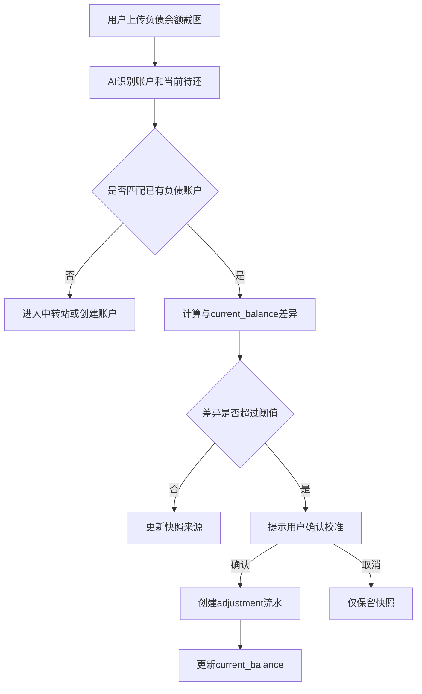

# 芥子负债账单与还款能力 PRD V0.1

## 版本记录

| 版本 | 日期 | 作者 | 说明 |
|---|---|---|---|
| V0.1 | 2026-06-07 | Codex | 梳理负债账户、账单周期、还款、截图证据、系统估算的边界，作为后续重构依据 |

## 一、概述

### 1.1 背景

芥子已经完成钱包账户绑定、账户流水、负债账户消费方向、自动补绑、还款周期雏形等能力。但用户验证中暴露出一个结构性问题：负债域不是简单的“账户余额 + 最近待还”，而是由多个相互关联但权威性不同的对象组成。

当前实现的主要问题：

1. `accounts.current_balance` 表示当前总欠款估算，但 UI 有时把它当成当月账单金额展示。
2. `account_repayment_cycles` 同时承载截图账单、系统估算账单、还款状态、结转状态，实体职责过重。
3. `liability_snapshot` 既被当成余额快照，也被当成账单证据，还可能被当成还款证据。
4. 还款确认直接写 `account_entries`，没有独立的还款记录实体，部分还款、多次还款、自动扣款、撤销会越来越难。
5. 首页与账户详情页缺少明确的信息口径，导致“五月账单为什么出现在六月”“大卡片是总欠款还是本月待还”这类疑惑。

因此，本 PRD 单独定义负债账单模型，避免继续通过零散补丁修复显示问题。

### 1.2 产品目标

业务目标：

1. 让负债账户长期可用，减少账实不一致带来的弃用风险。
2. 把截图识别、消费流水、还款确认、账单周期放进同一套可解释模型。
3. 为后续“篇章重启”“余额校准”“自动识别已还款”提供基础。

用户目标：

1. 用户能清楚知道当前总欠款、当月账单、最近待还分别是什么。
2. 用户不需要每个月都手动录入账单周期；能识别就自动带入，不能识别才提示补设置。
3. 用户截图还款或账单后，系统能高置信度自动更新；中置信度进入中转站确认。
4. 用户一段时间不记账后，可以开启新篇章重新建立可信起点，而不是被历史缺口困住。

### 1.3 非目标

V0.1 不追求和花呗、白条、信用卡官方账单 100% 一致。

V0.1 不接入银行或平台官方 API。

V0.1 不自动处理所有分期、利息、手续费细节，只要求可以记录为“额外费用/结转说明”。

V0.1 不把历史所有缺失交易强行补齐，允许用户从某个新篇章起点重新开始。

V0.1 不完整支持复杂信贷产品的银行级核销，例如多期账单自动分摊、溢缴款精确计息、分期提前结清。此类能力必须先有模型口子和用户预期说明，不能用错误的简单规则冒充准确。

## 二、名词与实体

### 2.1 核心名词

| 名词 | 定义 | 当前表/字段 | 备注 |
|---|---|---|---|
| 负债账户 | 花呗、京东白条、抖音月付、信用卡等欠款账户 | `accounts` | `current_balance` 正数表示当前欠款 |
| 当前总欠款 | 用户当前还欠该账户多少钱 | `accounts.current_balance` | 不是某个月账单 |
| 账单周期 | 一期账单覆盖的消费时间范围 | `statement_start_date` / `statement_end_date` | 如 2026-05-19 到 2026-06-18 |
| 账单 | 某个周期的应还金额和状态 | 当前为 `account_repayment_cycles` | 建议后续拆为 `liability_statements` |
| 还款记录 | 一次实际还款行为 | 当前缺失 | 建议新增 `liability_payments` |
| 还款证据 | 截图或用户操作证明已还款 | 当前混在 `data_records` / cycle note | 应显式关联到账单或还款 |
| 余额快照 | 某一时刻官方 App 展示的待还/余额 | `data_records` + `accounts.snapshot_balance` | 用于建立当前事实，不等同账单 |
| 系统估算账单 | 根据绑定消费流水和账单日推导出的账单 | `source = system` | 权威性低于截图账单 |
| 退款/冲正 | 原消费被退回，导致负债减少 | 目标为 `account_entries` | 不等同还款 |
| 溢缴款 | 用户还款超过当前欠款后形成的可用余额 | 目标字段待定 | 短期不强行支持负余额 |
| 最低还款 | 不逾期所需最低还款额 | 目标为 `min_payment_amount` | 影响部分还款状态判断 |
| 对账锁定时间 | 从某个时间点开始重新可信，之前历史流水不再反向污染当前余额 | 目标为 `last_reconciled_at` / `chapter.started_at` | 篇章能力底座 |

### 2.2 实体边界

#### 2.2.1 `accounts`

职责：

1. 保存负债账户身份、账单周期配置、当前总欠款缓存。
2. 作为账户流水的归属对象。
3. 保存最近一次快照来源，辅助用户理解当前余额来自哪里。

不应承担：

1. 不表示某一期账单金额。
2. 不直接表示还款状态。
3. 不负责保存每次还款明细。

关键字段建议：

| 字段 | 说明 |
|---|---|
| `current_balance` | 当前总欠款估算，正数为欠款 |
| `bill_day` | 账单周期结束日，仅当无法从截图识别完整周期时用于系统估算 |
| `payment_due_day` | 每月还款日 |
| `auto_debit_account_id` | 默认自动扣款资产账户 |
| `auto_confirm_repayment` | 是否允许高置信度还款截图自动确认 |
| `snapshot_balance` | 最近一次官方截图识别的余额/待还 |
| `snapshot_at` | 最近一次快照时间 |
| `grace_period_days` | 宽限期天数，用于从逾期提醒降级为历史待确认，默认 0 |
| `last_reconciled_at` | 最后一次校准或新篇章起点时间，此时间之前的延迟流水不得直接影响当前余额 |

溢缴款口径：

1. 当前数据库 `accounts.current_balance` 已有非负约束，短期不建议贸然改成允许负数。
2. V0.1 可将超额还款拆为：负债账户最多减少到 0，多出的金额记录为 `overpayment_amount` 或提示用户进入人工确认。
3. 长期如果要支持“负债账户变成可用余额”，需要调整 `current_balance` 约束和 UI 口径：正数为欠款，负数为溢缴款。

#### 2.2.2 `liability_statements`（目标实体）

当前可以暂用 `account_repayment_cycles` 承载，但 PRD 语义应按 `liability_statements` 理解。

职责：

1. 表示某个负债账户的某一期账单。
2. 保存账单周期、还款日、应还金额、剩余金额、状态和证据来源。
3. 接受截图账单、系统估算、人工确认的合并。

建议字段：

| 字段 | 类型 | 说明 |
|---|---|---|
| `id` | uuid | 主键 |
| `user_id` | uuid | 用户 |
| `account_id` | uuid | 负债账户 |
| `statement_month` | text | 账单归属月，格式 `YYYY-MM`，通常以还款日所在月为准 |
| `statement_start_date` | date | 周期开始日期 |
| `statement_end_date` | date | 周期结束日期 |
| `due_date` | date | 还款日 |
| `original_statement_amount` | numeric | 官方或首次确认的原始账单金额，用于对账展示 |
| `statement_amount` | numeric | 本期应还 |
| `min_payment_amount` | numeric | 最低还款额，可为空 |
| `paid_amount` | numeric | 已确认还款 |
| `remaining_amount` | numeric | 剩余待还 |
| `carried_over_amount` | numeric | 延期/结转到下期金额 |
| `interest_or_fee_amount` | numeric | 利息、手续费、延期费用，可选 |
| `refund_applied_amount` | numeric | 已抵扣本期账单的退款金额，可为空 |
| `status` | text | 账单状态 |
| `source` | text | `screenshot` / `manual` / `system_estimate` / `reconciliation` |
| `evidence_record_id` | uuid | 主要截图证据 |
| `confidence` | numeric | 识别或估算置信度 |

#### 2.2.3 `liability_payments`（建议新增）

职责：

1. 表示一次真实还款行为。
2. 支持部分还款、多次还款、自动扣款、撤销。
3. 与 `account_entries` 关联，但不被 `account_entries` 替代。

建议字段：

| 字段 | 类型 | 说明 |
|---|---|---|
| `id` | uuid | 主键 |
| `user_id` | uuid | 用户 |
| `account_id` | uuid | 被还款负债账户 |
| `statement_id` | uuid | 关联账单，可为空 |
| `debit_account_id` | uuid | 扣款资产账户，可为空 |
| `amount` | numeric | 还款金额 |
| `overpayment_amount` | numeric | 超出当前欠款或单期账单后的金额，可为空 |
| `paid_at` | timestamptz | 还款时间 |
| `source` | text | `screenshot` / `manual` / `auto_debit_assumed` / `system_match` |
| `evidence_record_id` | uuid | 还款截图证据 |
| `status` | text | `confirmed` / `pending_review` / `voided` |
| `note` | text | 备注 |

说明：

1. 退款抵扣可以出现在账单活动流中，但不建议伪装成普通还款。
2. 如果需要统一展示，可在 UI 层将 `liability_payments`、退款流水、校准流水合并为“账单变动记录”。
3. 底层语义仍应区分：还款是用户付款行为，退款是商户冲正行为。

#### 2.2.4 `data_records` 钱包快照

职责：

1. 保存截图识别出来的客观证据。
2. 可以是余额快照、账单截图、还款截图。
3. 为账户、账单、还款提供证据来源。

不应承担：

1. 不直接作为账户余额权威。
2. 不直接作为账单状态权威。
3. 不直接作为交易流水。

建议在 payload 中明确：

| 字段 | 说明 |
|---|---|
| `snapshot_kind` | `balance_snapshot` / `statement_snapshot` / `payment_snapshot` |
| `record_kind` | 兼容旧字段，仍可为 `cash_snapshot` / `liability_snapshot` |
| `account_name` | 账户名 |
| `amount` | 截图主金额 |
| `statement_amount` | 本期应还 |
| `remaining_amount` | 剩余待还 |
| `paid_amount` | 已还金额 |
| `due_date` | 还款日 |
| `statement_start_date` | 周期开始 |
| `statement_end_date` | 周期结束 |
| `statement_month` | 账单归属月 |
| `payment_status` | `unpaid` / `partial_paid` / `paid` / `carried_over` / `unknown` |

#### 2.2.5 `payment_statement_allocations`（长期建议）

当一笔还款覆盖多个账单时，需要记录还款如何核销到账单。

V0.1 可以先不建表，但必须有业务约定：

1. 默认一笔还款只关联一个账单。
2. 如果还款金额大于该账单剩余金额，超出部分进入人工确认，不自动分配到下一期。
3. 长期新增 `payment_statement_allocations` 后，按最早逾期账单、当前账单、下一期账单的顺序核销。

建议字段：

| 字段 | 类型 | 说明 |
|---|---|---|
| `payment_id` | uuid | 还款记录 |
| `statement_id` | uuid | 被核销账单 |
| `allocated_amount` | numeric | 分配金额 |
| `allocation_order` | integer | 核销顺序 |

## 三、业务规则

### 3.1 权威来源优先级

账单金额和周期的优先级：

1. 明确账单截图：有账户、周期、应还金额、还款日。
2. 用户手动确认：用户明确录入或确认的账单。
3. 系统估算：根据绑定消费流水和账户账单周期规则推导。
4. 仅余额快照：只能更新当前总欠款或校准，不应强行生成账单周期。

同一账户同一账单月冲突时：

| 冲突类型 | 处理规则 |
|---|---|
| 截图账单覆盖系统估算 | 允许，保留系统估算为解释来源或 note |
| 系统估算覆盖截图账单 | 禁止，除非用户手动选择重新估算 |
| 新截图金额小于旧截图金额 | 可能是部分还款后的剩余，应进入“待判断”而不是直接覆盖账单应还 |
| 新截图显示已还清 | 生成或确认还款记录，账单状态变为已还 |
| 新截图显示延期/下月还 | 账单状态变为结转，记录结转金额 |
| 删除错误截图证据 | 被替代的系统估算账单允许恢复为 `reopened` 或重新估算 |

### 3.1.1 退款与冲正规则

退款是高频场景，不能被当成还款。

规则：

1. 退款会减少负债账户当前欠款，账户流水方向为 `out`，但 `entry_type` 应为 `refund` 或 `adjustment`，不能使用 `transfer`。
2. 如果退款明确关联到某个本期账单，允许抵扣该账单 `remaining_amount`，并累加 `refund_applied_amount`。
3. 退款抵扣单期账单时，`remaining_amount` 最多降到 0，不允许变成负数。
4. 超出单期剩余金额的退款部分，只减少 `accounts.current_balance` 或进入人工确认，不继续把该账单扣成负数。
5. 如果无法判断退款属于哪一期，V0.1 只更新 `current_balance` 或进入中转站，不自动改账单金额。
6. 如果退款发生在账单已还清之后，可能形成溢缴款或抵扣下一期，V0.1 进入人工确认。

短期实现建议：

1. AI 识别到“退款成功/退回花呗/白条退款”等文案时，进入中转站并推荐对应负债账户。
2. 用户确认后生成负债账户减少流水。
3. 是否抵扣某期账单，V0.1 先让用户选择，不做自动推断。

### 3.1.2 分期规则

分期会让“当前总欠款”和“本期账单”天然不相等。

规则：

1. V0.1 不自动拆分期计划，不承诺精确还原官方分期账单。
2. 如果用户把分期商品按全额记入负债账户，`current_balance` 应增加全额。
3. 当月账单只包含本期应还部分，不能用 `current_balance` 直接推导 `statement_amount`。
4. 分期手续费、利息优先记录到 `interest_or_fee_amount` 或作为单独费用流水。
5. 快照对比时，如果账户存在分期标记，应降低“余额差异异常”的强度，避免频繁误报。

V0.1 用户预期文案：

> 分期账单可能和系统估算不完全一致。芥子会优先保证当前总欠款和截图证据可信，分期明细可后续补充。

### 3.2 账单归属月

默认规则：

1. 如果截图给出完整账单周期和还款日，以还款日所在月份作为 `statement_month`。
2. 如果截图只给出“记账周期 5.19-6.18”，但没有还款日，则以周期结束日所在月份作为 `statement_month`，同时标记 `due_date_missing`。
3. 如果没有截图周期，系统按账户 `bill_day` 和 `payment_due_day` 推导。
4. 过了还款日之后的新消费，不属于已过还款日的旧账单，应进入下一期估算账单。

示例：

| 账户 | 规则 | 消费时间 | 归属账单 |
|---|---|---|---|
| 京东白条 | 周期 5.19-6.18，6.28 还 | 2026-06-10 | 2026-06 |
| 京东白条 | 周期 5.19-6.18，6.28 还 | 2026-06-20 | 2026-07 |
| 花呗 | 5月账单，6月10日还 | 2026-05-23 | 2026-06 |

### 3.3 首页展示规则

首页只展示“需要用户现在关注的东西”，不是账单档案馆。

展示规则：

1. 总负债：展示所有负债账户 `current_balance` 合计，文案必须标明“当前总欠款估算”。
2. 最近待还：只展示 `due_date >= today` 的未还账单，或当天/逾期但未确认且仍需要用户操作的账单。
3. 已过还款日且未确认的旧账单，如果已超过宽限期且没有近期证据，应降级为“历史待确认”，不应占据“最近待还”主位置。
4. 已还清、已忽略、已结转的账单不进入首页最近待还。
5. 自动扣款账户存在时，到还款日当天或次日提示“是否已自动扣款”，而不是默认已还。

推荐首页卡片：

| 信息 | 文案口径 |
|---|---|
| 负债合计 | 当前总欠款估算 |
| 最近待还 | 6月28日 京东白条 ¥69.56 |
| 操作提醒 | 今天/昨天自动扣款了吗？ |
| 异常提醒 | 花呗余额与系统估算差 ¥xx，建议截图校准 |

### 3.4 账户详情展示规则

账户详情应分层展示：

1. 顶部大卡：当前总欠款估算。
2. 账单区：所选月份账单，必须标明 `statement_month`、周期、还款日、来源。
3. 还款区：该账单的还款记录列表。
4. 流水区：消费导致负债增加、还款导致负债减少、校准导致调整。
5. 证据区：最近截图与识别结果。

当用户切换月份：

1. 展示该月份账单，不应用最近待还替代所选月份。
2. 如果该月没有账单，显示“该月暂无账单”，可展示系统估算入口。
3. 顶部总欠款仍是当前值，但必须有副标题提示“不是所选月份余额”。

### 3.5 还款状态机

账单状态：

| 状态 | 含义 | 可流转至 | 触发条件 |
|---|---|---|---|
| `draft_estimated` | 系统估算账单 | `pending` / `ignored` / `replaced` | 生成有效金额、用户忽略、截图账单覆盖 |
| `pending` | 待还 | `due_today` / `overdue_unconfirmed` / `partial_paid` / `paid` / `carried_over` / `ignored` | 到期、截图/手动还款、延期、忽略 |
| `due_today` | 今日待还 | `paid` / `partial_paid` / `overdue_unconfirmed` / `carried_over` | 已还、部分还、次日未确认、延期 |
| `overdue_unconfirmed` | 已过还款日但未确认 | `paid` / `partial_paid` / `carried_over` / `ignored` / `historical_unconfirmed` | 还款证据、用户处理、超过宽限期 |
| `partial_paid` | 部分已还但未达到最低还款或仍需关注 | `paid` / `carried_over` / `overdue_unconfirmed` | 继续还款、结转、到期 |
| `minimum_paid` | 已达到最低还款但未还清 | `paid` / `carried_over` | 已还金额大于等于最低还款额 |
| `carried_over` | 剩余结转到下期 | `paid` / `closed` | 后续还清或进入新账单 |
| `paid` | 已还清 | `reopened` | 用户撤销还款或发现误识别 |
| `ignored` | 用户选择不追踪此账单 | `reopened` | 用户恢复 |
| `historical_unconfirmed` | 历史未确认，不再首页主提醒 | `paid` / `ignored` / `reconciled` | 用户处理或余额校准 |
| `replaced` | 被更高权威账单替代 | `reopened` / 终态 | 截图账单覆盖系统估算；若截图撤销可恢复 |

还款记录状态：

| 状态 | 含义 | 可流转至 | 触发条件 |
|---|---|---|---|
| `pending_review` | 还款截图或匹配结果待确认 | `confirmed` / `voided` | 用户确认或删除 |
| `confirmed` | 已确认还款 | `voided` | 用户撤销 |
| `voided` | 已作废 | 终态 | 撤销、账单删除、误识别 |

### 3.6 自动还款与截图识别

自动还款不能简单等于自动确认。

规则：

1. 如果账户设置了 `auto_debit_account_id`，还款日当天或次日首页提示用户检查是否已扣款。
2. 如果识别到扣款资产账户的还款截图，且金额、账户、日期匹配，应自动生成确认还款记录。
3. 如果只看到负债 App 显示“已还清”，但没有扣款账户，允许确认负债减少，但扣款资产账户可为空。
4. 如果金额只还了一部分，生成部分还款，账单状态为 `partial_paid`。
5. 如果截图显示剩余转入下月或产生利息，状态为 `carried_over`，并记录结转金额和费用。
6. 低置信度匹配进入中转站，不直接改账户余额。
7. 如果用户一直不确认自动扣款，超过 `due_date + grace_period_days` 后，账单转为 `overdue_unconfirmed`；超过历史降级阈值后转为 `historical_unconfirmed`，不阻塞下一期账单生成。
8. 如果一笔还款超过当前单期剩余金额，但不超过 `accounts.current_balance`，视为用户提前结清未出账欠款，静默减少当前总欠款，不弹溢缴款警告。
9. 只有当还款金额大于 `accounts.current_balance` 时，超出部分才进入溢缴款或人工确认。
10. 如果一笔还款需要精确分配到多期账单，V0.1 不自动跨期核销，优先只更新当前总欠款和当前账单，长期通过核销分配表处理。

匹配维度：

| 维度 | 高置信度条件 |
|---|---|
| 账户 | 截图平台/账户名与负债账户强匹配 |
| 金额 | 还款金额等于剩余待还，或截图明确显示已还清 |
| 日期 | 还款时间在 due date 前后合理范围内 |
| 扣款账户 | 自动扣款账户或截图可识别的银行卡/余额 |
| 文案 | 出现“还款成功”“已还清”“扣款成功”等明确文案 |

### 3.7 篇章重启与余额快照校准

篇章重启是解决用户断档后不信任账本的核心能力。余额快照校准只是其中一种工具，用于把新篇章的账户起点设为当前事实。

产品判断：

1. 对短期、小幅差异，余额校准有价值，用户仍愿意相信连续账本。
2. 对长期断档、大幅差异，单纯校准更像“视觉上抹平”，用户心理上可能仍不信任。
3. 对长期断档，应优先提供“开启新篇章”：历史保留，新记录、新首页、新资产分析从当前事实开始。

规则：

1. 用户上传官方 App 待还截图后，系统识别 `snapshot_balance`。
2. 如果 `snapshot_balance` 与 `accounts.current_balance` 差异小于阈值，只更新快照来源。
3. 如果差异超过阈值，但距离上次有效记录时间较短，提示“校准当前余额”。
4. 如果差异超过阈值，且用户长时间未记录，优先提示“开启新篇章”。
5. 开启新篇章时，用户可用当前截图或手动余额设置各账户起点。
6. 校准或新篇章都不追溯补齐所有漏记消费，只从新的可信点之后继续。
7. `last_reconciled_at` 或新篇章开始时间之前的延迟流水，不得反向更新当前余额，也不得触发历史账单重新估算。

建议阈值：

| 差异 | 处理 |
|---:|---|
| `<= 5 元` | 静默接受或弱提示 |
| `5-50 元` | 提示轻微差异，可校准 |
| `> 50 元` | 如果近期仍在记录，建议校准；如果长期断档，建议开启新篇章 |

## 四、功能需求

### 4.1 负债账户设置

字段：

| 字段 | 必填 | 说明 |
|---|---:|---|
| 账单周期结束日 | 否 | 不能从截图识别周期时用于估算 |
| 每月还款日 | 否 | 用于首页提醒 |
| 自动扣款账户 | 否 | 用于还款确认提示和生成资产扣款流水 |
| 高置信度自动确认 | 否 | 默认关闭，避免误改余额 |

交互：

1. 从快照创建负债账户时，若截图识别到 `statement_end_date`，自动填充周期结束日。
2. 若截图识别到 `due_date` 或 `payment_due_day`，自动填充还款日。
3. 编辑页文案应使用“账单周期结束日”，避免和“还款日”混淆。
4. 如果没有设置周期和还款日，系统不生成系统估算账单，只能展示快照。

### 4.2 待还详情页

入口：

1. 首页最近待还卡片。
2. 负债账户详情页账单区。

展示：

1. 账户名。
2. 账单月份。
3. 周期范围。
4. 还款日。
5. 应还、已还、剩余、结转、费用。
6. 状态。
7. 来源：截图、手动、系统估算。
8. 关联截图。
9. 关联还款记录。

操作：

1. 确认已还清。
2. 记录部分还款。
3. 标记延期/结转。
4. 忽略该期。
5. 上传或查看证据截图。
6. 余额校准或开启新篇章。

### 4.3 还款截图识别与匹配

识别结果分类：

| 分类 | 说明 |
|---|---|
| 账单截图 | 显示本期应还、还款日、账单周期 |
| 还款成功截图 | 显示已还款或扣款成功 |
| 余额/待还快照 | 只显示当前待还总额 |
| 模糊截图 | 无法确定类型 |

处理：

1. 高置信度账单截图：自动更新或创建账单。
2. 高置信度还款截图：若开启自动确认，自动确认还款；否则进入中转站但预选操作。
3. 中置信度：进入中转站展示候选账单、候选账户、原因。
4. 低置信度：只作为钱包快照保存，不影响余额和账单。

### 4.4 余额校准

流程：

### 4.5 历史账单处理

规则：

1. 历史月份账单不应出现在“最近待还”主卡，除非它仍处于需要用户处理的近期逾期状态。
2. 超过 30 天未确认的逾期账单，自动降级为 `historical_unconfirmed`。
3. 历史未确认账单在账户详情中保留，可由用户补处理。
4. 用户做余额校准或开启新篇章后，可选择将此前历史未确认账单标记为 `reconciled` 或 `ignored`。

## 五、数据与迁移策略

### 5.1 当前实现评估

可保留：

1. `accounts` 负债账户字段：`bill_day`、`payment_due_day`、`auto_debit_account_id`、`auto_confirm_repayment`。
2. 负债消费账户流水方向：支出绑定负债账户时 `direction = in`。
3. `ensure_liability_repayment_cycles` 的系统估算思路。
4. 钱包快照识别字段：`due_date`、`payment_due_day`、`statement_start_date`、`statement_end_date`。

需要调整：

1. `account_repayment_cycles` 不应长期同时承担账单和还款实体。
2. `set_repayment_cycle_paid_amount` 不应只用一条 RPC 直接改账单并写流水，应先有 `liability_payments`。
3. 系统估算账单不能覆盖截图账单。
4. UI 必须分清当前总欠款、所选月份账单、最近待还。
5. 首页最近待还不能用历史过期账单污染当前月份。
6. 退款、最低还款、溢缴款、跨期核销不能继续混在普通还款逻辑里。

### 5.2 短期迁移方案

不立刻大拆表，先用当前表实现语义收敛。

1. 将 `account_repayment_cycles` 视作 `liability_statements`。
2. 新增状态：`draft_estimated`、`historical_unconfirmed`、`replaced`、`reconciled`。
3. 新增字段：`evidence_record_id`、`confidence`、`interest_or_fee_amount`、`statement_source_priority`、`min_payment_amount`、`refund_applied_amount`。
4. `accounts` 新增字段：`grace_period_days`、`last_reconciled_at`。
5. 修正 `ensure_liability_repayment_cycles`：
   - 只生成或更新系统估算账单。
   - 不覆盖 `source = screenshot/manual/reconciliation` 的账单金额。
   - 对历史逾期账单做降级处理。
   - 扫描消费流水时不得读取 `last_reconciled_at` 或当前篇章开始时间之前的流水。
   - 对已冻结、已校准、已进入历史待确认的账单，不因延迟流水入库而自动改变金额。
   - 当错误截图被撤销、`replaced` 状态恢复为 `reopened` 时，异步触发一次该账户该周期的系统估算，重建估算账单。
6. 修正首页和账户详情筛选逻辑：
   - 首页只展示行动中的最近待还。
   - 账户详情选月份只展示该月份账单。

### 5.3 中期迁移方案

新增 `liability_payments`。

1. 将现有 `account_entries.source_table = account_repayment_cycles` 的还款流水回填为 `liability_payments`。
2. 新的还款确认 RPC：
   - 创建 `liability_payments`。
   - 作废旧还款流水。
   - 创建负债账户 `out` 流水。
   - 如果有扣款账户，创建资产账户 `out` 流水。
   - 更新账单 `paid_amount`、`remaining_amount`、`status`。
3. 支持撤销还款：
   - `liability_payments.status = voided`。
   - 作废关联流水。
   - 重算账单还款金额和账户余额。

### 5.4 长期迁移方案

独立 `liability_statements`，将 `account_repayment_cycles` 迁移或废弃。

目标：

1. `liability_statements` 专注账单。
2. `liability_payments` 专注还款。
3. `data_records` 专注证据。
4. `account_entries` 专注余额变动。
5. `accounts` 专注账户状态和配置。

## 六、验收标准

### 6.1 显示口径

1. 负债账户详情顶部大卡必须显示“当前总欠款估算”。
2. 所选月份无账单时，不能用最近待还账单冒充。
3. 首页最近待还不能显示已还清账单。
4. 首页最近待还不能优先显示很久以前的历史未确认账单。
5. 账单金额、总欠款金额、快照金额必须有明确标签。

### 6.2 账单生成

1. 有完整截图周期时，按截图生成账单。
2. 无截图周期但设置了周期结束日和还款日时，按绑定消费流水生成系统估算账单。
3. 系统估算不能覆盖截图账单。
4. 过了周期结束日的新消费必须进入下一期。

### 6.3 还款

1. 确认全额还款后，账单状态变为 `paid`，剩余金额为 0。
2. 部分还款后，账单状态变为 `partial_paid`，剩余金额正确。
3. 结转后，账单状态变为 `carried_over`，结转金额可见。
4. 还款撤销后，账单和账户余额可以恢复。

### 6.4 校准

1. 负债快照金额与系统余额差异超过阈值时提示校准。
2. 用户确认校准后生成 `adjustment` 流水。
3. 校准后当前总欠款等于截图快照金额。
4. 校准不会自动伪造缺失消费记录。

## 七、后续开发优先级

### P0：先收敛当前错误

1. 修正首页最近待还筛选，只展示当前可行动账单。
2. 修正账户详情月份切换，所选月份无账单就显示无账单。
3. 修正文案，明确总欠款、当月账单、最近待还。
4. 确保系统估算不覆盖截图账单。

### P1：还款记录实体

1. 新增 `liability_payments`。
2. 重构还款确认 RPC。
3. 支持部分还款、最低还款、结转、撤销。
4. 支持退款减少负债账户，但账单抵扣先走人工确认。

### P2：篇章重启与余额快照起点

1. 识别快照差异。
2. 当用户长期断档或差异较大时，提供“开启新篇章”。
3. 新篇章允许通过截图或手动输入设置账户起点。
4. 短期小差异仍支持余额校准和 adjustment 流水。
5. 首页、资产、AI 分析默认基于当前篇章。

### P3：更智能的截图匹配

1. 还款截图自动匹配账单。
2. 自动扣款提醒。
3. 中转站展示候选账单和原因。
4. 高置信度自动确认。
5. 长期支持跨账单核销分配和溢缴款精确展示。

## 八、待确认项

1. [假设] `statement_month` 以还款日所在月份为准。
2. [假设] 历史逾期账单超过 30 天未处理后降级为 `historical_unconfirmed`。
3. [假设] 余额差异阈值暂定 5 元和 50 元两档；长期断档时优先推荐开启新篇章而非校准。
4. [待确认] 是否允许默认开启“高置信度自动确认还款”，还是必须用户逐账户打开。
5. [待确认] 结转金额是否要计入下一期账单，还是仅作为上一期状态说明。
6. [待确认] 花呗/白条的利息、手续费是否先统一作为 `interest_or_fee_amount`，不单独分类。
7. [假设] V0.1 一笔还款默认只精确关联一张账单；超过单期但不超过当前总欠款的部分视为提前还未出账欠款，不弹溢缴款警告。
8. [假设] V0.1 不开放负债账户负数余额；溢缴款先作为待确认金额或独立字段展示。
9. [假设] 退款默认只影响当前欠款，是否抵扣某期账单由用户确认。
10. [假设] 最低还款额识别到则使用，未识别时部分还款仍按 `partial_paid` 处理。
11. [假设] UI 可以把还款、退款抵扣、校准统一展示为“账单变动记录”，但底层实体保持语义区分。

## 九、评审自检

### 产品视角

结论：有条件通过。

核心价值明确：解决用户断档、账单月份混乱、总欠款和当月账单混淆的问题。需要先做 P0 口径收敛，再做 P1 实体拆分。

### 研发视角

结论：有条件通过。

当前可以短期复用 `account_repayment_cycles`，但长期需要 `liability_payments`。否则部分还款、撤销、自动扣款会继续把 RPC 和流水表推向复杂补丁。

### 测试视角

结论：有条件通过。

状态机已有出口，但需要补充自动化或至少人工测试用例：账单覆盖、系统估算、退款、溢缴款、最低还款、跨账单还款、部分还款、结转、历史降级、校准。

### UI/UX 视角

结论：通过。

关键不是增加更多文字，而是每个数字必须有短标签。首页做少，详情页做清楚。

### 合规视角

结论：通过。

该能力涉及敏感财务信息，截图 OCR、日志、证据图访问仍需沿用现有脱敏和签名 URL 策略。
