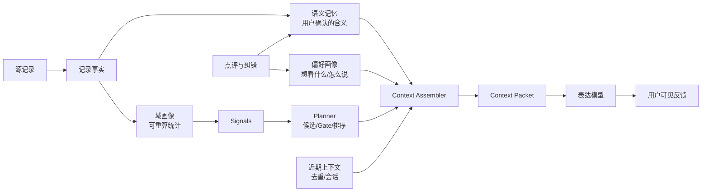

# Personal Context Architecture v0.1

> 状态：Phase 1 owner-only 生产闭环；v2 首候选正式 delivery 本地回归中
> 范围：个人上下文、域画像、Planner、陪伴表达之间的职责与数据契约
> 本文是实现约束与评审基线；生产部署、迁移执行和 TestFlight 仍需单独授权

截至 2026-08-08，owner-only `record_detail` 已完成生产 Canary 的 `GET -> 可见 ACK -> 点评` 基础闭环。本地分支已升级到 `context-packet-v2` 与 `expression-shadow-auto-v0.6`：插入前 Planner 只读选角度，一次 Voice 负责表达，落库后同一正式候选以 `companion_message` 或 `feedback_card` 作为 presentation target 创建快照；只有真实容器进入视口后才 ACK 和计曝光。该版本尚未部署，六域共享框架已接通，候选完整度仍需继续用真实样本验证。

## 1. 目标

芥子的价值不是把记录重新复述一遍，而是让用户逐渐感受到：系统既能准确理解当前记录，也能理解这条记录对这个用户的特殊含义。

因此，系统需要同时满足两件事：

1. **事实可靠**：金额、时间、商户、域、历史统计和比较口径只能来自代码可追溯的数据。
2. **理解有连续性**：用户纠正过的商户含义、人物关系、表达偏好和长期目标可以被保留，并在相关场景发挥作用。

核心原则仍然是：**代码负责算，大模型负责说。**

## 1.1 已确认的产品方向

- Personal Context 是覆盖所有域的基础框架，不按消费域做一次性特例；
- 用户可以查看芥子当前已经确认的理解，但不能直接编辑记忆内容；
- 用户可以删除某条理解，删除只针对芥子的理解，不删除原始记录；
- 用户明确确认或纠正的语义可以在匹配当前实体时进入陪伴表达；
- 未确认的系统推断只能影响候选排序、观察优先级或后续取证，不能直接对用户陈述；
- 各域可以分批补齐画像字段和候选规则，但必须消费同一套上下文、权威和生命周期契约。

## 1.2 范围与非目标

### 本架构覆盖

- 六个域（expense、sleep、food、sport、reading、wallet）的上下文组装；收入记录作为财务事实进入 expense/wallet 相关上下文，但不额外制造第七套 Memory 规则；
- 事实、候选、语义记忆、偏好和近期表达历史的边界；
- 记忆查看、删除、失效、冲突和回滚规则；
- 模型输入最小化、数字来源约束和全域契约测试。

### 本架构暂不覆盖

- 重新设计各域的原始识别字段；
- 让模型负责计算统计、时间窗口、金额或因果；
- 立即建立知识图谱或一张巨型个人画像 JSON；
- 通过用户手工编辑记忆来修正系统，修正入口采用删除和新的明确反馈；
- 本轮生产迁移、部署和 TestFlight 发布。

## 2. 当前系统盘点

当前仓库已经具备大部分骨架，不应重新建设同名系统：

| 现有模块 | 职责 | 当前边界 |
| --- | --- | --- |
| `transactions` / `income_records` / `data_records` | 原始记录真相 | 最终事实来源 |
| `user_domain_profiles` | 各域可重算的统计投影 | 由 rebuild 函数计算，不应被模型反向修改 |
| `signals.ts` | 当前记录 + 域画像 → 可验证信号 | 生成带口径、数字和来源的事实 |
| Expression Planner | 候选生成、Gate、评分、Surface 组合 | 当前主要处于 Shadow/owner-only 路径，不能假设已全面接管用户可见内容 |
| `user_configs` | 人格、语气、表达样式和自定义设置 | 属于偏好/设置，不是生活事实 |
| `user_companion_memories` | 语义记忆与自动模式混合存储 | 需要收敛读取和写入边界 |
| `get_companion_context` | 聚合设置、短期统计、近期文案和长期记忆 | 旧的混合上下文入口，必须逐步退役 |

`user_domain_profiles` 的 schema 约定已经明确：画像是投影，不是数据源；增量刷新和夜间回填共用 rebuild 逻辑。Personal Context 不替代这套设计，而是在它之上提供有类型的上下文协调。

### 2.1 权威来源矩阵

| 信息类型 | 唯一权威来源 | 允许谁改变 | 模型是否可自行推导 |
| --- | --- | --- | --- |
| 当前记录字段 | 对应源记录/识别结果 | 识别与用户补全流程 | 否 |
| 历史次数、金额、基线、趋势 | 域画像和候选事实 | rebuild、候选代码 | 否 |
| 候选是否值得展示 | Planner Gate、评分和 Surface 规则 | 规则与学习策略 | 否 |
| 商户/人物/目标的用户语义 | 已确认语义记忆 | 用户明确反馈或新版本替代 | 否，只有匹配后可转述 |
| 语气、人格、长度、禁用表达 | `user_configs` 与偏好画像 | 用户设置、结构化点评学习 | 否 |
| 最近说过的句式和候选 | 近期表达上下文 | 展示事件流水 | 否 |

若同一信息同时出现在多个来源，Context Assembler 必须按此矩阵选择权威来源，不允许“最后加载的值覆盖前面的值”。

## 3. 目标架构



Personal Context 是一个**协调层**，不是一张新的巨型画像表。它由以下四类信息组成：

### 3.1 域画像 Domain Profile

回答“客观上发生了什么”。例如：本自然周商户次数、近 90 天中位数、睡眠基线、阅读连续天数。

要求：

- 可由源记录重建；
- 明确时区、窗口和是否包含当前记录；
- 每个字段必须有消费它的信号或候选规则；
- 不直接作为自由文本 Memory 注入模型。

### 3.2 语义记忆 Semantic Memory

回答“这件事对这个用户意味着什么”。例如：

- 用户确认某商户是模型 API 中转站；
- 用户说明某个名字对应家人或朋友；
- 用户纠正系统对某条记录的解释；
- 用户明确表达某个长期目标或场景。

它不能承载可从交易或数据记录重算的统计数字。

用户可以在“芥子对我的理解”页面查看已生效的语义记忆，但不能直接编辑内容。用户可以删除某条理解；删除只移除这条语义记忆及其检索索引，不删除原始交易、截图或数据记录。删除后的记忆不得再次进入 Context Packet；如果未来从源记录或用户明确说明重新形成新的理解，应建立新的记忆版本，而不是恢复旧内容。

### 3.3 偏好画像 Preference Profile

回答“用户想看什么、希望怎么说”。例如：

- 更关注当前记录本身；
- 不喜欢说教或泛泛鼓励；
- 对周期比较、商户重复、消费节奏的偏好；
- 某个域适合详情展示，不适合快捷通知。

人格是表达策略，不能改变事实、候选资格或统计口径。

### 3.4 近期上下文 Recent Context

回答“最近已经说过什么”。它只用于句式去重、连续表达和会话体验，不能升级为长期事实，也不能替代语义记忆。

### 3.5 用户理解面

“芥子对我的理解”是透明度和控制入口，不是编辑器：

- 展示理解内容、适用对象/域、来源类型和最近验证时间；
- 不提供直接改写入口，避免用户修改后破坏证据链；
- 提供删除操作，并明确删除的是“芥子的理解”，不是原始记录；
- 删除后立即从所有域和所有 Surface 的检索结果中消失；
- 空状态、删除中、删除成功和删除失败都必须有明确反馈。

## 4. Memory 分类与迁移规则

旧 `get_companion_context` 中的内容按以下规则处理：

| 旧内容 | 目标归属 | 处理 |
| --- | --- | --- |
| `today_spend`、`week_spend`、`frequent_merchants_30d` | 域画像/事实注册表 | 移出 Memory 上下文 |
| `sport_this_week`、`last_sleep`、`food_this_week` | 对应域画像 | 由域规则统一计算 |
| `recent_companions` | 近期上下文 | 只用于去重，设置短生命周期 |
| 用户确认的商户含义、人物关系、纠错 | 语义记忆 | 保留，优先级最高 |
| `tone_preference`、`avoidance` | 偏好画像 | 与生活事实分开读取 |
| 自动生成“用户会在 X 消费” | 派生模式 | 停止续写，逐步归档，不批量删除 |

迁移原则：**保留用户确认过的语义资产，停止把可重算统计写成 Memory。** 未确认的模型推断只能作为候选假设，不能直接进入用户可见断言。

## 5. 语义记忆的最小契约

当前表已有 `memory_key`、`memory_type`、`evidence_jsonb`、`confidence`、`weight`、`expires_at`、`source_table` 和 `source_id`。这些字段可以作为过渡数据源，但不能继续依赖隐含约定。

Context Assembler 读取时应把旧行标准化成以下逻辑字段：

```text
origin: user_explicit | record_derived | model_inferred
authority: confirmed | supported | hypothesis
scope: domain + entity key
state: hypothesis | confirmed | denied | superseded | expired | deleted
claimability: expressible | context_only | ranking_only
evidence: source records, feedback, or user statement
```

第一阶段可以在代码层完成标准化，不立即新增完整表结构。标准化结果必须保留原始 `memory_id`，并把无法确认的字段标记为 `unknown`，不能通过空值猜测为用户确认。

现有字段到逻辑字段的过渡映射：

| 逻辑字段 | 首选来源 | 缺失时的处理 |
| --- | --- | --- |
| `origin` | `evidence_jsonb.source`、`source_table` | 标记 `unknown`，不得升级为 `user_explicit` |
| `scope` | `memory_key`、`memory_type`、证据中的实体别名 | 无法解析实体时只能 `ranking_only` |
| `authority` | 用户明确反馈标记、可追溯证据和当前状态 | 默认最高只能 `hypothesis` |
| `state` | 未来的状态字段或删除/过期记录 | 旧行默认 `confirmed` 仅限明确用户来源，其余为 `hypothesis` |
| `claimability` | 显式策略映射 | 不允许仅由 `weight` 或 `confidence` 推断 |
| `evidence` | `source_table`、`source_id`、`evidence_jsonb` | 证据为空时不得直接表达 |

只有当用户纠错、冲突和版本替换真实发生后，再决定是否增加 `status`、记忆版本链和多证据表。这里的“暂不新增表结构”不等于“暂不定义契约”。

特别约束：

- `weight` 只用于排序，不能代表事实正确性；
- `confidence` 不能替代用户确认状态；
- `memory_type` 不能单独决定是否允许模型表达；
- 语义记忆与当前记录实体不匹配时，不得注入表达上下文。

### 5.1 用户可见记忆契约

用户理解页面只读取 `state=confirmed` 且未删除的语义记忆。每条可见项至少显示：

- 理解内容（使用用户能读懂的短句）；
- 对象或域（例如某商户、某本书、睡眠域）；
- 来源概括（用户确认、用户纠正或系统观察）；
- 最近验证时间；
- 删除入口。

页面不显示候选分数、内部置信度、原始 JSON、Prompt 或模型内部标签。删除操作需要确认，成功后必须使活跃检索、短期缓存、待发送 Packet 和未来 Surface 读取全部失效。删除语义记忆不会删除源记录，也不会自动删除已经生成并持久化的历史文案；历史文案只在重新生成时遵守删除结果。

## 6. Context Packet 契约

模型每次只接收一个经过筛选的 Context Packet，不接收原始 `get_companion_context` JSON：

```text
record_facts:
  当前记录字段、记录时间、域、识别置信度

selected_candidates:
  Planner 选中的候选事实、数字、时间口径、证据来源、Surface

semantic_context:
  与当前实体直接相关的少量语义记忆及其 claimability

expression_preferences:
  人格、长度、语气、禁用表达、用户偏好的分析角度

recent_expression_context:
  最近已展示的候选/句式指纹，仅用于避免重复
```

模型不得从 `semantic_context` 重新计算次数、金额、趋势或因果；统计表达必须来自 `selected_candidates`。如果没有合格候选，模型只能围绕当前记录事实表达，不能用旧 Memory 凑内容。

### 6.1 Context Packet 的字段约束

| 字段 | 必填 | 内容边界 | 最大规模 |
| --- | --- | --- | --- |
| `packet_version` | 是 | 契约版本，例如 `context-packet-v2` | 1 个 |
| `record_facts` | 是 | 当前记录已确认字段、事件时间、域、识别状态 | 当前记录 1 条 |
| `selected_candidates` | 否 | Planner 已选事实、数字、口径、证据和 Surface | 单次 Packet 总计最多 2 条；当前 Voice 只接收 1 条主候选 |
| `semantic_context` | 否 | 当前实体匹配且有权使用的语义记忆 | 最多 3 条 |
| `expression_preferences` | 是 | 人格、风格、长度、禁区和当前 Surface | 只传当前 Surface 所需字段 |
| `recent_expression_context` | 否 | 最近展示的候选指纹和短句指纹 | 最近 5 条或 7 天内，以较小者为准 |
| `trace` | 是 | 来源域、候选类型、Memory ID、计算时间和内容指纹 | 不向用户展示 |

Packet 生成失败或 Planner 没有合格候选时，`trace.fallback_reason` 必须记录稳定原因，并退回当前记录/规则表达；不能把原始 Memory JSON 作为备用输入。v2 已把候选 `semantic_key`、来源、Surface、Planner 版本以及 `number_facts.role=count|measure` 纳入同步内容指纹；时间戳只放在 trace，不参与指纹。

### 6.2 候选与语义记忆的组合规则

1. `record_facts` 是当前记录的唯一主体；
2. `selected_candidates` 决定可以说哪些统计事实；
3. `semantic_context` 只补充用户语义，不新增统计事实；
4. `expression_preferences` 只改变说法，不改变事实和候选选择；
5. `recent_expression_context` 只用于去重，不得形成新的事实；
6. 候选和记忆冲突时，候选事实和源记录优先，冲突进入质量日志；
7. 任何缺少来源、范围或有效状态的信息都不得进入 `expressible`。

### 6.3 一次表达调用的边界

所有上下文筛选、事实计算、候选选择和记忆匹配在模型调用前完成。表达模型只接收一个冻结的 Context Packet；调用中途不得追加另一份 Memory 或重新查询统计。需要换角度时，代码生成新的 Packet 和新的候选曝光，而不是让模型自行扩大上下文范围。

### 6.4 三个模型入口的替换矩阵

当前代码存在三个不同入口，不能用“表达模型”四个字笼统替代：

| 入口 | 当前职责 | Packet 改造后的职责 |
| --- | --- | --- |
| `buildPrompt` | 首轮视觉识别，同时可能返回临时 companion_message | 只接收图片、识别规则和运行时设置；不得接收历史统计或未经当前实体匹配的语义；其 companion_message 不是最终表达事实 |
| `buildVoicePrompt` | Signals 之后的二次表达 | 接收唯一冻结 Context Packet，允许自然转述 `selected_candidates` 和已授权 `semantic_context` |
| `buildFeedbackPrompt` | `VOICE_SIGNALS_ENABLED=false` 时的兼容 fallback | 只接收由代码构造的同一 Packet；旧开关关闭后逐步下线，不能恢复原始 Memory JSON 注入 |

识别调用和表达调用可以是同一次请求中的两次模型调用，但职责必须分开：第一次识别出当前事实，代码随后计算画像、信号、候选和语义匹配，第二次才表达。不存在“先把完整 Memory 交给视觉模型，让它自己判断”的兜底路径。

### 6.5 可见表达与候选 delivery

Voice 已经表达 Planner 首候选时，不应把该候选从学习闭环中删除。正确关系是“同一候选、不同承载位置”：

- `presentation_target=companion_message`：正文只出现在原 AI 陪伴容器，候选身份和点评控件复用同一 delivery；
- `presentation_target=feedback_card`：客户端渲染独立 Planner 卡片；
- 两种 target 都必须先创建只读 snapshot，真实容器进入视口后才 ACK 和写曝光；
- snapshot 必须冻结实际可见 payload、visible field paths、claim 指纹和文本指纹；
- coverage 只能把最终可见文案关联到正式首候选，不能用于选择第二候选，也不能直接计曝光；
- 记录、候选、持久文案或指纹变化时，旧 snapshot 失效并重新 GET，客户端不得继续复用 stale pending。

## 7. 写入与生命周期

语义记忆不能由每条记录自动升级。建议采用以下状态流转：

```text
候选假设 → 用户确认 → 生效
候选假设 → 用户否定 → 禁用
生效记忆 → 新纠正 → 被替代/建立新版本
生效记忆 → 超过有效期 → 过期
```

写入来源按可信度排序：

1. 用户明确说明或纠正；
2. 用户点评中明确确认的语义；
3. 有稳定证据支持的系统推断；
4. 单次模型猜测。

用户明确纠正或确认的语义记忆，在当前记录实体和作用范围匹配时，可以进入 `expressible`，由模型自然表达；但它仍不能改变当前记录字段，也不能生成统计数字或因果结论。

未确认的系统推断只能进入 `ranking_only`，最多影响候选排序和是否值得继续观察，不得出现在用户可见文案中。具有稳定记录证据但未获用户确认的内容，默认进入 `context_only`。单次模型猜测只能留在待验证区域。

语义记忆状态流转必须完整：

| 当前状态 | 可流转至 | 触发条件 | 终态 |
| --- | --- | --- | --- |
| `hypothesis` | `confirmed` / `denied` / `expired` | 用户确认、用户否定、超过有效期 | 否 |
| `confirmed` | `superseded` / `expired` / `deleted` | 新纠正、有效期结束、用户删除 | 否 |
| `denied` | `hypothesis` | 后续出现新的独立证据，重新等待确认 | 否 |
| `superseded` | `deleted` | 新版本已接替，用户删除旧版本 | 否 |
| `expired` | `hypothesis` / `deleted` | 新证据重新验证、用户删除 | 否 |
| `deleted` | 无 | 用户删除理解 | 是 |

用户不直接修改内容，但可以删除任何可见理解；删除不能把关联原始记录误删或回写。

### 7.1 记忆产生规则

| 触发来源 | 初始状态 | 默认权限 | 是否可直接表达 |
| --- | --- | --- | --- |
| 用户明确说明或纠正 | `confirmed` | `expressible`（需实体匹配） | 是 |
| 用户对语义候选明确确认 | `confirmed` | `expressible`（需实体匹配） | 是 |
| 多条记录支持的系统观察 | `hypothesis` | `context_only` 或 `ranking_only` | 否 |
| 单次模型猜测 | `hypothesis` | `ranking_only` | 否 |
| 统计聚合结果 | 不写入语义记忆 | 仅由域画像/候选使用 | 否 |

自动观察不能因为重复出现就自动升级为 `confirmed`。升级必须来自用户明确确认，或来自后续专门设计的反馈事件；普通的“没有点评”不算确认。

### 7.2 冲突处理

- 同一实体出现两条互相矛盾的 `confirmed` 记忆时，暂停两条记忆的直接表达，进入冲突队列；
- 新的用户纠正创建新版本，并将旧版本标记为 `superseded`，保留来源关系；
- 用户删除只删除被选中的理解，不自动删除冲突的原始记录；
- Planner 在冲突未解决时只能使用无争议的当前记录事实。

## 8. 实施阶段

### 阶段零：已知断裂点止血

在 Context Packet 完整接入之前，先完成两个不依赖数据库迁移的安全修复：

- Voice Prompt 与 Signals 铁律统一：允许引用信号事实，禁止自行计算和改变时间口径；
- 数字校验和统计词校验按信号来源区分；有明确信号且数字/周期匹配时放行，无信号或口径不匹配时阻断。

阶段零必须与阶段一并验证，不能先切断旧 Memory 再把正确信号继续锁死，否则会产生“旧数据不见了、文案仍然变空”的中间坏状态。

### 阶段一：全域契约和观测

- 写 Context Packet 和 Memory 标准化读取器的测试样例；
- 统计线上 Memory 各类型、来源和实际消费情况；
- 确认哪些路径仍在读取 `short_term` 或原始 `long_term`。
- 为 expense、sleep、food、sport、reading、wallet 统一定义同一套输入、来源和表达权限；域特有字段由各域画像和候选规则补充。

产出：契约文档、分类清单、回归样本。

### 阶段二：全域切断混合上下文

- 停止把短期统计原样注入模型；
- 只注入与当前实体匹配的语义记忆和表达偏好；
- 保留旧字段读取作为兼容层，但不再把整个 JSON 传入 Prompt。
- 所有域统一通过 Context Packet 进入表达层；不能为消费域单独保留一条旧 Memory 通道。

产出：上下文来源单一、统计口径可追溯。

### 阶段三：全域语义记忆收敛

- 停止自动写入冗余商户/分类 Memory；
- 保留用户确认的语义资产；
- 增加否定、替代和过期的可审计状态；
- 在真实纠错数据增加后再决定是否拆分证据表。
- 消费、睡眠、饮食、运动、阅读和钱包共用来源、权限、删除和失效规则；各域只负责提供自己的语义实体和证据。

### 阶段三的迁移分类

旧 Memory 不直接全部转换为已确认画像，按以下分类处理：

| 分类 | 判断 | 迁移动作 |
| --- | --- | --- |
| 用户明确语义 | 有用户原文、纠正点评或人工确认来源 | 转为 `confirmed + expressible` |
| 可重算统计 | 金额、次数、排行、均值、中位数、窗口趋势 | 不迁移，删除读取路径，由域画像提供 |
| 自动记录模式 | 由单条记录生成“用户会在 X 消费”等句子 | 停止续写，保留兼容数据但标记 `record_derived` |
| 来源不明 | 无法判断来自用户还是系统 | 暂不表达，进入人工/规则核验队列 |
| 用户否定或已删除 | 明确表示错误或主动删除 | 标记 `denied/deleted`，阻断未来召回 |

### 阶段四：全域表达和学习接入

- Planner 选择候选，偏好画像影响排序，不得改写事实；
- 继续保留规则兜底和 Shadow 对照，直到线上闭环稳定。
- 所有域都必须验证“代码事实可追溯、模型只表达已选事实、反馈能回到候选/表达偏好”这条闭环。

## 9. 暂不做的事情

- 不新建一张巨型 `personal_profile` JSON 表；
- 不把所有自动推断升级为长期记忆；
- 不让 Memory 产生金额、次数、周期或因果结论；
- 不在没有回归样本和线上观测的情况下批量删除旧记忆；
- 不把 Planner 的 Shadow 结果直接当作已经完成的表达闭环。

## 10. 已确认的产品决策

1. 用户明确纠正或确认的语义记忆，在实体和作用范围匹配时允许直接进入陪伴文案；仍不得改变记录字段或生成统计结论。
2. 未确认的系统推断只能影响候选排序、观察优先级或是否继续收集证据，不得直接出现在用户可见文案中。
3. 用户可以查看“芥子对我的理解”，但不能直接编辑；可以删除。删除理解不删除原始记录，并立即阻断后续检索。
4. 这是全域基础框架，不是消费域试点。六个域共用 Context Packet、来源权威、状态生命周期和删除规则；各域画像与候选能力可以分批完善，但不能有不同的 Memory 读取原则。

## 11. 复审验收标准

架构进入代码阶段前，至少满足以下条件：

- 同一条统计事实只有一个代码权威来源，Memory 不再提供统计数字；
- 用户确认的语义记忆可追溯到来源，并能按实体/域匹配；
- 未确认推断在所有域、所有 Surface 均不能进入用户可见表达；
- 用户删除理解后，记录详情、通知、AI 卡片和周报均不再读取该记忆；
- `hypothesis`、`confirmed`、`denied`、`superseded`、`expired`、`deleted` 每个状态都有合法出口；
- 无候选、候选失效、记忆冲突、删除失败和模型表达违规都有规则兜底；
- expense、sleep、food、sport、reading、wallet 至少各有一条契约测试，验证同一套 Context Packet 边界。

## 12. 多角色复审结论

### 总体判定

**有条件通过，允许进入契约设计和测试准备，不允许直接改线上读取链路。**

核心架构方向成立，但必须先完成 Context Packet、记忆删除和全域验收契约，再进入实现。

### 产品视角

- 用户价值清晰：从“记录是什么”扩展到“这条记录对我意味着什么”；
- “可查看、可删除、不可编辑”形成了可信的个人理解边界；
- 需要在后续产品稿中补充成功指标：当前记录相关性、语义记忆删除后的不再召回率、重复表达率和用户纠错率。

### 研发视角

- 可复用现有域画像、Signals、Planner 和 `user_configs`，不新建平行事实系统；
- Context Packet 仍需在实现前确定必填字段、最大条数、来源标识和无候选时的空值行为；
- 删除语义记忆必须同时清理检索索引、缓存和各 Surface 的上下文快照，但不能删除源记录；
- 旧 `get_companion_context` 保留兼容读取期间，必须有明确的下线开关和回滚路径。

### 测试视角

- 状态机已覆盖 `hypothesis → confirmed/denied/expired`、`confirmed → superseded/expired/deleted` 和删除终态；
- 还必须覆盖实体不匹配、记忆冲突、删除后缓存命中、模型表达违规、候选失效和六域空画像；
- 每个域至少一条正例和一条拒绝例，证明未确认推断不会进入用户可见表达。

### UI/UX 视角

- “芥子对我的理解”应是浏览和删除页面，不做编辑表单；
- 每条理解显示对象、来源概括、最近验证时间和删除入口；
- 删除需要明确确认，并提供成功/失败反馈；空状态要说明“当前没有已确认的理解”，不能伪造画像内容。

### 运营视角

- 首次切换 Context Packet 后需要保留旧链路 Shadow 对照；
- 记录 Packet 版本、记忆命中数、候选命中数、表达兜底率、数字校验失败率和删除后的再召回率；
- 必须具备按用户和按域关闭语义记忆注入的开关，便于回滚。

### 隐私与合规视角

- 语义记忆属于个人画像数据，应沿用用户隔离、最小化传输和删除权原则；
- 发给模型的只能是当前场景所需的最小语义片段，不得传完整历史 Memory；
- 用户删除理解后，活跃存储、检索缓存和待发送上下文都必须失效；原始记录是否保留与“删除理解”是两个独立操作。

### 进入代码阶段的必要条件

1. Context Packet 的字段、来源和空值规则确定；
2. 记忆删除的存储、缓存和 Surface 失效规则确定；
3. 六域统一契约测试样例确定；
4. 旧链路 Shadow、回滚开关和观测指标确定。

## 13. 全域适配约定

框架层一次建设，域层按适配器接入。每个域适配器必须提供以下四类输出：

| 输出 | 说明 |
| --- | --- |
| `record_facts` | 当前域已经识别并通过字段校验的字段 |
| `profile_facts` | 当前域画像中的可追溯统计，包含窗口和样本数 |
| `candidate_facts` | 当前域可供 Planner 选择的候选事实 |
| `semantic_entities` | 当前记录可匹配的商户、人物、书籍、运动类型等实体 |

域适配器不得自行把统计写入语义记忆，也不得绕过 Context Assembler 直接拼接 Prompt。不同域的差异只体现在字段、候选和实体匹配规则，不体现在权威、删除和表达权限上。

最低接入要求：

- expense：商户、分类、时间、金额和账户语义；
- wallet：收入来源、账户、快照和负债语义；收入记录的来源字段由财务事实适配器提供；
- sleep：睡眠事件日期、时长、评分和睡眠习惯语义；
- food：餐次、食物实体、营养字段和饮食偏好语义；
- sport：运动类型、时长、距离、配速和目标语义；
- reading：书籍、章节/页码、摘录内容和阅读目标语义。

缺少某个域的画像字段时，仍必须生成只依赖当前记录的 `record_facts`，不能因为没有历史画像就调用旧 Memory 兜底。

## 14. 观测、灰度与回滚

### 14.1 必须记录的内部指标

- `context_packet_version` 与 `memory_schema_version`；
- 当前记录域、候选 ID、候选来源、候选口径和 `planner_version`；
- `packet_fingerprint`、`coverage_version`、`expressed_semantic_key(s)`、`claim_fingerprint`、`presentation_target`、`rendered_text_fingerprint` 与 `source_surface`；
- 插入前 synthetic 候选只用稳定 `semantic_key` 与落库后计划关联，不以会变化的 `candidate_id` 关联；正式曝光仍记录真实候选 ID；
- 语义记忆命中数、被过滤数及过滤原因；
- 模型表达成功率、规则兜底率、数字校验失败率；
- 用户纠错率、候选价值正负反馈和表达风格反馈；
- 删除后再次命中的次数；该指标必须为 0；
- 旧链路与新 Packet 的内容差异摘要，不记录完整敏感 Prompt。

### 14.2 灰度顺序

1. 离线契约样本：六域正例、拒绝例、冲突例和删除例；
2. Shadow：新旧上下文并行计算，但只展示旧链路，比较事实和候选差异；
3. 单用户 canary：只对当前用户启用新 Packet，保留回滚开关；
4. 稳定后扩大 Surface，最后才下线旧 `get_companion_context` 的统计注入。

### 14.3 回滚条件

出现以下任一情况，立即关闭语义记忆注入并退回规则/事实表达：

- 统计数字来源无法追溯；
- 用户已删除的记忆再次进入 Packet；
- 未确认推断进入用户可见文案；
- 任一域的事实字段被语义记忆覆盖；
- 兜底率或数字校验失败率显著高于旧链路。

## 15. 契约测试矩阵

每个域至少覆盖下列用例，测试实现可以复用同一个 Packet 验证器：

| 场景 | 预期 |
| --- | --- |
| 当前记录有完整事实和候选 | Packet 包含当前事实和已选候选，模型不得新增统计 |
| 只有当前事实、无历史画像 | 只允许事实表达，不读取旧统计 Memory |
| 命中已确认语义记忆 | 允许表达语义，但不改变识别字段 |
| 命中未确认推断 | 只能影响排序，不进入表达 Packet 的 `expressible` |
| 实体不匹配 | 语义记忆不注入 |
| 两条语义互相冲突 | 两条均不可直接表达，记录冲突日志 |
| 用户删除语义 | 所有未来 Packet 均不命中，源记录保持不变 |
| 候选失效或模型违规 | 退回规则事实表达，并保留失败原因 |
| 重试、编辑或补全记录 | 重新计算记录指纹、候选依赖和语义匹配 |

六个域都必须至少有一组上述用例；不能只用 expense 域证明框架正确。

## 16. 开发前冻结清单（历史门槛）

以下事项完成后，文档才进入“可开发”状态：

- [x] 确定 Context Packet v2 的字段名、版本、空值和 `fallback_reason` 规则；
- [x] 确定旧 Memory 行的标准化映射和未知来源处理；
- [x] 确定查看/删除页面的接口行为和删除后的缓存失效范围；
- [x] 确定候选、语义记忆、偏好、近期上下文和表达来源日志字段；
- [ ] 补齐六个域的全部候选质量样本；共享契约与基础正反例已具备，真实覆盖仍在积累；
- [x] 确定 Shadow、owner-only canary、回滚开关和上线门槛；
- [x] 通过架构与代码复审，模型调用统一经过 Context Assembler；coverage 不信任模型声明，只有最终可见陪伴语通过候选事实、claim 与文本指纹校验时成立。
