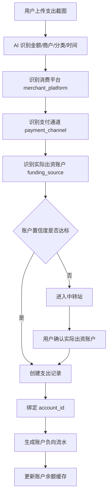
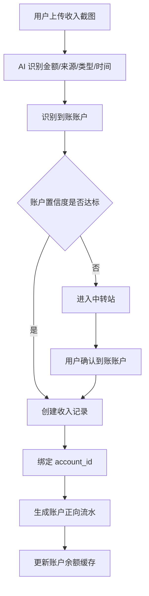
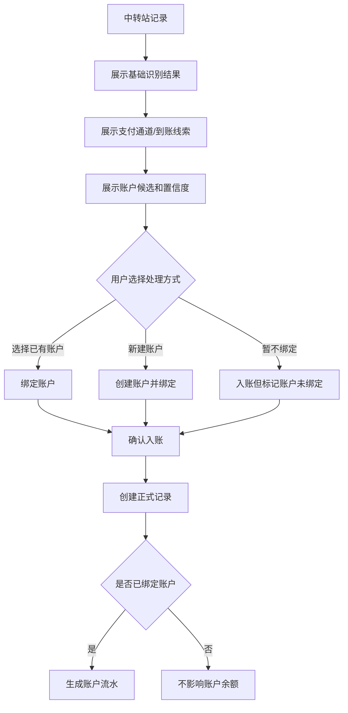
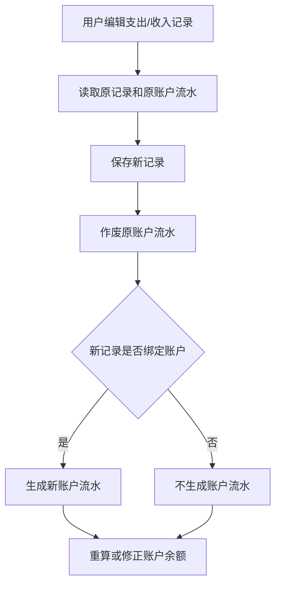
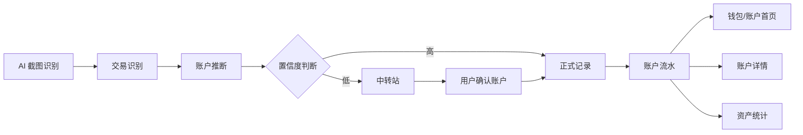
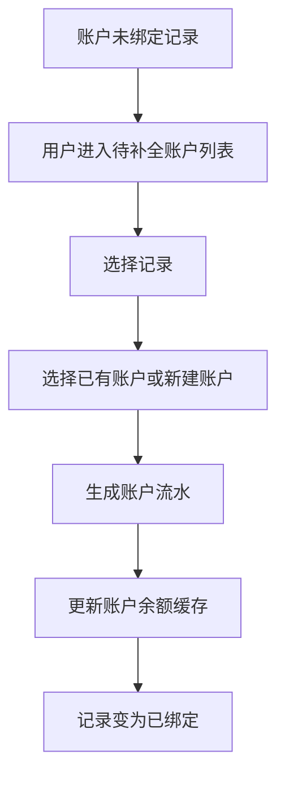

# SnapCount 钱包账户绑定能力 PRD V0.2

## 版本记录

| 版本 | 日期 | 作者 | 说明 |
|---|---|---|---|
| V0.2 | 2026-05-28 | Cascade | 补充状态机、余额一致性、幂等事务、存量数据兼容、AI 纠错记忆、多设备写竞争、PII 脱敏 |
| V0.1 | 2026-05-27 | Cascade | 初版，定义钱包账户绑定、支付通道与实际出资账户分离、中转站确认、账户流水模型 |

---

# 一、概述

## 1.1 产品概述及目标

### 1.1.1 背景介绍

SnapCount 当前已经具备截图识别、AI 自动记账、中转站确认、支出记录、收入记录、通用数据域记录、详情编辑等能力。现阶段财务记录更多停留在“流水记录”层面，即记录了消费或收入事件，但尚未和真实账户余额形成强绑定。

典型问题包括：

- 微信支付截图被识别为“微信支付”，但真实扣款账户可能是银行卡或信用卡。
- 工资到账后，收入记录存在，但银行卡余额没有对应增加。
- 支付宝、微信、美团等平台可能只是支付通道，不一定是实际资金来源。
- 用户无法从“钱包视角”查看某个账户的资金流入、流出和余额变化原因。
- 后续如果要实现账户转账、信用卡、花呗、白条、余额校准等能力，当前模型不足以支撑。

因此需要将钱包域升级为“账户域”，并让账户与支出、收入、中转站确认流程建立绑定关系。

### 1.1.2 产品概述

钱包账户绑定能力用于将支出、收入、转账等财务行为与真实账户进行关联。系统需要优先通过 AI、规则和历史习惯自动识别账户；当账户识别置信度不足、存在多个候选或无法判断实际资金来源时，记录进入中转站，由用户完成账户确认。

本功能的关键原则是：

> 支付通道不等于实际出资账户。账户余额只跟实际出资账户变化，不跟支付平台或截图来源直接绑定。

### 1.1.3 产品目标

#### 业务目标

- 建立 SnapCount 的账户资产基础模型。
- 支持支出、收入和账户之间的自动绑定。
- 支持低置信度账户识别进入中转站确认。
- 支持账户流水追踪，为余额、资产趋势、转账能力打基础。
- 降低用户手动录入成本，保持 SnapCount 自动记账体验。

#### 用户目标

- 用户截图记账后，通常不需要手动选择账户。
- 用户可以知道每笔支出实际从哪个账户扣款。
- 用户可以知道每笔收入实际进入哪个账户。
- 用户可以查看每个账户的余额变化和来源流水。
- 当系统无法确认账户时，用户可以在中转站集中处理。

### 1.1.4 目标用户

- SnapCount 当前个人用户。
- 有多个支付工具、银行卡、信用卡或钱包账户的用户。
- 希望了解真实账户余额变化，而不仅是消费分类统计的用户。

## 1.2 名词说明

| 名词 | 说明 | 示例 |
|---|---|---|
| 钱包/账户 | 用户真实资金或负债账户 | 微信零钱、支付宝余额、招商银行卡、信用卡、现金 |
| 支付通道 | 完成支付动作的平台或工具 | 微信、支付宝、银联、京东支付 |
| 消费平台 | 发生消费的业务平台或商户平台 | 美团、淘宝、京东、线下门店 |
| 实际出资账户 | 钱真实流出的账户 | 招商银行储蓄卡、微信零钱、信用卡 |
| 到账账户 | 收入真实进入的账户 | 工资卡、支付宝余额 |
| 账户流水 | 账户余额变化记录 | 微信零钱支出 25 元、工资卡收入 10000 元 |
| 中转站 | 低置信度或需人工确认的记录暂存区 | 账户无法识别时进入中转站 |
| 账户置信度 | 系统判断账户是否可靠的评分 | 0.91 |
| 资金来源推断 | AI/规则对实际出资账户的识别结果 | 招商银行储蓄卡尾号 1234 |

## 1.3 角色及权限

| 角色 | 权限 |
|---|---|
| 个人用户 | 查看、创建、编辑、归档账户；确认中转站账户；查看账户流水；校准余额 |
| 系统/AI | 根据截图和规则推断支付通道、消费平台、实际出资账户、到账账户和置信度 |

[假设] 当前阶段仍为个人单用户工具，不涉及多用户权限隔离。未来商业化或多用户化时，需要结合用户账号和 RLS 重新设计账户隔离。

## 1.4 文档阅读对象

- 产品设计人员
- 前端开发人员
- 后端/数据库开发人员
- AI Prompt/识别逻辑维护人员
- 测试人员

---

# 二、产品描述

## 2.1 产品需求描述

本需求将钱包域从普通数据域升级为账户资产域。系统需要支持账户管理、账户自动绑定、账户识别置信度判断、中转站账户确认、账户流水生成、账户余额追踪、记录编辑删除后的账户流水同步。

核心要求：

1. 支出记录必须区分“支付通道”和“实际出资账户”。
2. 收入记录必须区分“收入来源”和“到账账户”。
3. 当 AI 仅能识别微信/支付宝等支付通道，但无法识别实际扣款账户时，不得默认绑定微信/支付宝余额。
4. 只有明确识别到扣款账户、历史规则高置信命中或用户配置默认策略时，才允许自动绑定账户。
5. 低置信度账户识别进入中转站，由用户确认账户。
6. 支出、收入、转账、余额校准都需要生成账户流水，确保余额变化可追溯。

## 2.2 产品整体流程

### 2.2.1 支出账户绑定主流程



### 2.2.2 收入账户绑定主流程



### 2.2.3 中转站账户确认流程



### 2.2.4 记录编辑与账户流水同步流程



## 2.3 全局说明

### 2.3.1 支付通道与实际出资账户分离

支出记录中必须至少支持以下概念：

| 概念 | 字段建议 | 示例 |
|---|---|---|
| 消费平台 | `merchant_platform` | 美团、淘宝、线下门店 |
| 支付通道 | `payment_channel` | 微信、支付宝、银联 |
| 实际出资账户 | `account_id` | 招商银行储蓄卡、微信零钱 |
| 资金来源文本 | `funding_source_label` | 招商银行储蓄卡(1234) |

禁止规则：

- 禁止看到微信页面就默认扣微信零钱。
- 禁止看到支付宝页面就默认扣支付宝余额。
- 禁止将消费平台等同于支付通道。
- 禁止将支付通道等同于实际出资账户。

允许规则：

- 截图明确出现“零钱”时，可绑定微信零钱。
- 截图明确出现“支付宝余额”时，可绑定支付宝余额。
- 截图明确出现银行卡名称和尾号时，可匹配对应银行卡。
- 截图明确出现信用卡、花呗、白条时，可绑定对应负债账户。

### 2.3.2 置信度阈值

[假设] 第一版默认阈值：

| 置信度 | 处理方式 |
|---:|---|
| `>= 0.80` | 自动绑定账户并正式入账 |
| `0.50 - 0.79` | 进入中转站，展示推荐账户 |
| `< 0.50` | 进入中转站，不默认推荐或仅展示弱候选 |

### 2.3.3 账户未绑定处理

[假设] 第一版允许“暂不绑定账户”。

规则：

- 记录可以正式入账。
- `account_id` 为空。
- 不生成账户流水。
- 不影响任何账户余额。
- 详情页显示“账户未绑定”。
- 后续可在账户补全入口中处理。

### 2.3.4 账户归档规则

- 账户归档后不再作为默认候选。
- 账户归档后不参与普通新记录自动绑定。
- 历史记录和历史账户流水仍显示该账户名称。
- 已归档账户可以恢复。

### 2.3.5 存量数据兼容规则

账户功能上线前已经存在的支出、收入记录属于存量数据。存量数据默认不强制回溯绑定账户，避免用不完整历史记录倒推出错误余额。

第一版存量兼容策略：

- 老支出和老收入默认显示为“账户未绑定”。
- 老记录不自动生成账户流水。
- 钱包账户余额以用户设置的初始余额 + 上线后的有效账户流水为准。
- 系统提供“账户未绑定记录”入口，允许用户按需补绑定。
- 用户补绑定老记录后，系统根据该记录生成对应账户流水，并影响账户余额。
- 不根据历史支出/收入自动倒推当前账户余额。
- 不将老记录强行归入“微信”“支付宝”等账户。

可选增强：

- 后续可提供“存量账户归算助手”，基于支付通道、资金来源文本、商户关键词生成候选账户。
- 存量归算助手只给推荐，不自动批量改账。
- 批量补绑定前必须展示影响账户余额的汇总结果，由用户确认。

### 2.3.6 余额一致性与权威来源

账户余额必须具备可追溯性。`accounts.current_balance` 是余额缓存字段，不是唯一权威来源。账户余额的权威来源是 `account_entries` 中 `is_voided = false` 的有效流水。

余额规则：

- 每次创建有效账户流水时，同步增量更新对应账户 `current_balance`。
- 每次作废账户流水时，同步反向修正对应账户 `current_balance`。
- 系统应提供基于有效流水重算 `current_balance` 的能力。
- 前端不得直接读出余额后自行计算并写回。
- 余额更新必须由后端或数据库 RPC 在事务中完成。
- 如果正式记录创建成功但账户流水或余额更新失败，本次操作整体视为失败，不能留下半完成状态。

### 2.3.7 幂等与事务要求

涉及正式入账、账户流水和余额变化的操作必须具备幂等性。

必须具备幂等保护的场景：

- 中转站确认入账。
- 用户重复点击确认按钮。
- 网络超时后用户重试。
- 快捷指令重复上传同一截图。
- 编辑记录时重复保存。
- 删除记录时重复触发。

建议幂等键：

```text
source_table + source_id + entry_type + account_id + is_voided=false
```

约束规则：

- 同一来源记录同一业务类型下，最多只能存在一组有效账户流水。
- 编辑记录时，必须先作废旧有效流水，再创建新有效流水。
- 如果操作重试命中已完成结果，应返回已有结果，不重复创建流水。
- 中转站确认应保证：正式记录创建、账户流水创建、余额更新、中转站状态更新四者要么全部成功，要么全部不生效。

### 2.3.8 多设备与多入口写竞争策略

SnapCount 存在 PWA、网页端、iOS 快捷指令等多入口。账户余额不能依赖客户端本地缓存累加。

多设备规则：

- 每次进入钱包页或账户详情页，应从服务端拉取最新账户余额和最近流水。
- 客户端可以缓存余额用于展示，但不能把缓存余额作为写入依据。
- 离线状态下不支持直接修改账户余额；可暂存待上传截图或草稿。
- 所有账户余额变化由服务端事务或数据库原子操作完成。
- 并发写入同一账户时，数据库应通过事务、行级锁或原子更新避免余额覆盖。
- 若检测到账户余额缓存与流水汇总不一致，应触发余额重算或提示用户刷新。

### 2.3.9 AI 纠错记忆规则

AI 账户识别错误不可避免。系统应降低用户重复纠错成本，但第一版不强制上线完整规则管理系统。

第一版要求：

- 记录用户在中转站或详情页中对账户推断的修改行为。
- 在 `account_inference` 中保留 `corrected_from`、`corrected_to`、`corrected_at`、`correction_context`。
- 后续遇到相同资金来源文本、支付通道、账户尾号组合时，可提高正确账户的候选排序。
- 不在第一版自动生成不可见的强规则，避免错误规则长期污染。

后续增强：

- 支持用户确认“以后类似记录默认使用该账户”。
- 支持账户规则管理页。
- 支持规则撤销、禁用、优先级调整。

### 2.3.10 现有“钱包与待还”截图识别升级规则

当前 SnapCount 已存在“钱包与待还”系统域，用于通过截图识别账户余额、花呗、白条、月付、信用卡待还等快照记录。该能力不废弃，但需要从“普通数据域快照”升级为账户体系的数据来源之一。

现有截图识别能力与新账户体系的关系：

- 余额截图、待还截图仍可被路由到 `wallet` 域。
- 原有 `cash_snapshot` 应映射为资产类账户快照，例如微信零钱、支付宝余额、银行卡余额、现金。
- 原有 `liability_snapshot` 应映射为负债类账户快照，例如花呗、白条、抖音月付、信用卡待还。
- 余额/待还截图默认只更新账户当前快照，不自动生成支出或收入记录。
- 如果截图同时包含交易行为和账户余额，应优先按交易记录处理，并把余额信息作为账户线索或辅助上下文。
- 现有钱包域列表可以继续展示，但钱包首页应逐步由“快照记录列表”升级为“账户资产列表 + 最近账户流水”。

迁移原则：

- 已有 `wallet` 域历史记录不强制迁移到账户表。
- 用户可以从历史钱包记录中手动创建或关联账户。
- 后续可提供“从钱包快照初始化账户”入口，例如从“兴业银行资产总览 2065.23 元”创建银行卡账户并设置初始余额。
- 待还类快照可用于初始化负债账户，但不会自动生成信用卡还款或消费流水。

AI 识别需要更新的字段：

| 现有含义 | 新账户体系字段 | 说明 |
|---|---|---|
| `account_name` | `account_name` / `institution` | 账户或机构名称 |
| `account_type` | `type` | 映射到账户类型枚举 |
| `record_kind = cash_snapshot` | `account_snapshot_kind = asset` | 资产类快照 |
| `record_kind = liability_snapshot` | `account_snapshot_kind = liability` | 负债类快照 |
| `amount` | `snapshot_balance` | 当前余额或当前待还 |
| `due_date` / `bill_day` | `due_date` / `bill_day` | 负债类账户还款信息 |

因此，截图识别账户功能需要对应更新，主要更新点是：AI 输出字段、钱包域前端展示、账户初始化入口、以及后端将钱包快照与 `accounts` 关联的能力。PRD V0.2 已覆盖账户推断方向，但本节明确当前已有截图钱包域的兼容关系。

## 2.4 产品版本规划

| 版本 | 范围 | 目标 |
|---|---|---|
| V1 | 账户表、最小账户流水、支出/收入账户绑定、中转站账户确认、余额缓存更新 | 建立可信账户绑定闭环 |
| V2 | 账户未绑定补全、存量账户归算助手、余额重算工具 | 提升历史数据兼容与纠错能力 |
| V3 | 转账、信用卡还款、余额校准 | 支持真实资产流动 |
| V4 | 智能规则、历史习惯学习、账户规则管理 | 减少中转站打扰 |

[结论] V1 必须包含 `account_entries` 的最小实现。只做 `account_id` 绑定但不做账户流水，会导致余额不可审计，后续编辑、删除、补绑定都难以保证账实一致。

## 2.5 产品框架



## 2.6 功能清单

| 模块 | 功能 | 优先级 | 说明 |
|---|---|---|---|
| 账户管理 | 创建账户 | P0 | 支持微信、支付宝、银行卡、信用卡、现金等 |
| 账户管理 | 编辑账户 | P0 | 修改名称、类型、余额、默认规则 |
| 账户管理 | 归档账户 | P1 | 历史保留，新记录不再候选 |
| AI 识别 | 支付通道识别 | P0 | 微信/支付宝/银行 App 等 |
| AI 识别 | 实际出资账户识别 | P0 | 银行卡、零钱、余额、信用卡等 |
| 支出 | 绑定付款账户 | P0 | 高置信度自动绑定 |
| 收入 | 绑定到账账户 | P0 | 高置信度自动绑定 |
| 中转站 | 账户确认 | P0 | 低置信度人工确认 |
| 账户流水 | 创建流水 | P0 | 支出负向、收入正向 |
| 账户流水 | 作废流水 | P0 | 编辑/删除时处理 |
| 钱包页 | 账户列表 | P0 | 显示余额和最近变动 |
| 账户详情 | 流水列表 | P1 | 查看单账户变动原因 |
| 转账 | 账户间转账 | P2 | 不计入收入/支出 |
| 智能规则 | 历史确认规则沉淀 | P2 | 降低中转站频率 |

---

# 三、功能需求

## 3.1 账户管理

### 3.1.1 描述

用户可以管理自己的钱包/账户，包括微信、支付宝、现金、银行卡、信用卡、花呗、白条等。

### 3.1.2 用户故事

作为用户，我希望能维护自己的账户列表，以便系统将支出和收入自动关联到真实账户。

### 3.1.3 前置条件

- 用户已进入 SnapCount。
- 数据库中存在账户表。

### 3.1.4 后置条件

- 账户可被 AI/规则作为候选账户。
- 账户可被支出、收入和账户流水引用。

### 3.1.5 界面及交互

账户列表展示：

- 账户名称
- 账户类型
- 当前余额
- 今日流入
- 今日流出
- 最近一笔账户流水
- 是否默认支出账户
- 是否默认收入账户

账户创建/编辑字段：

| 字段 | 控件 | 必填 | 校验 |
|---|---|---|---|
| 账户名称 | 输入框 | 是 | 1-30 字 |
| 账户类型 | 单选/下拉 | 是 | 枚举值 |
| 初始余额 | 金额输入 | 否 | 可为 0，信用类账户可支持负债口径 |
| 银行名称 | 输入框 | 否 | 银行卡/信用卡建议填写 |
| 尾号 | 输入框 | 否 | 4 位数字 |
| 默认支出账户 | 开关 | 否 | 同一时间最多一个 |
| 默认收入账户 | 开关 | 否 | 同一时间最多一个 |

### 3.1.6 异常/分支流程

- 账户名称为空：提示“请输入账户名称”。
- 账户名称重复：允许但提示“存在同名账户，建议补充尾号或备注”。
- 删除账户：第一版不物理删除，只允许归档。
- 账户已有流水：禁止物理删除。

### 3.1.7 数据字典

见 4.4.1 `accounts` 表。

## 3.2 支出账户绑定

### 3.2.1 描述

系统在创建支出记录时，根据截图识别结果、规则和历史习惯自动判断实际出资账户。高置信度自动绑定，低置信度进入中转站。

### 3.2.2 用户故事

作为用户，我希望截图记账时系统自动判断钱从哪个账户扣除，以便我不用每次手动选择账户。

### 3.2.3 前置条件

- 系统存在至少一个可用账户。
- AI 已完成支出基础字段识别。

### 3.2.4 后置条件

- 高置信度记录生成正式支出记录和账户流水。
- 低置信度记录进入中转站。

### 3.2.5 业务流程

1. AI 识别金额、商户、时间、分类。
2. AI 识别消费平台，例如美团、淘宝、线下门店。
3. AI 识别支付通道，例如微信、支付宝、银行 App。
4. AI 识别实际出资账户，例如微信零钱、招商银行卡尾号 1234。
5. 系统根据账户列表进行匹配。
6. 如果置信度达标，自动创建支出记录并绑定账户。
7. 如果置信度不达标，进入中转站。

### 3.2.6 账户识别规则

自动绑定条件：

- 截图明确出现“零钱”“微信零钱”。
- 截图明确出现“支付宝余额”。
- 截图明确出现银行卡名称和尾号，且能匹配账户。
- 截图明确出现信用卡名称和尾号，且能匹配账户。
- 截图明确出现花呗、白条等资金来源，且对应账户存在。
- 历史规则命中且置信度达到阈值。

进入中转站条件：

- 只识别到微信/支付宝支付成功，未识别到实际扣款方式。
- 同时出现多个可能账户。
- 银行卡尾号不完整或无法匹配。
- 账户类型冲突。
- 置信度低于阈值。

### 3.2.7 账户匹配冲突优先级

当截图证据、用户纠错、历史规则、默认账户之间出现冲突时，按以下优先级处理：

| 优先级 | 来源 | 处理规则 |
|---:|---|---|
| 1 | 用户本次手动选择 | 最高优先级，直接以用户选择账户为准 |
| 2 | 截图明确资金来源 | 出现银行/余额/信用工具名称和尾号时优先使用截图证据 |
| 3 | 用户确认过的纠错记忆 | 与支付通道、尾号、机构匹配时提高候选排序 |
| 4 | 显式账户规则 | 用户主动创建的规则优先于系统历史推断 |
| 5 | 历史习惯推断 | 仅作为推荐，不覆盖明确截图证据 |
| 6 | 默认账户 | 仅在无明确资金来源且用户允许默认兜底时使用 |

冲突处理：

- 如果截图明确显示“招商银行尾号 1234”，但默认账户是微信零钱，应绑定招商银行卡或进入中转站，不得使用默认账户覆盖截图证据。
- 如果用户纠错记忆与本次截图明确证据冲突，以本次截图证据优先。
- 如果两个账户尾号相同且机构无法区分，必须进入中转站。
- 如果历史习惯与用户显式规则冲突，以用户显式规则优先。
- 如果任何自动规则置信度低于阈值，进入中转站。

### 3.2.8 数据字段

| 字段 | 类型 | 必填 | 说明 | 示例 |
|---|---|---:|---|---|
| `account_id` | uuid | 否 | 实际出资账户 | 招商银行卡 ID |
| `merchant_platform` | text | 否 | 消费平台 | 美团 |
| `payment_channel` | text | 否 | 支付通道 | 微信 |
| `funding_source_label` | text | 否 | 资金来源原文 | 招商银行储蓄卡(1234) |
| `account_confidence` | numeric | 否 | 账户置信度 | 0.91 |
| `account_inference` | jsonb | 否 | 推断详情 | JSON |

## 3.3 收入账户绑定

### 3.3.1 描述

系统在创建收入记录时，根据截图识别到账账户。高置信度自动绑定，低置信度进入中转站。

### 3.3.2 用户故事

作为用户，我希望收入记录能自动进入正确账户，以便我知道工资、退款、转账等真实到账位置。

### 3.3.3 业务流程

1. AI 识别收入金额、来源、到账时间。
2. AI 识别到账账户线索，例如银行卡名称、支付宝余额、微信零钱。
3. 系统匹配用户账户。
4. 高置信度自动创建收入记录和账户流水。
5. 低置信度进入中转站确认。

### 3.3.4 数据字段

| 字段 | 类型 | 必填 | 说明 |
|---|---|---:|---|
| `account_id` | uuid | 否 | 到账账户 |
| `receiving_source_label` | text | 否 | 到账账户原文 |
| `account_confidence` | numeric | 否 | 账户置信度 |
| `account_inference` | jsonb | 否 | 推断详情 |

## 3.4 中转站账户确认

### 3.4.1 描述

中转站需要承担账户确认职责。当 AI 无法可靠判断账户时，用户在中转站中完成账户选择、新建账户或暂不绑定。

### 3.4.2 用户故事

作为用户，我希望只有系统不确定时才让我确认账户，以便减少打扰，同时保证账户余额准确。

### 3.4.3 界面及交互

中转站卡片增加账户确认区：

- 支付通道：微信
- 实际出资账户：待确认
- AI 推荐账户：招商银行卡，置信度 62%
- 需要确认原因：截图仅显示微信支付成功，未显示实际扣款方式

用户操作：

- 选择已有账户
- 新建账户并绑定
- 暂不绑定账户
- 设为类似记录默认规则 [待确认是否第一版支持]

### 3.4.4 异常/分支流程

- 用户选择归档账户：默认不展示归档账户，可通过“显示归档账户”展开。
- 用户暂不绑定：正式入账但不生成账户流水。
- 用户新建账户失败：保留在中转站并提示失败原因。
- 网络异常：确认按钮恢复可点击，记录仍留在中转站。

## 3.5 账户流水

### 3.5.1 描述

账户流水记录每次账户余额变化，是余额可信和可追溯的基础。

### 3.5.2 用户故事

作为用户，我希望可以查看账户余额为什么变化，以便发现误记账或账户绑定错误。

### 3.5.3 流水生成规则

| 来源 | 流水方向 | 示例 |
|---|---|---|
| 支出 | out | 招商银行卡支出 25 元 |
| 收入 | in | 工资卡收入 10000 元 |
| 转账转出 | out | 微信转出 500 元 |
| 转账转入 | in | 银行卡转入 500 元 |
| 余额校准 | in/out | 余额校准 +20 元 |

### 3.5.4 编辑/删除规则

- 编辑记录时，原账户流水标记为作废，新建新流水。
- 删除记录时，对应账户流水标记为作废。
- 不建议物理删除账户流水。
- 余额可通过有效流水重算。

### 3.5.5 状态机

| 实体 | 当前状态 | 可流转至 | 触发操作 | 说明 |
|---|---|---|---|---|
| `accounts` | `active` | `archived` | 用户归档账户 | 不再参与新记录候选 |
| `accounts` | `archived` | `active` | 用户恢复账户 | 恢复后可重新参与候选 |
| `account_entries` | `active` | `voided` | 编辑/删除来源记录、余额重算纠错 | 作废后不再参与余额汇总 |
| `account_entries` | `voided` | 无 | 终态 | 作废流水不可恢复，只能新建替代流水 |
| `transactions` | `created_bound` | `edited_bound` | 修改金额、时间、账户 | 作废旧流水并创建新流水 |
| `transactions` | `created_bound` | `deleted` | 删除支出 | 作废关联有效流水 |
| `transactions` | `created_unbound` | `created_bound` | 用户补绑定账户 | 创建账户流水并更新余额 |
| `transactions` | `created_unbound` | `deleted` | 删除支出 | 无需作废账户流水 |
| `income_records` | `created_bound` | `edited_bound` | 修改金额、时间、账户 | 作废旧流水并创建新流水 |
| `income_records` | `created_unbound` | `created_bound` | 用户补绑定账户 | 创建账户流水并更新余额 |
| `staging_records` | `pending_review` | `confirming` | 用户点击确认 | 前端禁用重复提交 |
| `staging_records` | `confirming` | `confirmed_bound` | 正式记录、流水、余额均成功 | 移出中转站 |
| `staging_records` | `confirming` | `confirmed_unbound` | 用户选择暂不绑定且正式记录成功 | 移出中转站 |
| `staging_records` | `confirming` | `failed_retryable` | 网络错误、事务失败 | 保留中转站记录，可重试 |
| `staging_records` | `failed_retryable` | `pending_review` | 用户重新打开或点击重试 | 重新进入确认态 |

### 3.5.6 账户未绑定补全流程



补全规则：

- 补绑定只对 `account_id` 为空且未删除的支出/收入记录开放。
- 补绑定成功后应创建对应账户流水。
- 补绑定失败时，记录保持未绑定状态。
- 老记录补绑定会影响账户余额，因此确认前必须提示本次余额影响。

## 3.6 钱包账户首页

### 3.6.1 描述

钱包域首页展示账户资产概览，不再只是普通 domain 记录列表。

### 3.6.2 展示内容

- 总资产 [待确认信用卡负债是否纳入净资产]
- 账户列表
- 每个账户当前余额
- 今日流入
- 今日流出
- 最近账户流水
- 账户未绑定待处理数量

### 3.6.3 空状态

当没有账户时：

- 展示“还没有账户”
- 提供“创建微信/支付宝/现金账户”快捷入口
- 可一键初始化默认账户

---

# 四、非功能需求

## 4.1 安全与合规

- 账户数据属于个人敏感财务数据。
- 银行卡建议只存尾号，不存完整卡号。
- AI Prompt 不应要求用户提供完整银行卡号。
- 日志中不得输出完整账户识别原文中的敏感信息。
- 未来多用户版本必须启用按用户隔离的 RLS 策略。

### 4.1.1 AI 调用前 PII 脱敏规则

在调用 LLM 进行账户推断前，Edge Function 应对 OCR 文本和结构化字段执行最小必要原则处理。AI 只应接收完成交易识别和账户匹配所需的信息。

脱敏规则：

| 信息类型 | 处理规则 | 是否允许保留 |
|---|---|---|
| 完整银行卡号 | 仅保留后 4 位，其余替换为 `*` | 仅尾号 |
| 银行卡尾号 | 保留 | 是 |
| 手机号 | 中间 4 位脱敏 | 否，默认脱敏 |
| 身份证号 | 全量脱敏 | 否 |
| 支付协议号 | 全量脱敏或仅保留类型 | 否 |
| 订单号/流水号 | 默认脱敏，除非用于去重 | 部分场景可保留哈希 |
| 用户姓名 | 默认脱敏 | 否 |
| 商户名称 | 保留 | 是 |
| 金额、时间 | 保留 | 是 |
| 支付通道、资金来源文本 | 保留必要片段 | 是 |

日志规则：

- 不在普通运行日志中输出原始 OCR 全文。
- 不在错误日志中输出完整账户文本。
- 用于排查的敏感字段应哈希化或掩码化。
- 如需保存原始截图，应遵循现有存储权限和生命周期策略。

### 4.1.2 信用账户余额口径

[待确认] 第一版建议将信用卡、花呗、白条统一视为负债类账户。

建议口径：

- `credit_card`、`credit_line` 的 `current_balance` 表示当前欠款额，正数代表负债。
- `account_entries.direction` 表示账户余额方向，不表示消费/收入业务方向：`in` 表示该账户余额数值增加，`out` 表示该账户余额数值减少。
- 使用信用卡、花呗、白条消费时，因为负债账户欠款额增加，应生成 `entry_type = expense` 且 `direction = in` 的账户流水。
- 信用账户还款会让欠款额减少，应在 V3 转账/还款能力中生成负债账户 `direction = out` 的流水；如果同时从资产账户扣款，应通过同一组转账/还款流水关联两侧账户。
- 钱包总资产展示时，应区分“资产合计”“负债合计”“净资产”。
- 信用账户还款在 V3 转账/还款能力中正式处理。

## 4.2 统计需求

| 事件名 | 触发时机 | 参数 |
|---|---|---|
| `account_created` | 用户创建账户 | `account_type` |
| `account_archived` | 用户归档账户 | `account_type` |
| `account_auto_bound` | 系统自动绑定账户 | `record_type`, `confidence`, `source` |
| `account_review_required` | 记录进入中转站 | `record_type`, `reason`, `candidate_count` |
| `account_review_confirmed` | 用户确认账户 | `record_type`, `selected_account_type` |
| `account_unbound_confirmed` | 用户选择暂不绑定 | `record_type` |
| `account_entry_created` | 创建账户流水 | `entry_type`, `direction` |
| `account_entry_voided` | 作废账户流水 | `entry_type`, `reason` |
| `account_correction_recorded` | 用户修正 AI 推断账户 | `from_account_type`, `to_account_type`, `channel` |
| `account_balance_recalculated` | 用户或系统重算余额 | `account_type`, `diff_amount` |
| `account_pii_redacted` | AI 调用前执行脱敏 | `field_types`, `redaction_count` |

[待确认] 当前项目是否已有统一埋点体系；如果没有，第一版可先不接第三方埋点，仅保留事件定义。

## 4.3 性能需求

- 账户列表加载目标：本地网络正常时 1 秒内完成。
- 中转站确认账户后，正式入账和账户流水生成应在一次用户操作内完成。
- 账户余额重算应避免每次全表扫描，可使用余额缓存加流水校验。
- 单账户流水列表需要分页或按时间范围加载。
- 钱包页和账户详情页应支持下拉刷新或重新拉取服务端最新余额。
- 中转站确认按钮点击后应立即进入 loading/禁用状态，避免重复提交。

## 4.4 数据库设计

### 4.4.1 `accounts`

| 字段 | 类型 | 必填 | 说明 |
|---|---|---:|---|
| `id` | uuid | 是 | 主键 |
| `name` | text | 是 | 账户名称 |
| `type` | text | 是 | `cash` / `wallet_balance` / `debit_card` / `credit_card` / `credit_line` / `other` |
| `institution` | text | 否 | 银行或机构名称 |
| `last4` | text | 否 | 卡号或账户尾号 |
| `currency` | text | 是 | 默认 CNY |
| `initial_balance` | numeric | 是 | 初始余额 |
| `current_balance` | numeric | 是 | 当前余额缓存 |
| `is_default_expense` | boolean | 是 | 默认支出账户 |
| `is_default_income` | boolean | 是 | 默认收入账户 |
| `is_archived` | boolean | 是 | 是否归档 |
| `sort_order` | integer | 是 | 排序 |
| `created_at` | timestamptz | 是 | 创建时间 |
| `updated_at` | timestamptz | 是 | 更新时间 |

### 4.4.2 `account_entries`

| 字段 | 类型 | 必填 | 说明 |
|---|---|---:|---|
| `id` | uuid | 是 | 主键 |
| `account_id` | uuid | 是 | 账户 ID |
| `direction` | text | 是 | `in` / `out` |
| `amount` | numeric | 是 | 正数金额 |
| `entry_type` | text | 是 | `expense` / `income` / `transfer` / `adjustment` |
| `source_table` | text | 否 | 来源表 |
| `source_id` | uuid | 否 | 来源记录 ID |
| `occurred_at` | timestamptz | 是 | 发生时间 |
| `note` | text | 否 | 备注 |
| `is_voided` | boolean | 是 | 是否作废 |
| `voided_reason` | text | 否 | 作废原因 |
| `created_at` | timestamptz | 是 | 创建时间 |

约束建议：

- `amount > 0`。
- `direction in ('in', 'out')`，语义为账户余额方向：`in` 增加该账户余额数值，`out` 减少该账户余额数值。
- `entry_type in ('expense', 'income', 'transfer', 'adjustment')`。
- `account_id` 建立索引。
- `source_table + source_id` 建立组合索引。
- 同一 `source_table + source_id + entry_type` 下最多允许一组 `is_voided = false` 的有效流水。
- 所有创建、作废流水的操作必须通过后端服务或数据库 RPC 执行，不允许前端直接拼接多步写入。

### 4.4.3 `transactions` 增量字段

| 字段 | 类型 | 说明 |
|---|---|---|
| `account_id` | uuid | 实际出资账户 |
| `merchant_platform` | text | 消费平台 |
| `payment_channel` | text | 支付通道 |
| `funding_source_label` | text | 资金来源原文 |
| `account_confidence` | numeric | 账户置信度 |
| `account_inference` | jsonb | 账户推断详情 |

### 4.4.4 `income_records` 增量字段

| 字段 | 类型 | 说明 |
|---|---|---|
| `account_id` | uuid | 到账账户 |
| `receiving_source_label` | text | 到账账户原文 |
| `account_confidence` | numeric | 账户置信度 |
| `account_inference` | jsonb | 账户推断详情 |

### 4.4.5 `staging_records` 增量字段或 JSON 字段

| 字段 | 类型 | 说明 |
|---|---|---|
| `requires_account_review` | boolean | 是否需要账户确认 |
| `account_candidates` | jsonb | 候选账户 |
| `account_review_reason` | text | 需要确认原因 |

[建议] 第一版可先将账户推断信息放入 `extracted_json.account_inference`，但正式绑定和查询需要结构化字段。

### 4.4.6 `account_corrections`

[建议] V1 可先不独立建表，使用 `account_inference` JSON 记录纠错；若后续要沉淀规则，建议新增 `account_corrections` 或 `account_rules`。

| 字段 | 类型 | 必填 | 说明 |
|---|---|---:|---|
| `id` | uuid | 是 | 主键 |
| `source_channel` | text | 否 | 支付通道 |
| `funding_source_label` | text | 否 | 资金来源文本 |
| `institution` | text | 否 | 银行/机构 |
| `last4` | text | 否 | 尾号 |
| `corrected_account_id` | uuid | 是 | 用户修正后的账户 |
| `confidence_boost` | numeric | 否 | 后续候选排序加权 |
| `is_active` | boolean | 是 | 是否启用 |
| `created_at` | timestamptz | 是 | 创建时间 |

### 4.4.7 Supabase Data API 授权规范

Supabase 已调整 Data API 默认暴露规则：新项目从 2026-05-30 起，现有项目新表从 2026-10-30 起，`public` schema 下新建表不会默认暴露给 PostgREST、GraphQL 或 `supabase-js`。因此所有新建业务表迁移必须显式声明 `GRANT`、RLS 和 policy。

建表迁移必须包含：

1. 创建表。
2. 创建索引和约束。
3. `alter table ... enable row level security;`
4. 创建 RLS policy。
5. 显式 `GRANT` 给需要访问 Data API 的角色。

建议模板：

```sql
grant usage on schema public to authenticated;

grant select, insert, update, delete
on table public.accounts
to authenticated;

grant select, insert, update, delete
on table public.account_entries
to authenticated;

grant all privileges
on table public.accounts, public.account_entries
to service_role;
```

权限原则：

- 默认不给 `anon` 业务写权限。
- 登录后用户访问使用 `authenticated`。
- Edge Function 使用 service role 时，仍需确保服务端逻辑校验 `user_id`。
- 即使已 `GRANT`，仍必须启用 RLS；`GRANT` 负责 Data API 可访问性，RLS 负责行级数据隔离。
- 所有带 `user_id` 的业务表 policy 应使用 `auth.uid() = user_id`。

账户相关表建议 policy：

```sql
create policy "accounts_user_access"
on public.accounts
for all
using (auth.uid() = user_id)
with check (auth.uid() = user_id);

create policy "account_entries_user_access"
on public.account_entries
for all
using (auth.uid() = user_id)
with check (auth.uid() = user_id);
```

如果需要对历史 `user_id is null` 数据做过渡兼容，只能在迁移期临时放宽，并应在回填完成后移除。

## 4.5 系统集成

### 4.5.1 AI Edge Function

`ingest-receipt` 需要输出：

```json
{
  "merchant_platform": "美团",
  "payment_channel": {
    "name": "微信",
    "confidence": 0.98,
    "evidence": "截图为微信支付成功页"
  },
  "funding_source": {
    "raw_text": "招商银行储蓄卡(1234)",
    "type": "debit_card",
    "institution": "招商银行",
    "last4": "1234",
    "confidence": 0.91,
    "evidence": "截图支付方式区域出现招商银行储蓄卡尾号1234"
  }
}
```

如果未识别实际出资账户：

```json
{
  "payment_channel": {
    "name": "微信",
    "confidence": 0.98,
    "evidence": "截图为微信支付成功页"
  },
  "funding_source": {
    "raw_text": null,
    "type": null,
    "confidence": 0.25,
    "evidence": "未看到明确扣款账户，仅能判断支付通道为微信"
  },
  "requires_account_review": true
}
```

### 4.5.2 前端 Store

需要扩展：

- 账户列表状态
- 账户流水状态
- 中转站账户候选状态
- 账户确认保存逻辑
- 支出/收入详情账户展示
- 编辑记录后的账户流水刷新

### 4.5.3 数据库 RPC / 后端服务

涉及账户余额变化的写操作应通过数据库 RPC 或后端服务封装，避免前端执行多步写入。

建议能力：

| 能力 | 说明 |
|---|---|
| `confirm_staging_with_account` | 中转站确认入账，创建正式记录、账户流水并更新余额 |
| `create_account_entry_for_record` | 为支出/收入生成账户流水 |
| `void_account_entries_for_record` | 作废某条来源记录关联的有效账户流水 |
| `recalculate_account_balance` | 按有效流水重算单个账户余额 |
| `bind_account_to_existing_record` | 为未绑定记录补绑定账户并生成流水 |

事务要求：

- RPC 内部完成所有相关写入。
- 任一步失败时回滚整个事务。
- RPC 返回幂等结果，重复请求不重复生成账户流水。

---

# 五、附录

## 5.1 验收标准与测试要点

### 5.1.1 支付通道与账户分离

- 给定微信支付截图但未显示扣款账户，系统不得自动绑定微信零钱。
- 给定微信支付截图且显示招商银行卡尾号，系统应绑定对应银行卡。
- 给定支付宝支付截图且显示花呗，系统应绑定花呗/信用额度账户。

### 5.1.2 中转站确认

- 账户低置信度时记录进入中转站。
- 中转站展示支付通道、账户候选、置信度和确认原因。
- 用户选择账户后正式入账并生成账户流水。
- 用户选择暂不绑定后正式入账但不生成账户流水。

### 5.1.3 账户流水

- 支出绑定资产账户后生成 `out` 流水。
- 支出绑定负债账户（信用卡、花呗、白条等）后生成 `in` 流水，表示欠款额增加。
- 收入绑定账户后生成 `in` 流水。
- 编辑金额后原流水作废，新流水生成。
- 编辑账户后原账户流水作废，新账户流水生成。
- 删除记录后相关账户流水作废。

### 5.1.4 钱包首页

- 钱包首页展示账户列表和余额。
- 账户余额能反映有效账户流水。
- 归档账户默认不出现在普通候选列表。

### 5.1.5 存量数据兼容

- 账户功能上线后，历史支出/收入默认显示为账户未绑定。
- 历史记录不自动生成账户流水。
- 用户补绑定历史记录后，系统生成账户流水并更新余额。
- 系统不得用历史支出/收入自动倒推当前账户余额。

### 5.1.6 幂等与并发

- 用户重复点击中转站确认按钮，不得生成重复正式记录或重复账户流水。
- 同一截图重复上传时，不得重复扣减账户余额。
- 两个设备同时写入同一账户时，余额结果必须等于所有有效流水的汇总结果。
- 前端刷新钱包页后，应展示服务端最新余额。

### 5.1.7 隐私脱敏

- AI 调用前的 OCR 文本不得包含完整银行卡号、手机号、身份证号、支付协议号。
- 日志中不得输出原始 OCR 全文。
- 账户匹配所需的银行卡尾号可以保留。
- 商户名、金额、时间、支付通道可以保留。

## 5.2 待确认项清单

### 必须确认

1. [假设] 第一版账户自动绑定阈值为 `0.80`，是否确认？
2. [假设] 第一版允许“暂不绑定账户”，是否确认？
3. [假设] 第一版仍是个人单用户工具，不做多用户账户隔离，是否确认？
4. [结论] 第一版必须同时上线 `account_entries` 最小账户流水，是否确认？
5. [待确认] 信用卡、花呗、白条的 `current_balance` 是否采用“正数代表欠款额”的口径？

### 建议确认

6. [待确认] 默认初始化账户是否为：微信、支付宝、现金、未指定账户？
7. [待确认] 信用卡、花呗、白条是否第一版作为账户类型支持，还是仅预留枚举？
8. [待确认] 中转站是否支持“一键设为以后类似记录默认账户”？
9. [待确认] 总资产是否扣除信用卡/花呗负债？
10. [待确认] 是否在 V1 提供账户未绑定记录列表？
11. [待确认] 是否在 V1 提供“从钱包快照初始化账户”入口？

### 可后续补充

12. [待确认] 是否需要账户规则管理页？
13. [待确认] 是否需要余额校准历史页？
14. [待确认] 是否需要账户图标、颜色和排序自定义？
15. [待确认] 是否接入正式埋点系统？

## 5.3 复评清单

| # | 修改项 | 责任角色 | 复评标准 | 状态 |
|---|---|---|---|---|
| 1 | 完整状态机表 | 产品/测试 | 账户、中转站、交易、流水状态均有出口 | ✅ 已补充 |
| 2 | 余额一致性策略 | 产品/研发 | `current_balance` 与 `account_entries` 权责清晰 | ✅ 已补充 |
| 3 | 事务与幂等要求 | 研发 | 重复点击、网络失败、部分失败均有处理 | ✅ 已补充 |
| 4 | V1 是否包含账户流水 | 产品 | 版本范围不再自相矛盾 | ✅ 已补充 |
| 5 | 账户未绑定补全流程 | 产品/UX | 未绑定记录有明确后续处理入口 | ✅ 已补充 |
| 6 | 信用账户余额口径 | 产品/研发 | 信用卡、花呗、白条展示和余额计算规则明确 | ⚠️ 待用户确认 |
| 7 | 账户匹配冲突优先级 | 产品/AI | 截图证据、历史规则、默认账户冲突时有确定规则 | ✅ 已补充 |
| 8 | 存量数据兼容方案 | 产品/研发 | 老记录展示、补绑定、余额初始化、历史回溯策略明确 | ✅ 已补充 |
| 9 | 隐私脱敏处理机制 | 安全/研发 | AI 推断前、日志前、落库前的脱敏规则明确 | ✅ 已补充 |
| 10 | 多设备余额写竞争策略 | 研发 | 多入口并发写入时余额更新具备事务或原子 RPC | ✅ 已补充 |
| 11 | AI 误识别修复路径 | 产品/AI/UX | 用户纠错后有记录、有复用策略、有撤销或不自动强规则说明 | ✅ 已补充 |
| 12 | 现有钱包截图识别升级方案 | 产品/AI/研发 | `wallet` 域快照与新账户体系的关系明确 | ✅ 已补充 |
| 13 | Supabase Data API 显式授权规范 | 研发/安全 | 新建表迁移包含 `GRANT`、RLS、policy | ✅ 已补充 |

## 5.4 关键实现提醒

- 不要把 `platform = 微信` 直接映射为 `account = 微信零钱`。
- 账户余额变化必须基于实际出资账户或到账账户。
- 支付通道字段用于解释交易路径，不用于直接扣余额。
- 中转站是账户不确定性的主处理入口。
- 编辑和删除记录时必须处理账户流水作废与重建。
